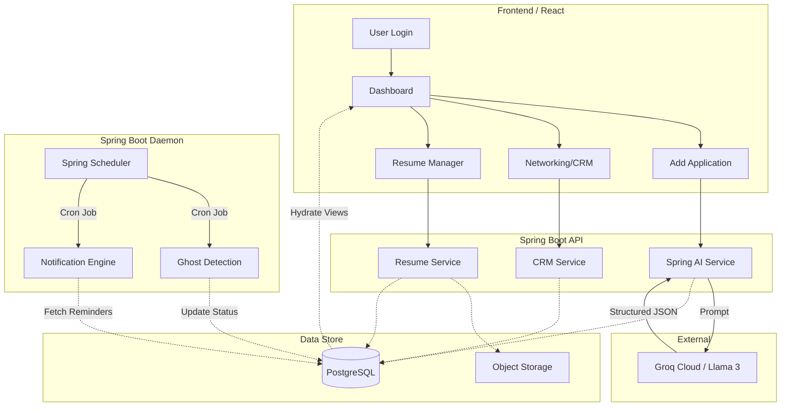

# App Flow: Trajectory

This document outlines the user journey and data flow within the Trajectory platform, from initial authentication to the core AI-powered application loop.

---

## 1. Authentication & Onboarding Flow
*   **Entry:** User arrives at the landing page.
*   **Sign Up/Login:** 
    *   Social Auth (Google/GitHub) via Spring Security OAuth2.
    *   Email/Password registration (JWT issued and stored in Secure Cookie/Local Storage).
*   **Initial Setup:**
    1.  User creates their first **Career Profile** (e.g., "Full Stack Engineer").
    2.  User uploads their base **Resume (v1)**.
    3.  Backend stores the file in S3/MinIO and creates a database record linked to the Profile.

---

## 2. The Application Loop (Core Workflow)

### 2.1 Creation Flow (AI-Powered)
1.  **Input:** User clicks "Add Application" and selects **AI Import**.
2.  **Processing:** User pastes a Job Description or an Interview Invite email into the text area.
3.  **Spring AI Integration:** 
    *   Frontend sends text to `/api/ai/extract`.
    *   Backend sends a prompt to **Groq (Llama 3)** via **Spring AI**.
    *   LLM returns a structured JSON (Company, Role, Location, Salary, Deadlines).
4.  **Review:** React frontend populates the "Add Application" modal with the extracted data.
5.  **Save:** User confirms/edits data. The application is saved to PostgreSQL.

### 2.2 Application Management Flow
1.  **Status Update:** User moves an application from `Applied` to `OA` (Online Assessment).
2.  **Trigger:** System prompts for "Assessment Date" and "Link."
3.  **Timeline Logging:** Backend automatically creates an entry in `ApplicationStatusHistory` to track the duration in the `Applied` stage.
4.  **Notification:** System schedules a **Web Push** reminder for the assessment time.

---

## 3. Resume & Profile Flow
1.  **Context Selection:** User views their "Software Engineering" profile.
2.  **Iteration:** User clicks "New Version" for a specific resume.
3.  **Upload:** User uploads a modified PDF and adds a "Changelog" note (e.g., "Added Kubernetes keywords").
4.  **Auto-Version:** Spring Boot backend increments version (v1 → v2).
5.  **Association:** When adding a new job, the system defaults to the "Latest Version" (v2) for that specific profile.

---

## 4. Networking (CRM) Flow
1.  **Entry:** User logs a cold outreach to a recruiter.
2.  **Tracking:** Sets a "Follow-up Date" (e.g., 5 days from today).
3.  **Monitoring:** 
    *   The **Dashboard Agenda** widget shows the pending follow-up on the target date.
    *   Spring Scheduler checks for "Reached" follow-up dates and sends a nudge.
4.  **Conversion:** If the recruiter responds with an interview, the user clicks "Convert to Application," transferring recruiter notes and company data to the main Application Tracker.

---

## 5. Automated Background Flows

### 5.1 Ghosting Detection (Spring Scheduler)
1.  **Daily Cron:** Every night at 00:00, the Spring Boot backend runs a job.
2.  **Check:** It scans applications where `status == ACTIVE` and `last_updated > user_ghost_threshold`.
3.  **Update:** Status is flipped to `GHOSTED`.
4.  **Alert:** User receives a notification: "3 applications have been moved to Ghosted due to inactivity."

### 5.2 Dashboard Analytics
1.  **Query:** Upon Dashboard load, the frontend fetches an aggregated stats object.
2.  **Calculation:** Backend calculates:
    *   **Response Rate:** (Interviews + OAs) / Total Applications.
    *   **Resume Hits:** Compares Response Rates across different resume versions to identify the top-performing document.

---

## 6. Data Portability Flow
1.  **Export:** User clicks "Download Data." Backend queries all tables related to `user_id`, generates a massive JSON/CSV file, and streams it to the client.
2.  **Import:** User uploads a Trajectory JSON file. Backend validates the schema, clears existing records (optional), and performs a batch insert into PostgreSQL to restore the state.

---

## 7. Visual Flow Diagram (Mermaid)

