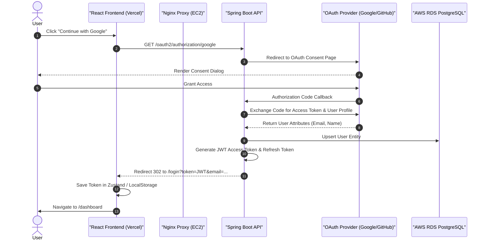
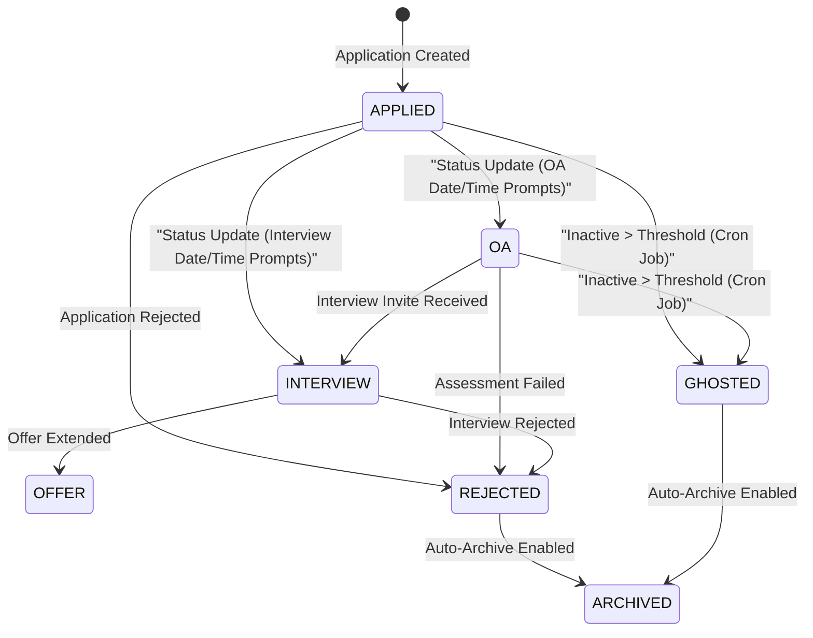

# App Flow & Execution Lifecycles: Trajectory

This document outlines the user journeys, data flows, and system execution lifecycles within Trajectory, spanning client-side state transitions, REST API endpoints, AI LLM extractions, database transactions, and background daemons.

---

## 1. Authentication & Onboarding Lifecycles

### 1.1 Local Credentials & JWT Authentication
1. **Entry:** User navigates to `https://trajectory-mu-six.vercel.app/login`.
2. **Action:** User enters email and password, submitting the form to `POST /api/auth/login`.
3. **Backend Processing:** `AuthController` invokes `AuthenticationManager` using `bcrypt` password verification.
4. **Token Generation:** `JwtTokenProvider` generates a signed 24-hour access JWT, and `RefreshTokenService` stores a refresh token in `refresh_tokens`.
5. **Client Response:** `AuthResponse` returns `{ token, refreshToken, userId, email, name }`.
6. **State Persistence:** Zustand (`useAuthStore`) saves `token` and `user` to `localStorage` and sets default Axios `Authorization: Bearer <token>` headers for all API requests. User is redirected to `/dashboard`.

### 1.2 Social OAuth 2.0 Authorization Flow (Google & GitHub)
1. **Trigger:** User clicks "Continue with Google" or "Continue with GitHub" on `/login`.
2. **Redirect Initiation:** React client triggers browser navigation to `${apiBase}/oauth2/authorization/{provider}` (stripping `/api`).
3. **Identity Provider Handshake:** Spring Security OAuth2 Client redirects user to Google/GitHub consent page.
4. **Callback Processing:** Upon user consent, provider returns authorization code to `/login/oauth2/code/{provider}`.
5. **Token Exchange:** Backend exchanges authorization code for user profile metadata, provisions or updates the user in PostgreSQL, and generates JWT tokens.
6. **Production Target Redirect:** `OAuth2AuthenticationSuccessHandler.java` redirects browser to `https://trajectory-mu-six.vercel.app/login?token=...&refreshToken=...`.
7. **Client Token Consumption:** `LoginPage.tsx` extracts query params, invokes `setAuth()`, and navigates to `/dashboard`.

---

## 2. Core Application Lifecycle Loop

### 2.1 AI-Powered Application Creation Flow
1. **Trigger:** User clicks "Add Application" on `/applications` and pastes raw job posting text into the AI Import modal.
2. **API Call:** Frontend invokes `POST /api/ai/extract-jd` with `{ "text": rawJdText }`.
3. **Groq / Llama 3 Extraction:** `AIService` invokes Spring AI `ChatClient` requesting structured JSON matching `JobExtraction`.
4. **Mock Fallback:** If `SPRING_AI_OPENAI_API_KEY` is not configured or set to `mock-key`, `AIService` returns regex-parsed mock extraction payload.
5. **Form Pre-Population:** React client pre-fills modal fields (`companyName`, `roleTitle`, `location`, `salaryRange`, `suggested_profile_title`).
6. **Save Transaction:** User confirms form fields and clicks Save. Frontend executes `POST /api/applications`. `ApplicationService` saves record to `applications` table and creates initial `application_status_history` entry (`status: APPLIED`).

### 2.2 Status Transition & History Timeline Audit
1. **Trigger:** User opens Application Inspector on `/applications/:id` and updates status (e.g. from `APPLIED` to `OA` or `INTERVIEW`).
2. **Modal Input:** System prompts for `oaDateTime` or `interviewDateTime`, `meetingLink`, and notes. Optional AI invite extraction (`POST /api/ai/extract-event`) pre-fills date/time/link fields.
3. **API Call:** Frontend executes `PATCH /api/applications/{id}/status` sending `StatusUpdateRequest`.
4. **Backend Transaction:**
   - `ApplicationService` updates `status`, `oa_date_time`, `interview_date_time`, `meeting_link`, and `last_activity_at` on `applications`.
   - `ApplicationStatusHistory` entity is created logging previous status duration and new status transition.
5. **UI Update:** React query invalidates `applications` cache and renders pulsing nodes on chronological timeline.

---

## 3. Cold Outreach & Networking CRM Workflow

1. **Log Outreach:** User enters recruiter details, company, email, LinkedIn URL, position discussed, and follow-up date on `/outreach` (`POST /api/outreach`).
2. **Recruiter Response Analysis:** When recruiter replies, user pastes message into analysis modal. Frontend executes `POST /api/ai/analyze-outreach`. `AIService` returns `OutreachAnalysis` (`suggested_status`, `suggested_action`, `key_points`).
3. **Status Update:** Status transitions to `REPLIED` or `INTERVIEW_SECURED` (`PUT /api/outreach/{id}`).
4. **One-Click Application Conversion:** User clicks "Convert to Application". Frontend executes `POST /api/outreach/{id}/convert`. `OutreachService` creates a formal `Application` entry, links relevant `CareerProfile`, transfers recruiter notes and company details, and updates outreach status.

---

## 4. Resume Version Control Workflow

1. **Profile Personas:** User navigates to `/resumes` to create/manage `CareerProfile` personas (e.g., "Full Stack Engineer" vs. "Product Manager").
2. **PDF Upload:** User uploads a PDF resume version, selecting target profile and entering changelog notes ("Added Virtual Thread keywords").
3. **Multipart Request:** Frontend calls `POST /api/resumes/upload` (`MultipartFile file`, `UUID profileId`, `String changelog`).
4. **S3 File Storage:** `S3StorageService` sanitizes filename, generates S3 key (`resumes/{profile_id}/v{version_number}_{filename}`), uploads file to AWS S3 bucket, and persists record in `resumes` table with auto-incremented `version_number`.
5. **Application Auto-Link:** When creating a new application under a career profile, the backend automatically links the latest resume version for that profile.

---

## 5. Background Daemon Workflows

### 5.1 Automated Ghost Detection (`GhostDetectionScheduler`)
1. **Cron Trigger:** Scheduled task runs daily at 00:00 server time (`@Scheduled(cron = "0 0 0 * * ?")`).
2. **Scan Query:** Queries `applications` where `status IN ('APPLIED', 'OA', 'INTERVIEW')` AND `last_activity_at < (NOW() - user.ghost_threshold_days)`.
3. **Batch Transition:** Flips status of identified applications to `GHOSTED` and inserts `application_status_history` audit records.
4. **Notification Creation:** Generates a `Notification` entity for affected users ("3 applications flagged as Ghosted due to inactivity").

### 5.2 Notification & Daily Agenda Engine (`NotificationScheduler`)
1. **Cron Trigger:** Scheduled task runs hourly to evaluate upcoming events.
2. **Reminders:** Scans `applications` for `oa_date_time` or `interview_date_time` occurring within the next 24 hours.
3. **Alert Dispatch:** Creates `Notification` records and dispatches browser push alerts if `browser_notifications_enabled` is true.

---

## 6. Workspace Data Portability Workflow

### 6.1 Data Export (`GET /api/users/me/data/export`)
1. User clicks "Export Workspace Data" in `/settings`.
2. Backend collects user's entities (`users`, `career_profiles`, `resumes`, `applications`, `status_history`, `outreach`, `company_documents`, `notifications`).
3. Serializes records into a single JSON file and streams binary output (`Content-Disposition: attachment; filename=trajectory_export.json`).

### 6.2 Data Import (`POST /api/users/me/data/import`)
1. User uploads a valid Trajectory export JSON file in `/settings`.
2. `UserService` validates JSON schema integrity.
3. Performs transactional batch insertion into PostgreSQL, restoring user workspace across device sessions.

---

## Related Documentation

- [**Documentation Index (Docs/INDEX.md)**](file:///d:/vaibhav%20gupta/Coding/Projects----For%20Resume/Trajectory/Docs/INDEX.md)
- [**REST API Specification (Docs/API_SPECIFICATION.md)**](file:///d:/vaibhav%20gupta/Coding/Projects----For%20Resume/Trajectory/Docs/API_SPECIFICATION.md)
- [**Spring AI Prompt Engineering (Docs/PromptSkills.md)**](file:///d:/vaibhav%20gupta/Coding/Projects----For%20Resume/Trajectory/Docs/PromptSkills.md)
- [**Production Deployment Guide (Docs/Deployment.md)**](file:///d:/vaibhav%20gupta/Coding/Projects----For%20Resume/Trajectory/Docs/Deployment.md)