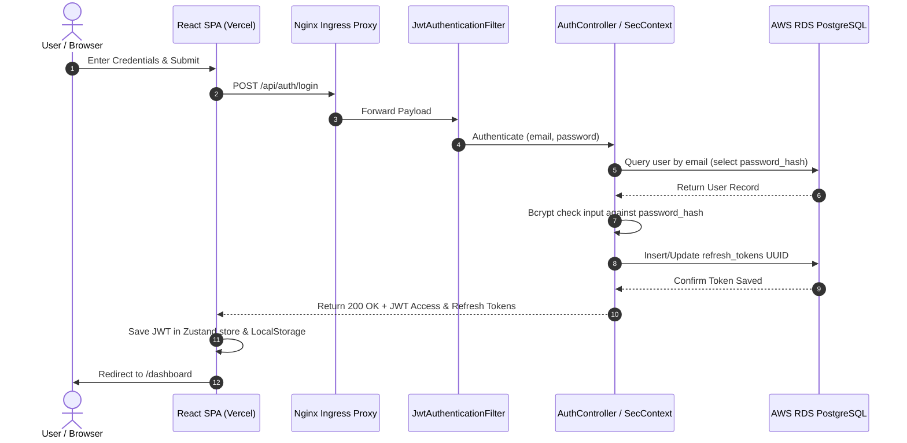
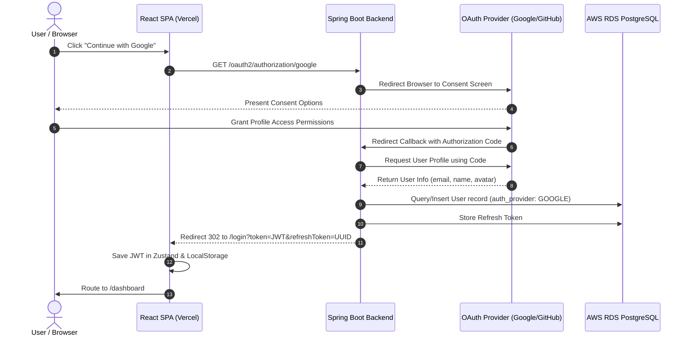
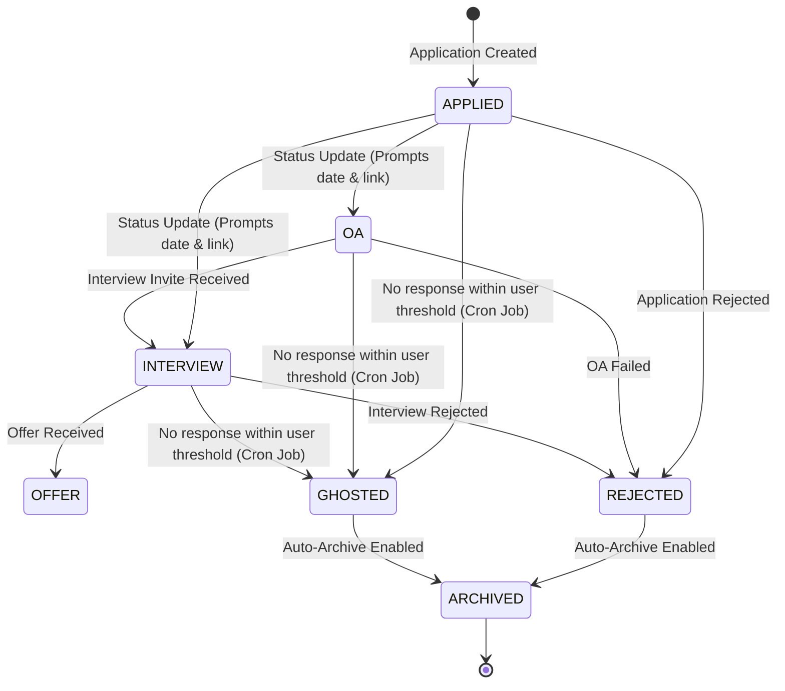

# App Flow & Execution Lifecycles: Trajectory (v1.0.1)

This document provides the canonical specification of user journeys, execution lifecycles, and data-flow sequences across the **Trajectory** ecosystem, covering client-side React routes, Zustand store mutations, backend REST gateways, Groq LLM operations, S3 persistence, and background crons.

---

## 1. Authentication & Onboarding Lifecycles

### 1.1 Local Credentials & JWT Authentication

This flow manages user authentication via traditional email/password credentials.

1.  **Form Input:** The user navigates to `/login` and enters credentials, triggering submission.
2.  **API Transport:** React SPA posts payload to `POST /api/auth/login` containing `{ "email": email, "password": password }`.
3.  **Security Filtering:** `JwtAuthenticationFilter` intercepts the request. `AuthController` delegates validation to `AuthenticationManager`.
4.  **Bcrypt Hashing Verification:** Spring Security invokes `UserDetailsService` loading user metadata and comparing the input password with the database's `users.password_hash` using Bcrypt.
5.  **Token Generation:** If validation succeeds:
    *   `JwtTokenProvider` builds a signed HMAC SHA-256 JWT access token (valid for 24 hours).
    *   `RefreshTokenService` creates/updates a secure UUID record in the `refresh_tokens` database table.
6.  **HTTP Response:** Returns `{ "token": "<JWT>", "refreshToken": "<UUID>", "userId": "<UUID>", "email": "...", "name": "..." }`.
7.  **Zustand Persistency:** Zustand (`useAuthStore`) saves the token to local storage and updates default Axios request interceptors with `Authorization: Bearer <JWT>`. The router redirects the browser to `/dashboard`.


```mermaid
sequenceDiagram
    autonumber
    actor User as User / Browser
    participant SPA as React SPA (Vercel)
    participant Nginx as Nginx Ingress Proxy
    participant Filter as JwtAuthenticationFilter
    participant Auth as AuthController / SecContext
    participant DB as AWS RDS PostgreSQL

    User->>SPA: Enter Credentials & Submit
    SPA->>Nginx: POST /api/auth/login
    Nginx->>Filter: Forward Payload
    Filter->>Auth: Authenticate (email, password)
    Auth->>DB: Query user by email (select password_hash)
    DB-->>Auth: Return User Record
    Auth->>Auth: Bcrypt check input against password_hash
    Auth->>DB: Insert/Update refresh_tokens UUID
    DB-->>Auth: Confirm Token Saved
    Auth-->>SPA: Return 200 OK + JWT Access & Refresh Tokens
    SPA->>SPA: Save JWT in Zustand store & LocalStorage
    SPA->>User: Redirect to /dashboard
```

---

### 1.2 Social OAuth 2.0 Authorization Flow (Google & GitHub)

Enables passwordless authentication via Google or GitHub identity providers.

1.  **Provider Selection:** The user clicks "Continue with Google" or "Continue with GitHub" on `/login`.
2.  **Redirection Handshake:** The React client initiates a full browser redirect to `${apiBase}/oauth2/authorization/{provider}` (directing to the backend API instance).
3.  **Identity Request:** The backend Spring Security OAuth2 Client redirects the browser to the provider's authorization screen.
4.  **Consent & Code Return:** The user grants permission. The provider redirects the browser to the backend callback endpoint `/login/oauth2/code/{provider}` with an authorization code.
5.  **Token Exchange:** Spring Security contacts the provider's token endpoint over a secure backend connection, exchanges the authorization code for a profile access token, and retrieves user profile details (email, name, avatar).
6.  **User Provisioning:** The backend checks the `users` table. If the email doesn't exist, a user record is created with `auth_provider` set to `GOOGLE` or `GITHUB`.
7.  **Callback Redirection:** `OAuth2AuthenticationSuccessHandler.java` generates JWT tokens and redirects the browser back to the frontend Vercel URL: `https://trajectory-mu-six.vercel.app/login?token=<JWT>&refreshToken=<UUID>`.
8.  **Token Processing:** `LoginPage.tsx` reads parameters from the URL, calls `setAuth()` on the Zustand store to persist the tokens, and redirects the router to `/dashboard`.


```mermaid
sequenceDiagram
    autonumber
    actor User as User / Browser
    participant SPA as React SPA (Vercel)
    participant API as Spring Boot Backend
    participant Auth as OAuth Provider (Google/GitHub)
    participant DB as AWS RDS PostgreSQL

    User->>SPA: Click "Continue with Google"
    SPA->>API: GET /oauth2/authorization/google
    API->>Auth: Redirect Browser to Consent Screen
    Auth-->>User: Present Consent Options
    User->>Auth: Grant Profile Access Permissions
    Auth->>API: Redirect Callback with Authorization Code
    API->>Auth: Request User Profile using Code
    Auth-->>API: Return User Info (email, name, avatar)
    API->>DB: Query/Insert User record (auth_provider: GOOGLE)
    API->>DB: Store Refresh Token
    API-->>SPA: Redirect 302 to /login?token=JWT&refreshToken=UUID
    SPA->>SPA: Save JWT in Zustand & LocalStorage
    SPA->>User: Route to /dashboard
```

---

## 2. Core Application Lifecycle Loop

### 2.1 AI-Powered Application Creation Flow

Minimizes manual data entry by extracting job information using Spring AI and Groq.

1.  **Form Input:** The user clicks "Add Application", opens the AI Import modal, and pastes a raw job description or email.
2.  **API Call:** React posts the text to `POST /api/ai/extract-jd` with `{ "text": "..." }`.
3.  **Groq LLM Call:** `AIService` issues a structured JSON schema extraction prompt to the Groq Cloud endpoint.
4.  **Failsafe Fallback:** If `SPRING_AI_OPENAI_API_KEY` is set to `mock-key` or is missing, `AIService` catches the failure and runs regex-based parser mock fallbacks to output a valid payload.
5.  **Form Pre-population:** The backend returns the extracted data. The React UI populates the application form fields for user verification.
6.  **Save Action:** The user reviews the fields and clicks Save. React posts the form to `POST /api/applications`. `ApplicationService` saves the application, logs the initial status history as `APPLIED`, and updates dashboard state cache.

---

### 2.2 Status Transition & History Timeline Audit

Track application lifecycle progression with historical auditing.

1.  **User Trigger:** The user opens `/applications/{id}` (Application Inspector) and selects a status transition (e.g. `APPLIED` ➔ `OA`).
2.  **Context Request:** React displays modal inputs depending on the target status (e.g., date/time for an OA or interview, meeting link).
3.  **REST Mutation:** React patch-updates the resource via `PATCH /api/applications/{id}/status` with:
    ```json
    {
      "status": "OA",
      "oaDateTime": "2026-07-28T22:00:00Z",
      "meetingLink": "https://zoom.us/j/...",
      "notes": "Completed HackerRank assessment"
    }
    ```
4.  **Database Updates:** Inside a database transaction:
    *   The backend updates the target application record (`status`, `oa_date_time`, `meeting_link`, and `last_activity_at`).
    *   Calculates the duration spent in the previous status based on the preceding `application_status_history` record.
    *   Inserts a new `application_status_history` record containing the status, notes, and timestamp.
5.  **Cache Invalidation:** The React client invalidates TanStack Query keys, updates UI metrics, and refreshes the timeline nodes.


```mermaid
stateDiagram-v2
    [*] --> APPLIED : Application Created
    APPLIED --> OA : Status Update (Prompts date & link)
    APPLIED --> INTERVIEW : Status Update (Prompts date & link)
    OA --> INTERVIEW : Interview Invite Received
    INTERVIEW --> OFFER : Offer Received
    
    APPLIED --> REJECTED : Application Rejected
    OA --> REJECTED : OA Failed
    INTERVIEW --> REJECTED : Interview Rejected
    
    APPLIED --> GHOSTED : No response within user threshold (Cron Job)
    OA --> GHOSTED : No response within user threshold (Cron Job)
    INTERVIEW --> GHOSTED : No response within user threshold (Cron Job)

    REJECTED --> ARCHIVED : Auto-Archive Enabled
    GHOSTED --> ARCHIVED : Auto-Archive Enabled
    
    ARCHIVED --> [*]
```

---

## 3. Cold Outreach & Networking CRM Workflow

Tracks networking interactions and outreach conversion to applications.

1.  **Log Outreach:** The user adds a contact via `POST /api/outreach` specifying the name, company, email, LinkedIn URL, position discussed, and follow-up date. The status defaults to `PENDING`.
2.  **Response Analysis:** When a recruiter replies, the user pastes the reply text into the Sentiment modal.
3.  **AI Classification:** React posts the text to `POST /api/ai/analyze-outreach`. The AI service parses the sentiment and returns:
    ```json
    {
      "suggestedStatus": "REPLIED",
      "suggestedAction": "Schedule intro call",
      "keyPoints": "Recruiter is interested in Java skills"
    }
    ```
4.  **Status Sync:** The user accepts the suggestion, updating the outreach record's status to `REPLIED` or `INTERVIEW_SECURED` via `PUT /api/outreach/{id}`.
5.  **One-Click Conversion:** When an interview is secured, the user clicks "Convert to Application". The frontend triggers `POST /api/outreach/{id}/convert`. The backend:
    *   Creates a new `applications` record, copying over the company name, role title, and notes.
    *   Associates the new application with a career profile.
    *   Updates the outreach record's status to `INTERVIEW_SECURED`.

---

## 4. Resume Version Control Workflow

Allows users to manage versioned resumes and automatically match them to applications.

1.  **Upload Action:** The user navigates to `/resumes`, selects a `career_profile_id`, selects a PDF file, and enters changelog notes.
2.  **API Transmission:** React transmits a multipart form via `POST /api/resumes/upload`.
3.  **AWS S3 Path Generation:** The backend `S3StorageService`:
    *   Verifies the PDF format.
    *   Retrieves the current version count for the target profile and increments it (e.g., `v2`).
    *   Generates a secure S3 key path: `resumes/{profile_id}/v{version_number}_{sanitized_filename}.pdf`.
    *   Uploads the binary stream to the AWS S3 bucket.
4.  **Database Persistence:** Inserts a metadata record into the `resumes` table mapping the `s3_key`, `version_number`, and `changelog`.
5.  **Automatic Matching:** When creating a job application under a specific Career Profile, the backend automatically links the application to the latest resume version associated with that profile.

---

## 5. Background Daemon Workflows

### 5.1 Automated Ghost Detection (`GhostDetectionScheduler`)

Identifies inactive job applications and marks them as ghosted.

*   **Trigger Schedule:** Runs daily at 00:00 server time (`@Scheduled(cron = "0 0 0 * * ?")`).
*   **Active Selection Query:**
    ```sql
    SELECT * FROM applications a
    JOIN users u ON a.user_id = u.id
    WHERE a.status IN ('APPLIED', 'OA', 'INTERVIEW')
      AND a.is_archived = FALSE
      AND a.last_activity_at < (CURRENT_TIMESTAMP - (u.ghost_threshold_days || ' days')::INTERVAL);
    ```
*   **Execution Steps:**
    1.  For each identified application, updates `status = 'GHOSTED'` and `last_activity_at = CURRENT_TIMESTAMP`.
    2.  Inserts a corresponding status transition audit record in `application_status_history`.
    3.  Inserts a new record in the `notifications` table for the user: `"Application at {Company} flagged as GHOSTED due to {Threshold} days of inactivity."`
    4.  Triggers in-app alerts and Web Push notifications.

---

### 5.2 Notification & Reminder Engine (`NotificationScheduler`)

Monitors upcoming events and schedules notifications.

*   **Trigger Schedule:** Runs hourly (`@Scheduled(cron = "0 0 * * * ?")`).
*   **Reminders Sweep:**
    1.  Queries the database for applications where status is `OA` or `INTERVIEW` and the event date (`oa_date_time` / `interview_date_time`) is within the next 24 hours.
    2.  Verifies if a reminder has already been sent to prevent duplicate notifications.
    3.  Creates a user notification: `"Reminder: Your Online Assessment / Interview with {Company} is scheduled for {Time}."`
    4.  Sends real-time browser push alerts using the Web Push API if `browser_notifications_enabled` is set to `true`.

---

## 6. Workspace Data Portability Workflow

### 6.1 Data Export (`GET /api/users/me/data/export`)

Allows users to back up their complete career workspace.

*   **REST Endpoint:** `GET /api/users/me/data/export`
*   **Response Payload Structure:** A single JSON object containing arrays of the user's data:
    ```json
    {
      "version": "1.0.1",
      "exportedAt": "2026-07-28T20:10:00Z",
      "user": {
        "email": "...",
        "fullName": "...",
        "ghostThresholdDays": 30
      },
      "careerProfiles": [
        { "id": "...", "title": "Frontend Engineer", "colorCode": "#3b82f6" }
      ],
      "resumes": [
        { "id": "...", "versionNumber": 1, "s3Key": "..." }
      ],
      "applications": [
        {
          "id": "...",
          "companyName": "...",
          "status": "APPLIED",
          "history": [
            { "status": "APPLIED", "changedAt": "..." }
          ]
        }
      ],
      "outreach": [],
      "companyDocuments": []
    }
    ```

---

### 6.2 Data Import (`POST /api/users/me/data/import`)

Enables users to restore workspace data.

*   **REST Endpoint:** `POST /api/users/me/data/import`
*   **Import Process:**
    1.  **Format Validation:** Verifies the import file matches the JSON schema rules and checks version compatibility.
    2.  **Transaction Boundary:** Opens a single transaction to insert the imported records.
    3.  **Conflict Management:** Clears existing records for the user account and restores tables (`career_profiles`, `resumes`, `applications`, `outreach`) using the imported IDs to preserve history mappings.
    4.  **Transaction Commit:** Commits the transaction to complete the restore. If a failure occurs, changes are rolled back.

---

## Related Documentation
*   [**Documentation Index (Docs/INDEX.md)**](file:///d:/Coding/Projects----For%20Resume/Trajectory/Docs/INDEX.md)
*   [**Product Requirements Document (Docs/PRD.md)**](file:///d:/Coding/Projects----For%20Resume/Trajectory/Docs/PRD.md)
*   [**Feature List (Docs/FEATURE_LIST.md)**](file:///d:/Coding/Projects----For%20Resume/Trajectory/Docs/FEATURE_LIST.md)
*   [**System Architecture (Docs/SYSTEM_ARCHITECTURE.md)**](file:///d:/Coding/Projects----For%20Resume/Trajectory/Docs/SYSTEM_ARCHITECTURE.md)
*   [**Tech Stack Specification (Docs/Tech Stack.md)**](file:///d:/Coding/Projects----For%20Resume/Trajectory/Docs/Tech%20Stack.md)
*   [**Visual Design System (Docs/DESIGN.md)**](file:///d:/Coding/Projects----For%20Resume/Trajectory/Docs/DESIGN.md)