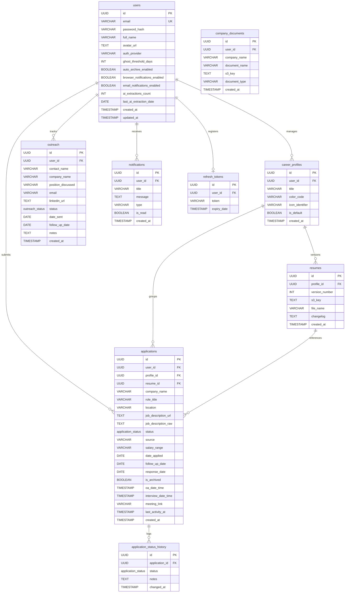

# Database Schema: Trajectory (v1.0.1)

This document provides the authoritative engineering specification for the relational database schema of **Trajectory**, implemented via **AWS RDS PostgreSQL 16** and versioned programmatically using **Flyway** migrations.

---

## 1. Entity-Relationship Diagram (ERD)

The database follows a normalized relational structure designed to preserve transaction integrity and facilitate fast user-isolated queries:

---

## 2. Table Definitions

### 2.1 `users`
Stores credentials, configurations, notifications settings, and usage trackers for each user account.

| Column Name | Data Type | Constraints | Default Value | Description |
| :--- | :--- | :--- | :--- | :--- |
| `id` | `UUID` | `PRIMARY KEY` | `gen_random_uuid()` | Unique user identifier. |
| `email` | `VARCHAR(255)` | `UNIQUE`, `NOT NULL` | None | Account email address. |
| `password_hash` | `VARCHAR(255)` | `NULLABLE` | None | Bcrypt password hash. Null for OAuth2 accounts. |
| `full_name` | `VARCHAR(100)` | `NULLABLE` | None | User's full display name. |
| `avatar_url` | `TEXT` | `NULLABLE` | None | Profile picture URL. |
| `auth_provider` | `VARCHAR(50)` | `NOT NULL` | `'LOCAL'` | Account auth provider: `LOCAL`, `GOOGLE`, `GITHUB`. |
| `ghost_threshold_days`| `INT` | `NOT NULL` | `30` | Inactivity threshold for automated ghosting detection. |
| `auto_archive_enabled`| `BOOLEAN` | `NOT NULL` | `FALSE` | Auto-archive rejected applications switch. |
| `browser_notifications_enabled` | `BOOLEAN` | `NOT NULL` | `TRUE` | Toggle for web push notification events. |
| `email_notifications_enabled` | `BOOLEAN` | `NOT NULL` | `TRUE` | Toggle for email digest alerts. |
| `ai_extractions_count`| `INT` | `NOT NULL` | `0` | Tracks total number of AI parser calls. |
| `last_ai_extraction_date` | `DATE` | `NULLABLE` | None | Date of user's last AI extractor call. |
| `created_at` | `TIMESTAMPTZ` | `NOT NULL` | `CURRENT_TIMESTAMP` | Account creation timestamp. |
| `updated_at` | `TIMESTAMPTZ` | `NOT NULL` | `CURRENT_TIMESTAMP` | Profile update timestamp. |

---

### 2.2 `career_profiles`
Manages different career personas (e.g. Frontend vs. Full Stack) configured by a user.

| Column Name | Data Type | Constraints | Default Value | Description |
| :--- | :--- | :--- | :--- | :--- |
| `id` | `UUID` | `PRIMARY KEY` | `gen_random_uuid()` | Unique profile identifier. |
| `user_id` | `UUID` | `NOT NULL`, `FOREIGN KEY` | None | References `users.id` (ON DELETE CASCADE). |
| `title` | `VARCHAR(100)` | `NOT NULL` | None | Name of the career persona. |
| `color_code` | `VARCHAR(7)` | `NOT NULL` | `'#3b82f6'` | Hex color code used to style UI components. |
| `icon_identifier` | `VARCHAR(50)` | `NULLABLE` | None | Mapped Lucide React icon name. |
| `is_default` | `BOOLEAN` | `NOT NULL` | `FALSE` | Marks the default profile for new applications. |
| `created_at` | `TIMESTAMPTZ` | `NOT NULL` | `CURRENT_TIMESTAMP` | Profile creation timestamp. |

---

### 2.3 `resumes`
Metadata for versioned resume files stored in AWS S3.

| Column Name | Data Type | Constraints | Default Value | Description |
| :--- | :--- | :--- | :--- | :--- |
| `id` | `UUID` | `PRIMARY KEY` | `gen_random_uuid()` | Unique resume identifier. |
| `profile_id` | `UUID` | `NOT NULL`, `FOREIGN KEY` | None | References `career_profiles.id` (ON DELETE CASCADE). |
| `version_number` | `INT` | `NOT NULL` | None | Auto-incrementing version count. |
| `s3_key` | `TEXT` | `NOT NULL` | None | Path location inside S3 bucket. |
| `file_name` | `VARCHAR(255)` | `NOT NULL` | None | Original uploaded file name. |
| `changelog` | `TEXT` | `NULLABLE` | None | Explanatory comments for version differences. |
| `created_at` | `TIMESTAMPTZ` | `NOT NULL` | `CURRENT_TIMESTAMP` | Upload timestamp. |
| *Constraints:* | | `UNIQUE(profile_id, version_number)` | | Enforces sequential version counts. |

---

### 2.4 `applications`
Core entity tracking job applications.

| Column Name | Data Type | Constraints | Default Value | Description |
| :--- | :--- | :--- | :--- | :--- |
| `id` | `UUID` | `PRIMARY KEY` | `gen_random_uuid()` | Unique application identifier. |
| `user_id` | `UUID` | `NOT NULL`, `FOREIGN KEY` | None | References `users.id` (ON DELETE CASCADE). |
| `profile_id` | `UUID` | `NOT NULL`, `FOREIGN KEY` | None | References `career_profiles.id`. |
| `resume_id` | `UUID` | `NULLABLE`, `FOREIGN KEY` | None | References `resumes.id` (Set Null on Delete). |
| `company_name` | `VARCHAR(255)` | `NOT NULL` | None | Target hiring company. |
| `role_title` | `VARCHAR(255)` | `NOT NULL` | None | Target job position title. |
| `location` | `VARCHAR(255)` | `NULLABLE` | None | Job location details. |
| `job_description_url` | `TEXT` | `NULLABLE` | None | External link to job posting. |
| `job_description_raw` | `TEXT` | `NULLABLE` | None | Full raw text preserved for audit checks. |
| `status` | `application_status` | `NOT NULL` | `'APPLIED'` | Enum status state. |
| `source` | `VARCHAR(100)` | `NULLABLE` | None | Application source channel. |
| `salary_range` | `VARCHAR(100)` | `NULLABLE` | None | Compensation range. |
| `date_applied` | `DATE` | `NOT NULL` | `CURRENT_DATE` | Submission date. |
| `follow_up_date` | `DATE` | `NULLABLE` | None | Scheduled follow-up check date. |
| `response_date` | `DATE` | `NULLABLE` | None | Date of first company reply. |
| `is_archived` | `BOOLEAN` | `NOT NULL` | `FALSE` | Toggle to hide application from default lists. |
| `oa_date_time` | `TIMESTAMPTZ` | `NULLABLE` | None | Online Assessment scheduled date/time. |
| `interview_date_time` | `TIMESTAMPTZ` | `NULLABLE` | None | Interview round scheduled date/time. |
| `meeting_link` | `VARCHAR(255)` | `NULLABLE` | None | Link to video call or assessments platform. |
| `last_activity_at` | `TIMESTAMPTZ` | `NOT NULL` | `CURRENT_TIMESTAMP` | Updated on any status or details modification. |
| `created_at` | `TIMESTAMPTZ` | `NOT NULL` | `CURRENT_TIMESTAMP` | Initial creation timestamp. |

---

### 2.5 `application_status_history`
Stores audit trails of application status changes to compute timeline views.

| Column Name | Data Type | Constraints | Default Value | Description |
| :--- | :--- | :--- | :--- | :--- |
| `id` | `UUID` | `PRIMARY KEY` | `gen_random_uuid()` | Unique audit event identifier. |
| `application_id` | `UUID` | `NOT NULL`, `FOREIGN KEY` | None | References `applications.id` (ON DELETE CASCADE). |
| `status` | `application_status` | `NOT NULL` | None | Status state transitioned to. |
| `notes` | `TEXT` | `NULLABLE` | None | User comments added during transition. |
| `changed_at` | `TIMESTAMPTZ` | `NOT NULL` | `CURRENT_TIMESTAMP` | State transition timestamp. |

---

### 2.6 `outreach`
Stores contacts and cold interactions managed in the networking CRM.

| Column Name | Data Type | Constraints | Default Value | Description |
| :--- | :--- | :--- | :--- | :--- |
| `id` | `UUID` | `PRIMARY KEY` | `gen_random_uuid()` | Unique contact identifier. |
| `user_id` | `UUID` | `NOT NULL`, `FOREIGN KEY` | None | References `users.id` (ON DELETE CASCADE). |
| `contact_name` | `VARCHAR(255)` | `NOT NULL` | None | Recruiter or employee name. |
| `company_name` | `VARCHAR(255)` | `NOT NULL` | None | Target company name. |
| `position_discussed` | `VARCHAR(255)` | `NULLABLE` | None | Role position discussed. |
| `email` | `VARCHAR(255)` | `NULLABLE` | None | Contact email address. |
| `linkedin_url` | `TEXT` | `NULLABLE` | None | LinkedIn profile URL. |
| `status` | `outreach_status`| `NOT NULL` | `'PENDING'` | Current status of interaction. |
| `date_sent` | `DATE` | `NOT NULL` | `CURRENT_DATE` | Date message was sent. |
| `follow_up_date` | `DATE` | `NULLABLE` | None | Scheduled CRM follow-up check date. |
| `notes` | `TEXT` | `NULLABLE` | None | History notes and reply logs. |
| `created_at` | `TIMESTAMPTZ` | `NOT NULL` | `CURRENT_TIMESTAMP` | Record creation timestamp. |

---

### 2.7 `company_documents`
Metadata for private company files uploaded to AWS S3.

| Column Name | Data Type | Constraints | Default Value | Description |
| :--- | :--- | :--- | :--- | :--- |
| `id` | `UUID` | `PRIMARY KEY` | `gen_random_uuid()` | Unique document identifier. |
| `user_id` | `UUID` | `NOT NULL`, `FOREIGN KEY` | None | References `users.id` (ON DELETE CASCADE). |
| `company_name` | `VARCHAR(255)` | `NOT NULL` | None | Associated company. |
| `document_name` | `VARCHAR(255)` | `NOT NULL` | None | Display file name. |
| `s3_key` | `TEXT` | `NOT NULL` | None | Path location inside S3 bucket. |
| `document_type` | `VARCHAR(50)` | `NULLABLE` | None | Document category (e.g. Benefits PDF). |
| `created_at` | `TIMESTAMPTZ` | `NOT NULL` | `CURRENT_TIMESTAMP` | Record upload timestamp. |

---

### 2.8 `notifications`
Stores system alerts, reminders, and notifications.

| Column Name | Data Type | Constraints | Default Value | Description |
| :--- | :--- | :--- | :--- | :--- |
| `id` | `UUID` | `PRIMARY KEY` | `gen_random_uuid()` | Unique alert identifier. |
| `user_id` | `UUID` | `NOT NULL`, `FOREIGN KEY` | None | References `users.id` (ON DELETE CASCADE). |
| `title` | `VARCHAR(255)` | `NOT NULL` | None | Alert title header. |
| `message` | `TEXT` | `NOT NULL` | None | Detailed notification content. |
| `type` | `VARCHAR(50)` | `NOT NULL` | `'INFO'` | Category type of notification. |
| `is_read` | `BOOLEAN` | `NOT NULL` | `FALSE` | Toggle tracking read/unread state. |
| `created_at` | `TIMESTAMPTZ` | `NOT NULL` | `CURRENT_TIMESTAMP` | Creation timestamp. |

---

### 2.9 `refresh_tokens`
Stores active session tokens to support JWT token rotation.

| Column Name | Data Type | Constraints | Default Value | Description |
| :--- | :--- | :--- | :--- | :--- |
| `id` | `UUID` | `PRIMARY KEY` | `gen_random_uuid()` | Unique token record identifier. |
| `user_id` | `UUID` | `UNIQUE`, `FOREIGN KEY` | None | References `users.id` (ON DELETE CASCADE). |
| `token` | `VARCHAR(255)` | `UNIQUE`, `NOT NULL` | None | Cryptographic session refresh UUID string. |
| `expiry_date` | `TIMESTAMP` | `NOT NULL` | None | Token expiration timestamp. |

---

## 3. Database Indexes

These indexes are defined to speed up foreign key joins, user-level data isolation filters, status updates, and chronological sorting:

| Index Name | Target Table | Columns Indexed | Optimization Context |
| :--- | :--- | :--- | :--- |
| `idx_applications_user` | `applications` | `user_id` | Speeds up user isolation queries (e.g. `WHERE user_id = :id`). |
| `idx_applications_status`| `applications` | `status` | Speeds up dashboard aggregation counts. |
| `idx_outreach_user` | `outreach` | `user_id` | Speeds up user CRM dashboard listings. |
| `idx_resumes_profile` | `resumes` | `profile_id` | Speeds up career profile version listings. |
| `idx_status_history_app` | `application_status_history` | `application_id` | Speeds up chronological timeline audit histories. |

---

## 4. Flyway Schema Migration Log

Database changes are managed via SQL files placed under `backend/src/main/resources/db/migration/`:

### 4.1 Migration V1 — `V1__init_schema.sql`
*   Creates custom enums: `application_status` and `outreach_status`.
*   Creates core tables: `users`, `career_profiles`, `resumes`, `applications`, `application_status_history`, `outreach`, and `company_documents`.
*   Applies primary/foreign keys, uniqueness constraints, and performance indexes.

### 4.2 Migration V2 — `V2__add_missing_fields_and_tables.sql`
*   Alters `applications` adding columns: `is_archived`, `oa_date_time`, `interview_date_time`, and `meeting_link`.
*   Alters `users` adding columns: `browser_notifications_enabled`, `email_notifications_enabled`, `ai_extractions_count`, and `last_ai_extraction_date`.
*   Creates the `notifications` and `refresh_tokens` tables.

---

## Related Documentation
*   [**Documentation Index (Docs/INDEX.md)**](file:///d:/Coding/Projects----For%20Resume/Trajectory/Docs/INDEX.md)
*   [**REST API Specification (Docs/API_SPECIFICATION.md)**](file:///d:/Coding/Projects----For%20Resume/Trajectory/Docs/API_SPECIFICATION.md)
*   [**System Architecture (Docs/SYSTEM_ARCHITECTURE.md)**](file:///d:/Coding/Projects----For%20Resume/Trajectory/Docs/SYSTEM_ARCHITECTURE.md)
