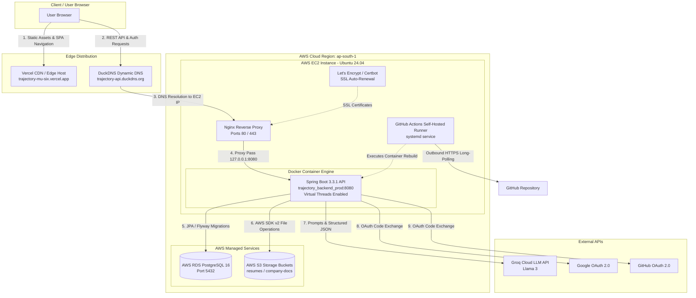

# Trajectory Production Deployment Architecture & Operations Guide

This document serves as the canonical, single source of truth for the production deployment architecture, infrastructure configuration, containerization, security policies, CI/CD pipelines, and operational procedures of **Trajectory** (Career Operating System).

For navigation across all project documentation, refer to the [Documentation Index (Docs/INDEX.md)](file:///d:/vaibhav%20gupta/Coding/Projects----For%20Resume/Trajectory/Docs/INDEX.md).

---

## Table of Contents
1. [Project Deployment Overview](#1-project-deployment-overview)
2. [Infrastructure & Cloud Services](#2-infrastructure--cloud-services)
3. [Containerization & Service Architecture](#3-containerization--service-architecture)
4. [Nginx Reverse Proxy & Header Forwarding](#4-nginx-reverse-proxy--header-forwarding)
5. [HTTPS & SSL/TLS Management](#5-https--ssltls-management)
6. [OAuth 2.0 & Authentication Flow](#6-oauth-20--authentication-flow)
7. [Production Issues & Root Cause Analysis](#7-production-issues--root-cause-analysis)
8. [CI/CD Pipeline Architecture](#8-cicd-pipeline-architecture)
9. [GitHub Actions Self-Hosted Runner](#9-github-actions-self-hosted-runner)
10. [Deployment Workflow & Pipeline Execution](#10-deployment-workflow--pipeline-execution)
11. [Repository Directory Structure](#11-repository-directory-structure)
12. [Environment Configurations & Variables](#12-environment-configurations--variables)
13. [Operational & Troubleshooting Command Reference](#13-operational--troubleshooting-command-reference)
14. [Comprehensive Troubleshooting Guide](#14-comprehensive-troubleshooting-guide)
15. [Security Architecture & Best Practices](#15-security-architecture--best-practices)
16. [Current Production Architecture Diagram](#16-current-production-architecture-diagram)
17. [Future Architectural Enhancements](#17-future-architectural-enhancements)

---

## 1. Project Deployment Overview

### 1.1 High-Level Architecture
Trajectory is built as a decoupled, cloud-native full-stack application designed for maximum throughput, low-latency API interactions, and seamless user experience.

- **Frontend Application Layer:** A Single Page Application (SPA) built with React 19, TypeScript, Tailwind CSS, Zustand, and TanStack Query. It is hosted on **Vercel's Edge Network** for worldwide CDN distribution and instant page loads.
- **Backend Application Layer:** A RESTful API built on **Java 21** and **Spring Boot 3.3.1**, compiled with JDK 21 **Virtual Threads** (`spring.threads.virtual.enabled=true`) to maximize concurrent request handling during long-running LLM and object storage calls. It runs inside a Docker container on an **AWS EC2** instance.
- **Database Layer:** A managed **AWS RDS PostgreSQL 16** instance running in a dedicated Virtual Private Cloud (VPC) security group. Schema migrations are managed programmatically via **Flyway**.
- **Object Storage Layer:** **AWS S3** (`ap-south-1` region) storing user resume PDFs, placement sheet files, and company document attachments.
- **Reverse Proxy & Domain Gateway:** **Nginx** running natively on the EC2 host, managing HTTPS termination (via **Let's Encrypt / Certbot**), security header injection, and HTTP reverse proxying to port `8080`.
- **Domain Resolution:** **DuckDNS** dynamic DNS service providing domain resolution pointing to the EC2 Elastic/Public IP.
- **CI/CD Automation:** **GitHub Actions** executing on a **Self-Hosted Runner** installed directly on the EC2 instance, enabling automated container rebuilds upon pushing to the `main` branch.

### 1.2 End-to-End Request Flow
```
[ User Browser ]
       │
       ├─── (Static Assets / SPA Routing) ──────────────► [ Vercel Edge CDN ]
       │
       └─── (REST API / OAuth Handshake) ─────────────► [ DuckDNS Domain ]
                                                               │ (DNS IP Lookup)
                                                               ▼
                                                      [ AWS EC2 Instance ]
                                                               │
                                                               ▼ (Port 443 HTTPS)
                                                      [ Nginx Reverse Proxy ]
                                                               │ (SSL Termination & Header Forwarding)
                                                               ▼ (Port 8080 HTTP)
                                                      [ Backend Docker Container ]
                                                               │
                                         ┌─────────────────────┴─────────────────────┐
                                         ▼                                           ▼
                            [ AWS RDS PostgreSQL 16 ]                      [ AWS S3 Bucket ]
```

---

## 2. Infrastructure & Cloud Services

| Component | Provider / Technology | Purpose & Responsibility | Communication & Interconnection |
| :--- | :--- | :--- | :--- |
| **Server Host** | AWS EC2 (Ubuntu 24.04 LTS) | Virtual server hosting the Docker engine, backend container, Nginx reverse proxy, and GitHub Actions runner. | Receives ingress HTTPS traffic on port `443` and HTTP on port `80`. Communicates outbound to RDS and S3. |
| **Database** | AWS RDS PostgreSQL 16 | Relational database storing users, job applications, resumes, CRM outreach contacts, and audit logs. | Accepts inbound TCP connections on port `5432` only from the EC2 instance's Security Group ID. |
| **Object Storage** | AWS S3 (`ap-south-1`) | Cloud object storage for versioned PDFs, resumes, and company documentation. | Communicates via AWS SDK v2 over HTTPS using IAM access/secret keys. |
| **Frontend Host** | Vercel Edge Network | Globally distributed static and SPA host for the React frontend application. | Connects to the backend via HTTPS REST calls using `VITE_API_BASE_URL`. |
| **Dynamic DNS** | DuckDNS | Resolves custom subdomains to the dynamic/static IP address of the AWS EC2 instance. | Updated via periodic HTTP cron scripts or fixed IP mapping. |
| **Web Server** | Nginx (Host Native) | Reverse proxy, SSL/TLS termination gateway, security header manager, and rate limiter. | Listens on ports `80` and `443`. Proxies requests to internal Docker container at `127.0.0.1:8080`. |
| **SSL Authority** | Let's Encrypt (Certbot) | Automated Certificate Authority providing free 90-day X.509 TLS/SSL certificates. | Validated via HTTP-01 challenge on port `80`. Auto-renewed via `systemd` timer. |
| **Containerization** | Docker & Docker Compose | Container engine for reproducible build and execution environments. | Exposes port `8080` internally on host loopback interface. |
| **Source Control** | GitHub | Git repository hosting application source code and workflow triggers. | Triggers deployment jobs via webhook upon pushing commits to tracked branches (`main`, `develop`, `test`). |
| **Deployment Agent**| GitHub Actions Runner | Self-hosted runner agent installed on EC2 listening for workflow jobs. | Long-polls GitHub API over HTTPS (outbound port `443`). Executes deployment commands locally on EC2 host. |

---

## 3. Containerization & Service Architecture

### 3.1 Dockerfile Design (`backend/Dockerfile`)
The backend uses a multi-stage `Dockerfile` to optimize final image size and enforce build reproducibility:

```dockerfile
# Stage 1: Build Stage (Maven + OpenJDK 21)
FROM maven:3.9.6-eclipse-temurin-21-alpine AS builder
WORKDIR /app
COPY pom.xml .
RUN mvn dependency:go-offline -B
COPY src ./src
RUN mvn clean package -DskipTests

# Stage 2: Runtime Stage (Lightweight JRE 21)
FROM eclipse-temurin:21-jre-alpine
WORKDIR /app
COPY --from=builder /app/target/backend-0.0.1-SNAPSHOT.jar backend.jar

EXPOSE 8080
ENTRYPOINT ["java", "-jar", "backend.jar"]
```

#### Key Architecture Principles:
- **Build Isolation:** Dependencies are cached in Layer 6 (`mvn dependency:go-offline`), preventing re-downloading dependencies on every code change.
- **Minimal Footprint:** Uses Alpine Linux runtime (`eclipse-temurin:21-jre-alpine`), yielding a lightweight, secure production footprint free from compilation tools.
- **Default Profile Independence:** Does **not** hardcode `ENV SPRING_PROFILES_ACTIVE=prod`. It runs under the default Spring Boot profile, consuming properties dynamically injected via environment variables.

### 3.2 Production Docker Compose Architecture (`docker-compose.prod.yml`)

```yaml
services:
  backend:
    build:
      context: ./backend
      dockerfile: Dockerfile
    container_name: trajectory_backend_prod
    restart: unless-stopped
    ports:
      - "8080:8080"
    env_file:
      - .env.prod
    environment:
      - SPRING_AUTOCONFIGURE_EXCLUDE=org.springframework.boot.autoconfigure.data.redis.RedisAutoConfiguration
```

### 3.3 Development vs. Production Service Comparison

```
+-----------------------------------------------------------------------------------+
|                            LOCAL DEVELOPMENT ENVIRONMENT                          |
|                                                                                   |
|  [ React Frontend ] ──► [ Spring Boot Backend ]                                   |
|                                │                                                  |
|                        ┌───────┼─────────────────┐                                |
|                        ▼       ▼                 ▼                                |
|                   [ Postgres ] [ Redis Cache ] [ MinIO Storage ]                  |
|                   (Docker)     (Docker)        (Docker)                           |
+-----------------------------------------------------------------------------------+

+-----------------------------------------------------------------------------------+
|                             PRODUCTION ENVIRONMENT                                |
|                                                                                   |
|  [ Vercel Edge SPA ] ──► [ Nginx Proxy ] ──► [ Spring Boot Backend Container ]    |
|                                                       │                           |
|                                         ┌─────────────┴─────────────┐             |
|                                         ▼                           ▼             |
|                                [ AWS RDS PostgreSQL ]        [ AWS S3 Bucket ]    |
|                                (Managed Database)            (Managed Storage)    |
+-----------------------------------------------------------------------------------+
```

#### Environment Distinctions:
1. **PostgreSQL:** Production connects directly to AWS RDS PostgreSQL via environment variables. The local Docker `db` container is removed from `docker-compose.prod.yml`.
2. **MinIO Object Storage:** MinIO is replaced by AWS S3 (`ap-south-1`).
3. **Redis Caching:** Redis is removed in production. Spring Boot's `RedisAutoConfiguration` is explicitly excluded via `SPRING_AUTOCONFIGURE_EXCLUDE` to prevent startup latency or connection exceptions.

---

## 4. Nginx Reverse Proxy & Header Forwarding

### 4.1 Purpose of Nginx
Nginx operates as the host-level reverse proxy and ingress gateway. The backend Docker container is kept private to the host and is not directly exposed to the public internet.

```
Public Request (HTTPS) ──► Nginx (Port 443) ──► Proxy Pass ──► Container (127.0.0.1:8080)
```

### 4.2 Nginx Host Configuration (`/etc/nginx/sites-available/default`)

```nginx
server {
    listen 80;
    server_name trajectory-api.duckdns.org;
    return 301 https://$host$request_uri;
}

server {
    listen 443 ssl http2;
    server_name trajectory-api.duckdns.org;

    ssl_certificate /etc/letsencrypt/live/trajectory-api.duckdns.org/fullchain.pem;
    ssl_certificate_key /etc/letsencrypt/live/trajectory-api.duckdns.org/privkey.pem;
    include /etc/letsencrypt/options-ssl-nginx.conf;
    ssl_dhparam /etc/letsencrypt/ssl-dhparams.pem;

    # Security Headers
    add_header X-Frame-Options "SAMEORIGIN" always;
    add_header X-XSS-Protection "1; mode=block" always;
    add_header X-Content-Type-Options "nosniff" always;
    add_header Referrer-Policy "no-referrer-when-downgrade" always;

    location / {
        proxy_pass http://127.0.0.1:8080;
        proxy_set_header Host $host;
        proxy_set_header X-Real-IP $remote_addr;
        proxy_set_header X-Forwarded-For $proxy_add_x_forwarded_for;
        proxy_set_header X-Forwarded-Proto $scheme;
        proxy_set_header X-Forwarded-Host $host;
        proxy_set_header X-Forwarded-Port $server_port;

        # WebSockets support
        proxy_http_version 1.1;
        proxy_set_header Upgrade $http_upgrade;
        proxy_set_header Connection "upgrade";
    }
}
```

### 4.3 Forwarded Headers & Spring Boot Integration
When Spring Security handles OAuth2 redirects, it needs to construct absolute URLs (e.g., redirecting back to `/login`). 

Without explicit forwarded header handling, Spring Security reads the scheme from the incoming connection (`http://127.0.0.1:8080`), generating an internal redirect to `http://...` instead of `https://...`.

To solve this:
1. Nginx sends:
   - `X-Forwarded-Proto: https`
   - `X-Forwarded-Host: trajectory-api.duckdns.org`
2. Spring Boot is configured in `backend/src/main/resources/application.yml`:
   ```yaml
   server:
     forward-headers-strategy: framework
   ```
   This forces Spring's `ForwardedHeaderFilter` to rewrite the internal request context to match the original client HTTPS request scheme.

---

## 5. HTTPS & SSL/TLS Management

### 5.1 Certificate Provisioning
HTTPS is enforced using Let's Encrypt certificates managed by Certbot. Certbot validates domain ownership via the `HTTP-01` challenge on port `80`.

#### Initial Certificate Generation Command:
```bash
sudo certbot --nginx -d trajectory-api.duckdns.org --non-interactive --agree-tos -m your-email@domain.com
```

### 5.2 Certificate Renewal Lifecycle
Certbot registers a systemd timer (`certbot.timer`) that runs twice daily to automatically check and renew expiring certificates:

```bash
# Check systemd renewal timer status
sudo systemctl status certbot.timer

# Dry run test for automatic renewal
sudo certbot renew --dry-run
```

### 5.3 Mandate of HTTPS for OAuth 2.0
OAuth 2.0 identity providers (Google Cloud Console and GitHub Developer Settings) **enforce strict HTTPS validation** for production redirect URIs. Any non-HTTPS callback URI (other than `http://localhost`) is rejected by OAuth providers during authorization requests.

---

## 6. OAuth 2.0 & Authentication Flow

### 6.1 Flow Architecture
Trajectory supports local JWT login as well as federated OAuth 2.0 authentication via Google and GitHub.

```
[ User ]       [ Frontend (Vercel) ]         [ Backend API ]         [ OAuth Provider ]
   │                     │                          │                        │
   │─── Click Google ───►│                          │                        │
   │                     │─── Redirect Authorization►│                        │
   │                     │    /oauth2/authorization/│                        │
   │                     │    google                │                        │
   │                     │                          │─── Redirect to Provider►│
   │                     │                          │    Authorization Page  │
   │◄────────────────────┼──────────────────────────┼────────────────────────┤ User Consents
   │                     │                          │                        │
   │─────────────────────┼──────────────────────────┼───────────────────────►│ Provider Callback
   │                     │                          │◄── Authorization Code ─│
   │                     │                          │                        │
   │                     │                          │── Exchange Code ──────►│
   │                     │                          │◄── Tokens & Profile ───│
   │                     │                          │                        │
   │                     │                          │ Generate JWT & Refresh │
   │                     │◄── Redirect /login ──────│                        │
   │                     │    ?token=...&email=...  │                        │
   │                     │                          │                        │
   │ Stores Tokens in    │                          │                        │
   │ LocalStorage &      │                          │                        │
   │ Redirects Dashboard │                          │                        │
```

### 6.2 Implementation Details

1. **Frontend Authorization Trigger (`LoginPage.tsx`):**
   ```typescript
   const handleOAuth = (provider: string) => {
     const apiBase = import.meta.env.VITE_API_BASE_URL.replace(/\/api$/, "");
     window.location.href = `${apiBase}/oauth2/authorization/${provider}`;
   };
   ```

2. **Backend Authentication Success Handler (`OAuth2AuthenticationSuccessHandler.java`):**
   ```java
   @Override
   public void onAuthenticationSuccess(HttpServletRequest request, HttpServletResponse response, Authentication authentication) throws IOException {
       UserPrincipal principal = (UserPrincipal) authentication.getPrincipal();
       String token = tokenProvider.generateTokenForUser(principal);
       String refreshToken = refreshTokenService.createRefreshToken(principal.getId()).getToken();

       String targetUrl = UriComponentsBuilder.fromUriString("https://trajectory-mu-six.vercel.app/login")
               .queryParam("token", token)
               .queryParam("refreshToken", refreshToken)
               .queryParam("email", principal.getEmail())
               .queryParam("name", principal.getFullName())
               .queryParam("userId", principal.getId().toString())
               .build().toUriString();

       clearAuthenticationAttributes(request);
       getRedirectStrategy().sendRedirect(request, response, targetUrl);
   }
   ```

3. **CORS Security Configuration (`SecurityConfig.java`):**
   ```java
   @Bean
   public CorsConfigurationSource corsConfigurationSource() {
       CorsConfiguration configuration = new CorsConfiguration();
       configuration.setAllowedOrigins(List.of(
           "http://localhost:5173",
           "http://localhost:3000",
           "https://trajectory-mu-six.vercel.app"
       ));
       configuration.setAllowedMethods(List.of("GET", "POST", "PUT", "DELETE", "OPTIONS", "PATCH"));
       configuration.setAllowedHeaders(List.of("Authorization", "Content-Type", "Cache-Control"));
       configuration.setExposedHeaders(List.of("Authorization"));
       configuration.setAllowCredentials(true);
       
       UrlBasedCorsConfigurationSource source = new UrlBasedCorsConfigurationSource();
       source.registerCorsConfiguration("/**", configuration);
       return source;
   }
   ```

---

## 7. Production Issues & Root Cause Analysis

During production deployment, several real-world architectural issues were encountered and resolved.

### Issue 1: OAuth Redirecting to `localhost:5173` in Production
- **Symptom:** Successfully authenticating with Google redirected the browser to `http://localhost:5173/login?token=...`, causing a "Site Cannot Be Reached" error in production.
- **Root Cause:** `OAuth2AuthenticationSuccessHandler.java` and `MockOAuth2RedirectFilter.java` had hardcoded `http://localhost:5173/login` as the post-authentication redirect URL.
- **Solution:** Updated both classes to dynamically or explicitly target the production Vercel frontend URL: `https://trajectory-mu-six.vercel.app/login`.

### Issue 2: Frontend OAuth Request Appending `/api` Duplicate Path
- **Symptom:** Clicking "Sign in with Google" routed the browser to `https://trajectory-api.duckdns.org/api/oauth2/authorization/google`, returning an HTTP 404 error.
- **Root Cause:** `LoginPage.tsx` concatenated `VITE_API_BASE_URL` (which ends with `/api`) directly with `/oauth2/authorization/google`.
- **Solution:** Modified `handleOAuth` in `LoginPage.tsx` to strip `/api` from `VITE_API_BASE_URL`:
  ```typescript
  const apiBase = import.meta.env.VITE_API_BASE_URL.replace(/\/api$/, "");
  window.location.href = `${apiBase}/oauth2/authorization/${provider}`;
  ```

### Issue 3: HTTPS Scheme Loss Behind Nginx Proxy
- **Symptom:** Spring Security generated HTTP redirects to `http://trajectory-api.duckdns.org/...` during OAuth processing, causing mixed content errors.
- **Root Cause:** Spring Security was unaware that Nginx was terminating SSL and receiving HTTPS traffic.
- **Solution:** Configured Nginx to send `X-Forwarded-Proto $scheme` and added `server.forward-headers-strategy: framework` in `application.yml`.

### Issue 4: Vercel SPA Route 404 on Page Refresh
- **Symptom:** Refreshing any sub-route on Vercel (e.g., `https://trajectory-mu-six.vercel.app/analytics` or `/applications`) resulted in a Vercel 404 page.
- **Root Cause:** Vercel was trying to look for physical static files matching `/analytics/index.html` on the file system.
- **Solution:** Created `frontend/vercel.json` with single-page application rewrite rules:
  ```json
  {
    "rewrites": [
      {
        "source": "/(.*)",
        "destination": "/index.html"
      }
    ]
  }
  ```

### Issue 5: CORS Block on OAuth Callbacks
- **Symptom:** Browser blocked cross-origin preflight requests during login redirects.
- **Root Cause:** `SecurityConfig.java` CORS configuration did not include the production Vercel domain in `allowedOrigins`.
- **Solution:** Added `"https://trajectory-mu-six.vercel.app"` to `CorsConfiguration.setAllowedOrigins`.

---

## 8. CI/CD Pipeline Architecture

### 8.1 Pipeline Architecture Comparison

#### SSH-Based Remote Deployment (Attempted Initially & Rejected)
```
[ Push to Main ] ──► [ GitHub Actions Cloud Runner ] ──► (SSH Connection via Port 22) ──► [ EC2 Host ]
```
- **Why it failed / Security Risks:** Required storing private SSH keys in GitHub Secrets, exposing port `22` to the public internet, and relying on external SSH actions (`appleboy/ssh-action`) which failed due to key authentication timeouts and host key verification errors.

#### Self-Hosted Runner Deployment (Current Production Pattern)
```
[ Push to Main ] ──► [ GitHub Workflow Event ]
                             │
                             ▼ (Long-Polling over HTTPS Outbound Port 443)
                    [ Self-Hosted Runner Agent on EC2 ]
                             │
                             ▼ (Executes Local Host Commands)
                    `git fetch` ──► `git reset` ──► `docker compose up --build -d`
```
- **Why it succeeded:** Zero inbound ports required. The runner agent installed on EC2 initiates outbound HTTPS long-polling to GitHub. Commands execute natively on the local filesystem with direct access to Docker sockets.

---

## 9. GitHub Actions Runner

### 9.1 Installation & Configuration on EC2
The runner agent is installed under `/home/ubuntu/actions-runner`:

```bash
# 1. Download latest runner package
mkdir ~/actions-runner && cd ~/actions-runner
curl -o actions-runner-linux-x64.tar.gz -L https://github.com/actions/runner/releases/download/v2.317.0/actions-runner-linux-x64-2.317.0.tar.gz
tar xzf ./actions-runner-linux-x64.tar.gz

# 2. Configure runner with repository token
./config.sh --url https://github.com/vaibhv19/Trajectory --token <RUNNER_REGISTRATION_TOKEN>

# 3. Install and start as a systemd service
sudo ./svc.sh install
sudo ./svc.sh start
```

### 9.2 Runner Service Verification
```bash
# Check service status
sudo ./svc.sh status

# Inspect runner logs via systemd
journalctl -u actions.runner.vaibhv19-Trajectory.<RUNNER_NAME>.service -f
```

---

## 10. Deployment Workflow

### 10.1 Workflow Configuration (`.github/workflows/deploy.yml`)

```yaml
name: Deploy Backend to EC2

on:
  push:
    branches:
      - main

jobs:
  deploy:
    runs-on: self-hosted

    steps:
      - name: Deploy latest version
        run: |
          set -e

          cd /home/ubuntu/Trajectory

          echo "Fetching latest code..."
          git fetch origin

          echo "Resetting to latest commit..."
          git reset --hard origin/main

          echo "Building and starting containers..."
          docker compose up --build -d

          echo "Cleaning unused images..."
          docker image prune -f

          echo "Deployment completed successfully!"
```

### 10.2 Execution Lifecycle Sequence
```
1. Developer pushes commit to 'main' branch on GitHub.
2. GitHub triggers workflow 'Deploy Backend to EC2'.
3. EC2 Self-Hosted Runner receives job notification via outbound HTTPS socket.
4. Shell executes 'set -e' (ensuring immediate script exit on any command error).
5. Script navigates to project directory '/home/ubuntu/Trajectory'.
6. Executes 'git fetch origin' followed by 'git reset --hard origin/main' (bypassing local file lock issues).
7. Executes 'docker compose up --build -d' (triggers Maven multi-stage container build and restarts container).
8. Runs 'docker image prune -f' (removes intermediate dangling build stages to prevent disk overflow).
```

---

## 11. Repository Directory Structure

```text
Trajectory/
├── .github/
│   └── workflows/
│       └── deploy.yml              # Production GitHub Actions workflow
├── backend/
│   ├── Dockerfile                  # Multi-stage Java 21 build definition
│   ├── pom.xml                     # Maven project configuration
│   └── src/
│       └── main/
│           ├── java/com/trajectory/backend/
│           │   ├── config/         # Security, CORS, S3 Configuration Beans
│           │   ├── controller/     # REST Endpoints
│           │   ├── security/       # JWT Provider & OAuth2 Handlers
│           │   └── service/        # Business Logic & S3 Storage Services
│           └── resources/
│               └── application.yml # Base Spring Boot Application Configurations
├── frontend/
│   ├── vercel.json                 # Vercel SPA routing rewrite definitions
│   ├── package.json                # React 19 dependencies & scripts
│   ├── vite.config.ts              # Vite bundler configuration
│   └── src/                        # React components, pages, & Zustand stores
├── infrastructure/                 # AWS Task Definitions & Deployment Templates
├── Docs/
│   └── Deployment.md               # Canonical Deployment Documentation
├── .env.prod                       # Production environment secrets (Git-ignored)
├── .env.prod.example               # Production environment variable template
├── docker-compose.yml              # Local development multi-container setup
└── docker-compose.prod.yml         # Production single-service backend compose
```

---

## 12. Environment Configurations & Variables

### 12.1 Production Environment Reference (`.env.prod`)

> [!CAUTION]
> Never commit actual credentials or `.env.prod` files to Git repositories. Ensure `.env.prod` is explicitly listed in `.gitignore`.

```properties
# =========================================================================
# Trajectory OS - Production Environment Variables (.env.prod)
# =========================================================================

# --- OAuth2 Client Credentials ---
GOOGLE_CLIENT_ID=your-google-client-id.apps.googleusercontent.com
GOOGLE_CLIENT_SECRET=your-google-client-secret
GITHUB_CLIENT_ID=your-github-client-id
GITHUB_CLIENT_SECRET=your-github-client-secret

# --- Spring AI / Groq API Key ---
SPRING_AI_OPENAI_API_KEY=gsk_your_groq_api_key_here

# --- Database Configurations (AWS RDS PostgreSQL) ---
SPRING_DATASOURCE_URL=jdbc:postgresql://trajectory-db.xxxx.ap-south-1.rds.amazonaws.com:5432/postgres
SPRING_DATASOURCE_USERNAME=postgres
SPRING_DATASOURCE_PASSWORD=your-secure-rds-password

# --- AWS S3 Object Storage Credentials ---
AWS_REGION=ap-south-1
AWS_ACCESS_KEY_ID=your-aws-access-key-id
AWS_SECRET_ACCESS_KEY=your-aws-secret-access-key
AWS_S3_BUCKET_RESUMES=resumes-bucket-name
AWS_S3_BUCKET_COMPANY_DOCS=company-docs-bucket-name

# --- Security Credentials ---
JWT_SECRET_KEY=base64-encoded-256-bit-jwt-secret-key-here
```

### 12.2 Frontend Environment Variables (Vercel Project Settings)
```properties
VITE_API_BASE_URL=https://trajectory-api.duckdns.org/api
```

---

## 13. Operational & Troubleshooting Command Reference

| Category | Command | Description / Purpose |
| :--- | :--- | :--- |
| **Docker** | `docker ps` | List all running Docker containers. |
| **Docker** | `docker compose -f docker-compose.prod.yml logs -f` | Tail live logs for production backend container. |
| **Docker** | `docker compose -f docker-compose.prod.yml up -d --build` | Rebuild and restart production containers in detached mode. |
| **Docker** | `docker compose -f docker-compose.prod.yml down` | Stop and remove running containers. |
| **Docker** | `docker image prune -f` | Remove unused dangling build images to clear disk space. |
| **Nginx** | `sudo nginx -t` | Validate Nginx configuration file syntax. |
| **Nginx** | `sudo systemctl reload nginx` | Reload Nginx server without dropping active connections. |
| **Nginx** | `sudo tail -f /var/log/nginx/error.log` | Inspect live Nginx error logs. |
| **Certbot** | `sudo certbot renew --dry-run` | Simulate automatic Let's Encrypt certificate renewal. |
| **Certbot** | `sudo certbot certificates` | Display active SSL certificates and expiration dates. |
| **Runner** | `sudo ~/actions-runner/svc.sh status` | Check status of GitHub Actions self-hosted runner service. |
| **Systemd** | `journalctl -u actions.runner.* -f` | Tail live systemd logs for the self-hosted GitHub runner. |
| **Git** | `git status` | View modified, staged, or untracked workspace files. |
| **Git** | `git reset --hard origin/main` | Hard reset local branch to match remote `main` branch exactly. |

---

## 14. Comprehensive Troubleshooting Guide

### 14.1 OAuth & Authentication Issues
- **Problem:** OAuth redirect returns HTTP 400/404 or redirects to `http://localhost`.
  - **Diagnostic:** Check browser network tab redirect headers (`Location`). Check Spring logs via `docker compose -f docker-compose.prod.yml logs -f`.
  - **Resolution:** Verify `OAuth2AuthenticationSuccessHandler.java` contains `https://trajectory-mu-six.vercel.app/login`. Ensure `server.forward-headers-strategy: framework` is present in `application.yml`.

### 14.2 Nginx & HTTP 502 Bad Gateway
- **Problem:** Nginx returns `502 Bad Gateway`.
  - **Diagnostic:** Run `docker ps` to verify container status. Run `sudo tail -f /var/log/nginx/error.log`.
  - **Resolution:** If container is down, check container crash logs (`docker logs trajectory_backend_prod`). Ensure backend is listening on `127.0.0.1:8080`.

### 14.3 Database Connectivity Failures
- **Problem:** Backend fails to start with `PSQLException: Connection refused` or timeout.
  - **Diagnostic:** Test connectivity from EC2 host: `nc -zv trajectory-db.xxxx.ap-south-1.rds.amazonaws.com 5432`.
  - **Resolution:** Inspect AWS RDS Security Group inbound rules. Ensure port `5432` allows inbound traffic from the EC2 instance's private IP or Security Group.

### 14.4 GitHub Actions Runner Offline
- **Problem:** GitHub Actions workflow hangs with status "Waiting for a runner to pick up this job".
  - **Diagnostic:** Inspect runner status on GitHub (`Settings > Actions > Runners`). Check EC2 service status: `sudo ~/actions-runner/svc.sh status`.
  - **Resolution:** Restart runner service on EC2: `sudo ~/actions-runner/svc.sh restart`.

---

## 15. Security Architecture & Best Practices

1. **Stateless JWT Security:** Authentication utilizes short-lived signed JWT access tokens (24h) and secure refresh tokens stored in memory/database.
2. **Reverse Proxy Isolation:** Direct access to container port `8080` from outside the host is blocked by AWS Security Groups. All traffic must pass through Nginx on port `443`.
3. **AWS Security Groups (Least Privilege):**
   - EC2 Security Group: Allows inbound `80` (HTTP) and `443` (HTTPS) from anywhere (`0.0.0.0/0`). Restricts port `22` (SSH) to administrator IP addresses.
   - RDS Security Group: Allows inbound `5432` **only** from the EC2 Security Group ID.
4. **Input Sanitization:** Uploaded file names are sanitized in `S3StorageService.java` using alphanumeric regex filters to prevent path traversal attacks (`../`).
5. **CORS Enforcement:** Strict origin validation preventing unapproved third-party domains from executing API calls.

---

## 16. Current Production Architecture Diagram



---

## 17. Future Architectural Enhancements

The following production enhancements represent potential future roadmap improvements for scaling and observability:

1. **Container Registry Integration:** Migrate from local `docker compose up --build` on EC2 to remote image compilation via GitHub Actions publishing to **GitHub Container Registry (GHCR)** or **AWS ECR**.
2. **Observability & Metrics:** Integrate **Spring Boot Actuator**, **Prometheus**, and **Grafana** to monitor real-time Virtual Thread pool health, memory usage, and JVM metrics.
3. **Zero-Downtime Deployments:** Implement Blue-Green deployment scripts or rolling updates using Nginx upstream target switching.
4. **Log Aggregation:** Centralize container and Nginx logs using **Grafana Loki** or **AWS CloudWatch Logs**.
5. **Infrastructure as Code (IaC):** Codify AWS EC2, RDS, S3, and Security Group provisioning using **Terraform** or **Pulumi**.

---

## Related Documentation

- [**Documentation Index (Docs/INDEX.md)**](file:///d:/vaibhav%20gupta/Coding/Projects----For%20Resume/Trajectory/Docs/INDEX.md)
- [**Tech Stack Specification (Docs/Tech Stack.md)**](file:///d:/vaibhav%20gupta/Coding/Projects----For%20Resume/Trajectory/Docs/Tech%20Stack.md)
- [**REST API Specification (Docs/API_SPECIFICATION.md)**](file:///d:/vaibhav%20gupta/Coding/Projects----For%20Resume/Trajectory/Docs/API_SPECIFICATION.md)
- [**Documentation Audit Report (Docs/DOCUMENTATION_AUDIT.md)**](file:///d:/vaibhav%20gupta/Coding/Projects----For%20Resume/Trajectory/Docs/DOCUMENTATION_AUDIT.md)
