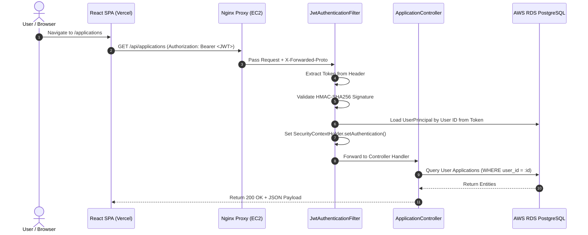

# Module 01: Authentication, Spring Security & OAuth2

This guide teaches the complete security architecture of **Trajectory**, detailing how Spring Security, JWT (JSON Web Tokens), Bcrypt password hashing, Google/GitHub OAuth2, and CORS origin controls interact across client and server layers.

---

## 1. What It Is
The security system in Trajectory is a **stateless, token-based authentication and authorization engine** implemented using **Spring Security 6**. Instead of using traditional HTTP sessions stored on the backend server, the server issues cryptographically signed JWT access tokens (short-lived, 24h) and refresh tokens (stored in database) to clients.

## 2. Why Trajectory Uses It
- **Stateless Decoupled Architecture:** Trajectory's frontend is hosted separately on Vercel's CDN, while the backend API runs on AWS EC2. Cookies tied to server sessions fail or require complex cross-domain configuration across distinct domains (`trajectory-mu-six.vercel.app` vs `trajectory-api.duckdns.org`).
- **Horizontal Scalability:** Stateless JWTs require no server-side memory lookups on every API request. Any backend instance can cryptographically verify incoming JWT signatures using a shared secret.

## 3. What Problem It Solves
- Eliminates sticky sessions and distributed session store complexities (like Redis session clusters).
- Eliminates CSRF (Cross-Site Request Forgery) vulnerability vectors typical of session-cookie authentication.
- Enables single sign-on (SSO) login options via Google and GitHub OAuth2 without requiring users to create manual passwords.

## 4. Where It Appears in This Repository
- **Backend Security Core:** `backend/src/main/java/com/trajectory/backend/security/`
- **Backend Security Config:** `backend/src/main/java/com/trajectory/backend/config/SecurityConfig.java`
- **Frontend Auth Store:** `frontend/src/store/authStore.ts`
- **Frontend Axios Interceptor:** `frontend/src/services/api.ts`

## 5. Every Related Configuration File
- [`backend/src/main/resources/application.yml`](file:///d:/vaibhav%20gupta/Coding/Projects----For%20Resume/Trajectory/backend/src/main/resources/application.yml) — Specifies `server.forward-headers-strategy: framework`, OAuth2 client ID/secret placeholders, and JWT secret key property mappings.
- [`.env.prod.example`](file:///d:/vaibhav%20gupta/Coding/Projects----For%20Resume/Trajectory/.env.prod.example) — Documents `JWT_SECRET_KEY`, `SPRING_SECURITY_OAUTH2_CLIENT_REGISTRATION_GOOGLE_CLIENT_ID`, and `GITHUB_CLIENT_ID`.

## 6. Every Important Class, File, Script, or Resource
- [`SecurityConfig.java`](file:///d:/vaibhav%20gupta/Coding/Projects----For%20Resume/Trajectory/backend/src/main/java/com/trajectory/backend/config/SecurityConfig.java) — Registers `SecurityFilterChain` bean, CORS policy, public endpoints, and filters.
- [`JwtTokenProvider.java`](file:///d:/vaibhav%20gupta/Coding/Projects----For%20Resume/Trajectory/backend/src/main/java/com/trajectory/backend/security/JwtTokenProvider.java) — Generates, signs, and parses HMAC SHA-256 JWT tokens.
- [`JwtAuthenticationFilter.java`](file:///d:/vaibhav%20gupta/Coding/Projects----For%20Resume/Trajectory/backend/src/main/java/com/trajectory/backend/security/JwtAuthenticationFilter.java) — Intercepts incoming HTTP requests, extracts `Bearer` header, validates token, and populates Spring's `SecurityContextHolder`.
- [`OAuth2AuthenticationSuccessHandler.java`](file:///d:/vaibhav%20gupta/Coding/Projects----For%20Resume/Trajectory/backend/src/main/java/com/trajectory/backend/security/OAuth2AuthenticationSuccessHandler.java) — Handles successful OAuth logins, provisions user in database, generates JWT, and redirects to frontend Vercel URL.
- [`MockOAuth2RedirectFilter.java`](file:///d:/vaibhav%20gupta/Coding/Projects----For%20Resume/Trajectory/backend/src/main/java/com/trajectory/backend/security/MockOAuth2RedirectFilter.java) — Dev helper that simulates OAuth redirection during local offline testing.

## 7. Complete Request/Response Execution Flow



## 8. How It Works Internally
1. **Password Hashing:** When registering via `POST /api/auth/register`, `PasswordEncoder` (`BCryptPasswordEncoder`) hashes raw passwords with a unique salt before saving to `users.password_hash`.
2. **JWT Structure:** Tokens produced by `JwtTokenProvider` consist of three Base64URL-encoded parts:
   - **Header:** Algorithm declaration (`{"alg": "HS256", "typ": "JWT"}`)
   - **Payload:** Claims (`sub` = user ID, `email`, `iat` = issued at, `exp` = expiry)
   - **Signature:** `HMACSHA256(header + "." + payload, secretKey)`
3. **Filter Pipeline Order:** Requests pass through `JwtAuthenticationFilter` *before* `UsernamePasswordAuthenticationFilter`. If valid, a `UsernamePasswordAuthenticationToken` is stored in the thread-local `SecurityContextHolder`.

## 9. How to Modify or Extend It Safely
- **Adding a Public Endpoint:** Edit `SecurityConfig.java` and append the path pattern to `requestMatchers(...)`:
  ```java
  .requestMatchers("/api/public/**", "/swagger-ui/**").permitAll()
  ```
- **Adding Roles/RBAC:** Add a `role` field to `User` model (`ROLE_USER`, `ROLE_ADMIN`), embed claims in `JwtTokenProvider.java`, and construct `GrantedAuthority` lists inside `UserPrincipal.java`.

## 10. Common Mistakes
- **Hardcoding HTTP Inbound Targets in OAuth Handlers:** Setting redirect URLs to `http://localhost:5173` breaking production OAuth redirects. Trajectory dynamically target-routes to `https://trajectory-mu-six.vercel.app`.
- **Forgetting `server.forward-headers-strategy: framework`:** Causing Spring Security behind Nginx proxy to generate HTTP redirect URIs instead of HTTPS, leading to Mixed Content browser errors.

## 11. Debugging Techniques
- **Test JWT Verification:** Decode tokens using [jwt.io](https://jwt.io) to inspect payload claims (`sub`, `exp`).
- **Inspect Security Context in Controller:** Add log statements in controllers:
  ```java
  UserPrincipal user = (UserPrincipal) SecurityContextHolder.getContext().getAuthentication().getPrincipal();
  log.info("Authenticated User ID: {}", user.getId());
  ```

## 12. Production Considerations
- **Secret Key Rotation:** Store `JWT_SECRET_KEY` in environment variables or AWS Secrets Manager. Key must be at least 256 bits (32 bytes) for HMAC-SHA256.

## 13. Security Considerations
- **XSS Mitigation:** Store JWT tokens carefully in client state.
- **Password Strength:** Bcrypt strength set to default work factor `10` (10 rounds of hashing), providing a strong balance between computational expense and CPU performance.

## 14. Best Practices Used in Trajectory
- Stateless JWT architecture with database refresh token revocation (`refresh_tokens` table).
- Thread-safe principal extraction via `@AuthenticationPrincipal UserPrincipal user`.

## 15. Practical Code Example from Trajectory

```java
// Snippet from JwtTokenProvider.java
public String generateToken(Authentication authentication) {
    UserPrincipal userPrincipal = (UserPrincipal) authentication.getPrincipal();
    Date now = new Date();
    Date expiryDate = new Date(now.getTime() + jwtExpirationInMs);

    return Jwts.builder()
            .subject(userPrincipal.getId().toString())
            .claim("email", userPrincipal.getEmail())
            .issuedAt(now)
            .expiration(expiryDate)
            .signWith(getSigningKey())
            .compact();
}
```

## 16. Architecture Diagram

```mermaid
graph TD
    subgraph Client ["Client Browser (Vercel SPA)"]
        Form["Login Form"]
        Store["Zustand Auth Store"]
    end

    subgraph Backend ["Spring Boot API (AWS EC2)"]
        AuthCtrl["AuthController"]
        JwtProv["JwtTokenProvider"]
        JwtFilt["JwtAuthenticationFilter"]
        SecCtx["SecurityContextHolder"]
    end

    subgraph Database ["AWS RDS PostgreSQL"]
        UserTable["users"]
        TokenTable["refresh_tokens"]
    end

    Form -->|POST /api/auth/login| AuthCtrl
    AuthCtrl -->|Verify Bcrypt Hash| UserTable
    AuthCtrl -->|Generate Access JWT| JwtProv
    AuthCtrl -->|Persist Refresh Token| TokenTable
    AuthCtrl -->>|Return Token Pair| Store
    
    Store -->|Bearer JWT Header| JwtFilt
    JwtFilt -->|Populate Authentication| SecCtx
```

## 17. Reference Source Files
- [`SecurityConfig.java`](file:///d:/vaibhav%20gupta/Coding/Projects----For%20Resume/Trajectory/backend/src/main/java/com/trajectory/backend/config/SecurityConfig.java)
- [`JwtTokenProvider.java`](file:///d:/vaibhav%20gupta/Coding/Projects----For%20Resume/Trajectory/backend/src/main/java/com/trajectory/backend/security/JwtTokenProvider.java)
- [`JwtAuthenticationFilter.java`](file:///d:/vaibhav%20gupta/Coding/Projects----For%20Resume/Trajectory/backend/src/main/java/com/trajectory/backend/security/JwtAuthenticationFilter.java)
- [`OAuth2AuthenticationSuccessHandler.java`](file:///d:/vaibhav%20gupta/Coding/Projects----For%20Resume/Trajectory/backend/src/main/java/com/trajectory/backend/security/OAuth2AuthenticationSuccessHandler.java)
