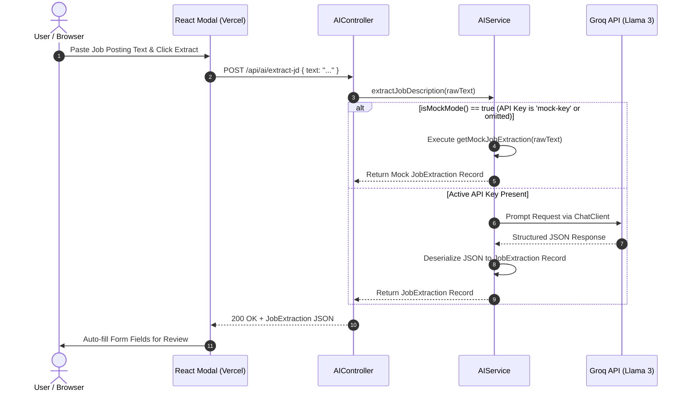

# Module 02: Spring AI & LLM Prompt Orchestration

This guide explains the AI automation engine of **Trajectory**, showing how Spring AI orchestrates Large Language Model (LLM) prompts against **Groq Cloud (Llama 3)**, converts outputs into strongly-typed Java records, and gracefully falls back to mock algorithms when offline.

---

## 1. What It Is
Spring AI is Spring's framework for integrating machine learning models into Java applications. In Trajectory, `AIService.java` uses Spring AI's `ChatClient` abstraction to parse raw unstructured text (job postings, interview email invites, recruiter messages) into structured JSON payloads.

## 2. Why Trajectory Uses It
- **Unified Abstraction:** Spring AI provides an OpenAI-compatible protocol interface (`ChatClient`). If Trajectory switches from Groq Cloud to OpenAI or Google Gemini, no prompt code changes are needed—only configuration URL updates.
- **Type-Safe Entity Conversion:** Standard Spring AI converters automatically deserialize LLM JSON outputs directly into Java 21 `record` classes (`JobExtraction`, `EventExtraction`, `OutreachAnalysis`).

## 3. What Problem It Solves
- Eliminates manual data entry when users add job applications or schedule invites.
- Eliminates fragile regex scrapers that break whenever job posting layout structures change.
- Provides high-speed inference (800+ tokens/sec on Groq Llama 3) with zero latency bottleneck for the end user.

## 4. Where It Appears in This Repository
- **Service Layer:** [`AIService.java`](file:///d:/vaibhav%20gupta/Coding/Projects----For%20Resume/Trajectory/backend/src/main/java/com/trajectory/backend/service/AIService.java)
- **Controller Layer:** [`AIController.java`](file:///d:/vaibhav%20gupta/Coding/Projects----For%20Resume/Trajectory/backend/src/main/java/com/trajectory/backend/controller/AIController.java)
- **DTO Records:** [`backend/src/main/java/com/trajectory/backend/dto/`](file:///d:/vaibhav%20gupta/Coding/Projects----For%20Resume/Trajectory/backend/src/main/java/com/trajectory/backend/dto/) (`JobExtraction.java`, `EventExtraction.java`, `OutreachAnalysis.java`)
- **Prompt Spec:** [`Docs/PromptSkills.md`](file:///d:/vaibhav%20gupta/Coding/Projects----For%20Resume/Trajectory/Docs/PromptSkills.md)

## 5. Every Related Configuration File
- [`application.yml`](file:///d:/vaibhav%20gupta/Coding/Projects----For%20Resume/Trajectory/backend/src/main/resources/application.yml) — Specifies properties:
  ```yaml
  spring:
    ai:
      openai:
        api-key: ${SPRING_AI_OPENAI_API_KEY:mock-key}
        base-url: ${SPRING_AI_OPENAI_BASE_URL:https://api.groq.com/openai/v1}
        chat:
          options:
            model: ${SPRING_AI_OPENAI_MODEL:llama3-8b-8192}
  ```

## 6. Every Important Class, File, Script, or Resource
- [`AIService.java`](file:///d:/vaibhav%20gupta/Coding/Projects----For%20Resume/Trajectory/backend/src/main/java/com/trajectory/backend/service/AIService.java) — Core service bean with `ChatClient`, `isMockMode()`, and fallback methods.
- [`JobExtraction.java`](file:///d:/vaibhav%20gupta/Coding/Projects----For%20Resume/Trajectory/backend/src/main/java/com/trajectory/backend/dto/JobExtraction.java) — Record for extracted job attributes.
- [`EventExtraction.java`](file:///d:/vaibhav%20gupta/Coding/Projects----For%20Resume/Trajectory/backend/src/main/java/com/trajectory/backend/dto/EventExtraction.java) — Record for parsed calendar invite events.
- [`OutreachAnalysis.java`](file:///d:/vaibhav%20gupta/Coding/Projects----For%20Resume/Trajectory/backend/src/main/java/com/trajectory/backend/dto/OutreachAnalysis.java) — Record for recruiter reply sentiment analysis.

## 7. Complete Request/Response Execution Flow



## 8. How It Works Internally
1. **ChatClient Injection:** `AIService` accepts `ChatClient.Builder` in constructor and calls `.build()`.
2. **Dynamic Parameter Injection:** For schedule event extractions, `AIService` dynamically injects `{current_date}` formatted as `ISO_LOCAL_DATE` (`YYYY-MM-DD`) so the LLM correctly parses relative dates ("this coming Tuesday").
3. **Structured Entity Conversion:** Spring AI appends implicit JSON schema instructions to the prompt and deserializes the model's response directly into the target Java `record` using Jackson `ObjectMapper`.
4. **Mock Fallback Mechanics:** `isMockMode()` evaluates to `true` if `apiKey` is blank or equals `"mock-key"`. If true, or if an exception occurs during HTTP execution against Groq Cloud, `AIService` falls back to regex-based parsing (`getMockJobExtraction()`) ensuring 100% continuous local application availability.

## 9. How to Modify or Extend It Safely
- **Adding a New AI Skill:**
  1. Define a Java `record` in `dto/` (e.g. `CoverLetterGeneration`).
  2. Add a new service method in `AIService.java` with system prompts and fallback:
     ```java
     public CoverLetterGeneration generateCoverLetter(String jdText, String resumeText) { ... }
     ```
  3. Expose REST endpoint in `AIController.java`.

## 10. Common Mistakes
- **Expecting LLMs to Format Relative Dates Without Base Context:** LLMs do not know "today's date" unless supplied in the prompt template context (`{current_date}`).

## 11. Debugging Techniques
- **Enable Spring AI Wire Logging:** Add to `application.yml`:
  ```yaml
  logging:
    level:
      org.springframework.ai: DEBUG
  ```
- **Force Mock Mode locally:** Set `SPRING_AI_OPENAI_API_KEY=mock-key` in `.env` to test UI form pre-population without consuming Groq rate limits.

## 12. Production Considerations
- **Groq API Rate Limits:** Free tier allows up to 30 requests/min. The fallback mechanism guarantees service integrity even if rate limits are exceeded.

## 13. Security Considerations
- **Data Privacy:** Raw job descriptions and recruiter responses are submitted over TLS (HTTPS) directly to Groq Cloud API. No user PII or password credentials are sent to LLM prompts.

## 14. Best Practices Used in Trajectory
- Non-blocking design running on JDK 21 Virtual Threads.
- Automatic fallback pattern preventing LLM outage cascades.

## 15. Practical Code Example from Trajectory

```java
// Snippet from AIService.java
public JobExtraction extractJobDescription(String rawJdText) {
    log.info("Extracting Job Description. Mock Mode: {}", isMockMode());
    if (isMockMode()) {
        return getMockJobExtraction(rawJdText);
    }

    try {
        return chatClient.prompt()
                .user(u -> u
                        .text("You are an expert Career Data Analyst. Your task is to parse raw job descriptions into structured data. Return ONLY a valid JSON object.\n\nText to Parse:\n{raw_jd_text}")
                        .param("raw_jd_text", rawJdText)
                )
                .call()
                .entity(JobExtraction.class);
    } catch (Exception e) {
        log.error("Spring AI extraction failed, falling back to mock: {}", e.getMessage());
        return getMockJobExtraction(rawJdText);
    }
}
```

## 16. Architecture Diagram

```mermaid
graph TD
    subgraph SpringBoot ["Spring Boot Backend Service"]
        Controller["AIController"]
        AIService["AIService"]
        MockEngine["Regex Mock Parser"]
    end

    subgraph External ["External Cloud Provider"]
        Groq["Groq Cloud API (Llama 3)"]
    end

    Controller -->|Request| AIService
    AIService -->|Check API Key| Decider{isMockMode?}
    Decider -->|True / On Error| MockEngine
    Decider -->|False| Groq
    Groq -->>|JSON Output| AIService
    MockEngine -->>|Fallback Payload| AIService
    AIService -->>|JobExtraction Record| Controller
```

## 17. Reference Source Files
- [`AIService.java`](file:///d:/vaibhav%20gupta/Coding/Projects----For%20Resume/Trajectory/backend/src/main/java/com/trajectory/backend/service/AIService.java)
- [`AIController.java`](file:///d:/vaibhav%20gupta/Coding/Projects----For%20Resume/Trajectory/backend/src/main/java/com/trajectory/backend/controller/AIController.java)
- [`JobExtraction.java`](file:///d:/vaibhav%20gupta/Coding/Projects----For%20Resume/Trajectory/backend/src/main/java/com/trajectory/backend/dto/JobExtraction.java)
- [`PromptSkills.md`](file:///d:/vaibhav%20gupta/Coding/Projects----For%20Resume/Trajectory/Docs/PromptSkills.md)
