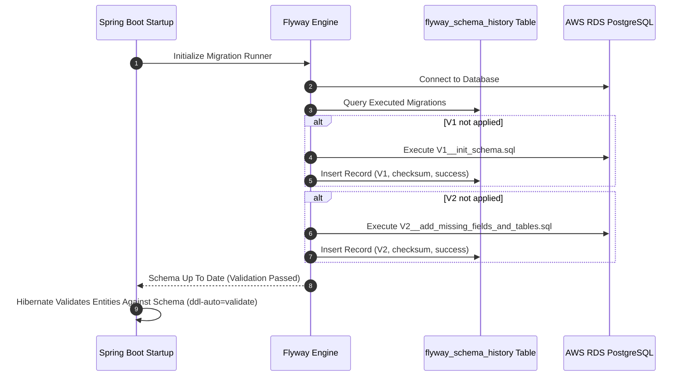
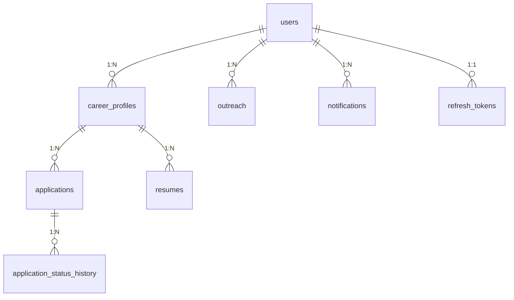

# Module 03: Database Architecture, Flyway Migrations & JPA Persistence

This guide teaches the database architecture of **Trajectory**, showing how PostgreSQL relational databases, programmatically versioned **Flyway** migrations, Hibernate ORM entity mappings, indexes, and custom Spring Data JPA queries interact.

---

## 1. What It Is
The persistence layer of Trajectory utilizes **PostgreSQL 16** (AWS RDS in Production / Docker in Local Dev), managed through programmatic DDL migrations via **Flyway** (`flyway-core`) and accessed in Java via **Spring Data JPA** (Hibernate).

## 2. Why Trajectory Uses It
- **Version-Controlled Database Schema:** Manually executing SQL scripts on servers leads to environment drift. Flyway ensures that local Docker databases and production AWS RDS databases apply SQL migrations in exact sequential order.
- **ORM Productive Mapping:** JPA `@Entity` classes map SQL rows to strongly-typed Java objects, handling join conditions, transaction management (`@Transactional`), and foreign key cascades.

## 3. What Problem It Solves
- Prevents database schema mismatch bugs between dev and prod environments.
- Automates foreign key cascading (`ON DELETE CASCADE`) to clean up orphan records (e.g. deleting a user automatically removes their applications, outreach, and resumes).
- Provides high-performance indexing (`CREATE INDEX idx_applications_user ON applications(user_id)`) preventing full-table scans.

## 4. Where It Appears in This Repository
- **Flyway Migration Scripts:** [`backend/src/main/resources/db/migration/`](file:///d:/vaibhav%20gupta/Coding/Projects----For%20Resume/Trajectory/backend/src/main/resources/db/migration/) (`V1__init_schema.sql`, `V2__add_missing_fields_and_tables.sql`)
- **JPA Entity Models:** [`backend/src/main/java/com/trajectory/backend/model/`](file:///d:/vaibhav%20gupta/Coding/Projects----For%20Resume/Trajectory/backend/src/main/java/com/trajectory/backend/model/) (`User.java`, `Application.java`, `Outreach.java`, `Resume.java`, `Notification.java`)
- **Spring Data Repositories:** [`backend/src/main/java/com/trajectory/backend/repository/`](file:///d:/vaibhav%20gupta/Coding/Projects----For%20Resume/Trajectory/backend/src/main/java/com/trajectory/backend/repository/)

## 5. Every Related Configuration File
- [`application.yml`](file:///d:/vaibhav%20gupta/Coding/Projects----For%20Resume/Trajectory/backend/src/main/resources/application.yml) — Specifies:
  ```yaml
  spring:
    datasource:
      url: ${SPRING_DATASOURCE_URL:jdbc:postgresql://localhost:5432/trajectory_os}
      username: ${SPRING_DATASOURCE_USERNAME:trajectory_user}
      password: ${SPRING_DATASOURCE_PASSWORD:trajectory_password}
    jpa:
      hibernate:
        ddl-auto: validate
      show-sql: false
    flyway:
      enabled: true
      baseline-on-migrate: true
      locations: classpath:db/migration
  ```

## 6. Every Important Class, File, Script, or Resource
- [`V1__init_schema.sql`](file:///d:/vaibhav%20gupta/Coding/Projects----For%20Resume/Trajectory/backend/src/main/resources/db/migration/V1__init_schema.sql) — Initial schema creating ENUM types, users, career_profiles, resumes, applications, application_status_history, outreach, company_documents, and indexes.
- [`V2__add_missing_fields_and_tables.sql`](file:///d:/vaibhav%20gupta/Coding/Projects----For%20Resume/Trajectory/backend/src/main/resources/db/migration/V2__add_missing_fields_and_tables.sql) — Migration adding `is_archived`, `oa_date_time`, `interview_date_time`, `meeting_link`, `notifications`, and `refresh_tokens`.
- [`ApplicationRepository.java`](file:///d:/vaibhav%20gupta/Coding/Projects----For%20Resume/Trajectory/backend/src/main/java/com/trajectory/backend/repository/ApplicationRepository.java) — Data access interface providing custom `@Query` JPQL methods for funnel aggregations and ghost detection scans.

## 7. Complete Request/Response Execution Flow



## 8. How It Works Internally
1. **Flyway Execution Lifecycle:** At application startup, Flyway checks the `flyway_schema_history` table inside PostgreSQL. If new migration files exist in `db/migration/`, Flyway runs them inside a database transaction and records the file checksum.
2. **PostgreSQL ENUM Mapping:** ENUM types created in SQL (`application_status`, `outreach_status`) are mapped in Java entities using `@Enumerated(EnumType.STRING)` to ensure DB string consistency.
3. **Hibernate DDL Validation:** `spring.jpa.hibernate.ddl-auto: validate` instructs Hibernate *never* to alter database tables automatically. Instead, Hibernate verifies that entity properties match the table schema created by Flyway, failing startup if a mismatch exists.

## 9. How to Modify or Extend It Safely
- **Adding a New Column:**
  1. Never modify an existing applied migration file (`V1` or `V2`).
  2. Create a new SQL migration file following Flyway naming conventions:
     `backend/src/main/resources/db/migration/V3__add_new_feature_columns.sql`
  3. Add the field to the corresponding Java `@Entity` class in `model/`.

## 10. Common Mistakes
- **Modifying an Already-Applied Migration File:** Changing `V1` or `V2` will break Flyway checksum validation at startup (`FlywayException: Validate failed: Checksum mismatch`).
- **N+1 Query Problem:** Forgetting to fetch linked entities in a single query. Use `@EntityGraph` or custom `JOIN FETCH` queries in Spring Data Repositories.

## 11. Debugging Techniques
- **Check Flyway History Table:** Query `SELECT * FROM flyway_schema_history;` in psql to check execution logs and checksums.
- **Repair Flyway Checksums:** If a migration failed during local dev, run `mvn flyway:repair` or delete the corrupt row from `flyway_schema_history`.

## 12. Production Considerations
- **AWS RDS Connections:** Connection pooling is handled via Spring Boot's default HikariCP (`maximum-pool-size: 10`).

## 13. Security Considerations
- **SQL Injection Prevention:** All Spring Data JPA methods use parameterized JPQL queries or prepared statements, completely immune to SQL injection attacks.

## 14. Best Practices Used in Trajectory
- Transaction boundaries enforced using `@Transactional(readOnly = true)` for GET queries and `@Transactional` for state modifications.
- Indexed foreign key columns (`idx_applications_user`, `idx_applications_status`, `idx_outreach_user`).

## 15. Practical Code Example from Trajectory

```java
// Snippet from ApplicationRepository.java
@Repository
public interface ApplicationRepository extends JpaRepository<Application, UUID> {

    List<Application> findByUserIdOrderByCreatedAtDesc(UUID userId);

    @Query("SELECT a FROM Application a WHERE a.user.id = :userId AND a.status = :status")
    List<Application> findByUserIdAndStatus(@Param("userId") UUID userId, @Param("status") ApplicationStatus status);

    @Query("SELECT a FROM Application a WHERE a.status IN ('APPLIED', 'OA', 'INTERVIEW') AND a.lastActivityAt < :thresholdDate")
    List<Application> findInactiveApplications(@Param("thresholdDate") LocalDateTime thresholdDate);
}
```

## 16. Architecture Diagram



## 17. Reference Source Files
- [`V1__init_schema.sql`](file:///d:/vaibhav%20gupta/Coding/Projects----For%20Resume/Trajectory/backend/src/main/resources/db/migration/V1__init_schema.sql)
- [`V2__add_missing_fields_and_tables.sql`](file:///d:/vaibhav%20gupta/Coding/Projects----For%20Resume/Trajectory/backend/src/main/resources/db/migration/V2__add_missing_fields_and_tables.sql)
- [`Application.java`](file:///d:/vaibhav%20gupta/Coding/Projects----For%20Resume/Trajectory/backend/src/main/java/com/trajectory/backend/model/Application.java)
- [`ApplicationRepository.java`](file:///d:/vaibhav%20gupta/Coding/Projects----For%20Resume/Trajectory/backend/src/main/java/com/trajectory/backend/repository/ApplicationRepository.java)
