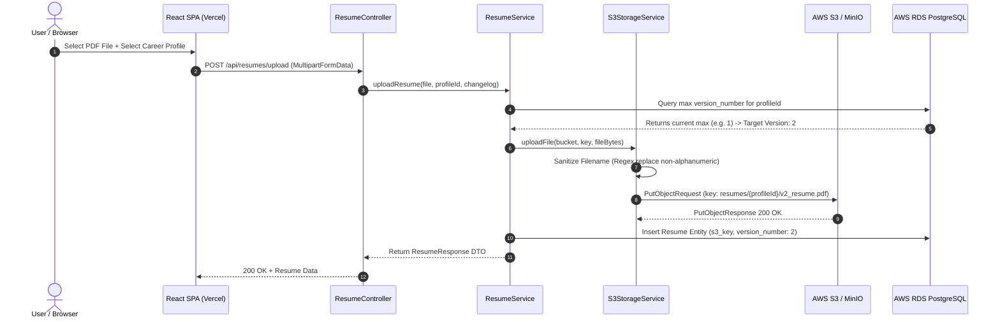
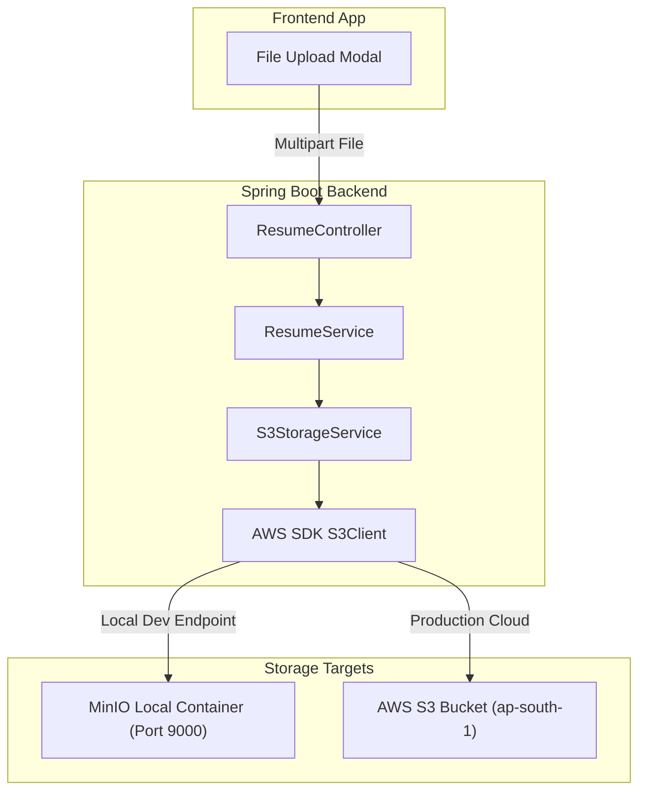

# Module 04: AWS S3 Object Storage & Resume File Pipeline

This guide teaches the cloud file management system of **Trajectory**, detailing how AWS SDK v2, MinIO local container storage, `S3StorageService.java`, filename sanitization, multipart PDF uploads, and auto-incrementing resume versioning operate.

---

## 1. What It Is
The file storage subsystem in Trajectory is an **S3-compatible object storage architecture**. It manages versioned PDF resumes (`resumes` bucket) and private company eligibility documents (`company-docs` bucket) using AWS SDK v2 (`software.amazon.awssdk:s3`).

## 2. Why Trajectory Uses It
- **Decoupled Binary Storage:** Database tables (`resumes`, `company_documents`) store light text metadata and S3 key references (`s3_key`), keeping PostgreSQL lean, fast, and backup-friendly.
- **S3 Standard Interface Compatibility:** MinIO runs locally in Docker exposing an S3 API (`http://localhost:9000`), allowing developers to test file uploads offline without incurring AWS cloud storage charges.

## 3. What Problem It Solves
- Prevents database bloat caused by storing binary files (BLOBs) directly inside PostgreSQL.
- Automatically handles file versioning (`v1` ➔ `v2` ➔ `v3`) for a specific `CareerProfile`, allowing users to track which resume iteration yields higher response rates.
- Protects server filesystem disks by offloading storage to scalable object stores.

## 4. Where It Appears in This Repository
- **S3 Configuration:** [`S3Config.java`](file:///d:/vaibhav%20gupta/Coding/Projects----For%20Resume/Trajectory/backend/src/main/java/com/trajectory/backend/config/S3Config.java)
- **S3 Storage Service:** [`S3StorageService.java`](file:///d:/vaibhav%20gupta/Coding/Projects----For%20Resume/Trajectory/backend/src/main/java/com/trajectory/backend/service/S3StorageService.java)
- **Resume Service:** [`ResumeService.java`](file:///d:/vaibhav%20gupta/Coding/Projects----For%20Resume/Trajectory/backend/src/main/java/com/trajectory/backend/service/ResumeService.java)
- **Controllers:** `ResumeController.java` (`/api/resumes/upload`), `CompanyDocumentController.java` (`/api/documents/upload`)

## 5. Every Related Configuration File
- [`application.yml`](file:///d:/vaibhav%20gupta/Coding/Projects----For%20Resume/Trajectory/backend/src/main/resources/application.yml) — Specifies:
  ```yaml
  aws:
    region: ${AWS_REGION:ap-south-1}
    s3:
      bucket:
        resumes: ${AWS_S3_BUCKET_RESUMES:resumes}
        company-docs: ${AWS_S3_BUCKET_COMPANY_DOCS:company-docs}
      endpoint: ${AWS_S3_ENDPOINT:} # Used for MinIO in local dev
  ```

## 6. Every Important Class, File, Script, or Resource
- [`S3Config.java`](file:///d:/vaibhav%20gupta/Coding/Projects----For%20Resume/Trajectory/backend/src/main/java/com/trajectory/backend/config/S3Config.java) — Provisions `S3Client` bean with AWS credentials and optional endpoint override for MinIO.
- [`S3StorageService.java`](file:///d:/vaibhav%20gupta/Coding/Projects----For%20Resume/Trajectory/backend/src/main/java/com/trajectory/backend/service/S3StorageService.java) — Provides `uploadFile()`, `downloadFile()`, `deleteFile()`, and filename sanitization.
- [`ResumeService.java`](file:///d:/vaibhav%20gupta/Coding/Projects----For%20Resume/Trajectory/backend/src/main/java/com/trajectory/backend/service/ResumeService.java) — Computes next version number (`maxVersion + 1`), invokes `S3StorageService`, and persists `Resume` entity.

## 7. Complete Request/Response Execution Flow



## 8. How It Works Internally
1. **Filename Sanitization:** To prevent path traversal attacks (`../../../etc/passwd`), `S3StorageService.java` cleans filenames:
   ```java
   String sanitizedFilename = originalFilename.replaceAll("[^a-zA-Z0-9._-]", "_");
   ```
2. **Version Calculation:** `ResumeRepository` executes `findMaxVersionByProfileId(profileId)`. If no resumes exist, version begins at `1`. Otherwise, version is incremented to `maxVersion + 1`.
3. **Storage Abstraction:** If `AWS_S3_ENDPOINT` is provided (local MinIO), `S3Config.java` configures `S3Client` with `endpointOverride(URI.create(endpoint))` and `forcePathStyle(true)`. In AWS production, `endpoint` is blank, so `S3Client` connects directly to `s3.ap-south-1.amazonaws.com`.

## 9. How to Modify or Extend It Safely
- **Adding File Type Constraints:** Validate MIME type in `ResumeController.java`:
  ```java
  if (!"application/pdf".equals(file.getContentType())) {
      throw new IllegalArgumentException("Only PDF files are allowed.");
  }
  ```

## 10. Common Mistakes
- **Forgetting `forcePathStyle(true)` on MinIO:** Standard AWS S3 uses virtual-hosted-style URLs (`bucket.s3.amazonaws.com`). Local MinIO requires path-style URLs (`localhost:9000/bucket`).

## 11. Debugging Techniques
- **Verify Local MinIO Storage:** Open `http://localhost:9001` in browser (MinIO Console) using credentials `trajectory_admin` / `trajectory_storage_secret` to inspect uploaded bucket objects.
- **Inspect S3 Errors:** Catch `S3Exception` in Java logs to read AWS error codes (`NoSuchBucket`, `AccessDenied`).

## 12. Production Considerations
- **AWS S3 Lifecycle Policies:** Configure bucket lifecycle rules to transition old resume versions to Infrequent Access (S3 Standard-IA) after 90 days to minimize cloud costs.

## 13. Security Considerations
- **Private Access:** S3 buckets must block public read access (`BlockPublicAccess`). Binary content is streamed through the authenticated Spring Boot API (`/api/resumes/{id}/download`).

## 14. Best Practices Used in Trajectory
- AWS SDK v2 non-blocking client execution.
- Deterministic key naming structure: `{bucket}/{profile_id}/v{version}_{filename}`.

## 15. Practical Code Example from Trajectory

```java
// Snippet from S3StorageService.java
public String uploadFile(String bucketName, String key, byte[] content, String contentType) {
    try {
        PutObjectRequest putObjectRequest = PutObjectRequest.builder()
                .bucket(bucketName)
                .key(key)
                .contentType(contentType)
                .build();

        s3Client.putObject(putObjectRequest, RequestBody.fromBytes(content));
        log.info("Successfully uploaded file to S3 bucket: {}, key: {}", bucketName, key);
        return key;
    } catch (S3Exception e) {
        log.error("Failed to upload file to S3: {}", e.awsErrorDetails().errorMessage());
        throw new RuntimeException("S3 Upload Failed: " + e.getMessage());
    }
}
```

## 16. Architecture Diagram



## 17. Reference Source Files
- [`S3Config.java`](file:///d:/vaibhav%20gupta/Coding/Projects----For%20Resume/Trajectory/backend/src/main/java/com/trajectory/backend/config/S3Config.java)
- [`S3StorageService.java`](file:///d:/vaibhav%20gupta/Coding/Projects----For%20Resume/Trajectory/backend/src/main/java/com/trajectory/backend/service/S3StorageService.java)
- [`ResumeService.java`](file:///d:/vaibhav%20gupta/Coding/Projects----For%20Resume/Trajectory/backend/src/main/java/com/trajectory/backend/service/ResumeService.java)
- [`ResumeController.java`](file:///d:/vaibhav%20gupta/Coding/Projects----For%20Resume/Trajectory/backend/src/main/java/com/trajectory/backend/controller/ResumeController.java)
