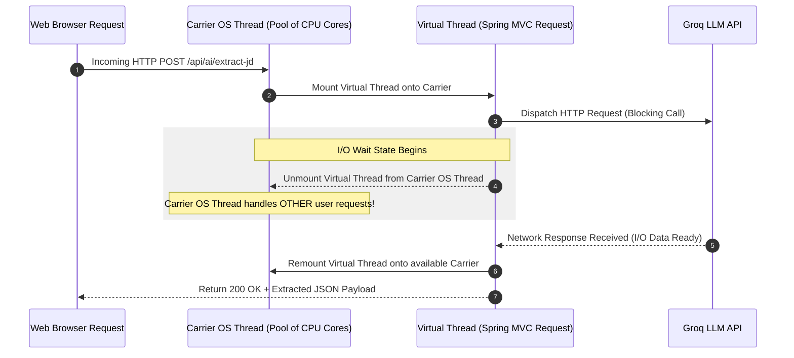
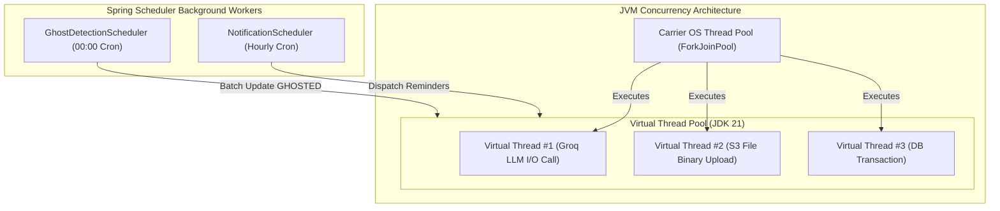

# Module 05: Java 21 Virtual Threads & Background Daemons

This guide teaches the concurrency architecture of **Trajectory**, detailing how Java 21 Virtual Threads (`Project Loom`), Spring Boot's task executor, and Spring Scheduler background daemons handle high-throughput parallel execution.

---

## 1. What It Is
Virtual Threads (`java.lang.Thread.ofVirtual()`) are lightweight user-mode threads introduced in JDK 21. Unlike traditional platform threads (which wrap 1-to-1 OS kernel threads), thousands of virtual threads run on top of a small pool of carrier OS threads.

## 2. Why Trajectory Uses It
- **I/O-Heavy Application Nature:** Trajectory frequently performs blocking network I/O calls: querying external Groq LLM APIs (500ms–2000ms), uploading PDF binaries to AWS S3, and querying AWS RDS PostgreSQL.
- **Zero Configuration Concurrency:** By setting `spring.threads.virtual.enabled=true` in `application.yml`, Spring Boot automatically configures Embedded Tomcat and task execution threads to run as Virtual Threads.

## 3. What Problem It Solves
- Eliminates thread starvation under high concurrent load. In traditional Spring Boot applications, Tomcat uses a thread pool of 200 platform threads. If 200 requests are simultaneously blocked waiting for Groq LLM API responses, incoming HTTP requests get rejected (503 Service Unavailable).
- With Virtual Threads, when a request blocks on Groq LLM HTTP I/O, the Virtual Thread unmounts from its carrier OS thread, allowing the carrier OS thread to execute other incoming requests.

## 4. Where It Appears in This Repository
- **Configuration:** [`application.yml`](file:///d:/vaibhav%20gupta/Coding/Projects----For%20Resume/Trajectory/backend/src/main/resources/application.yml) (`spring.threads.virtual.enabled=true`)
- **Ghost Detection Scheduler:** [`GhostDetectionScheduler.java`](file:///d:/vaibhav%20gupta/Coding/Projects----For%20Resume/Trajectory/backend/src/main/java/com/trajectory/backend/scheduler/GhostDetectionScheduler.java)
- **Notification Scheduler:** [`NotificationScheduler.java`](file:///d:/vaibhav%20gupta/Coding/Projects----For%20Resume/Trajectory/backend/src/main/java/com/trajectory/backend/scheduler/NotificationScheduler.java)

## 5. Every Related Configuration File
- [`application.yml`](file:///d:/vaibhav%20gupta/Coding/Projects----For%20Resume/Trajectory/backend/src/main/resources/application.yml) — Specifies:
  ```yaml
  spring:
    threads:
      virtual:
        enabled: true
  ```
- [`BackendApplication.java`](file:///d:/vaibhav%20gupta/Coding/Projects----For%20Resume/Trajectory/backend/src/main/java/com/trajectory/backend/BackendApplication.java) — Annotated with `@EnableScheduling`.

## 6. Every Important Class, File, Script, or Resource
- [`BackendApplication.java`](file:///d:/vaibhav%20gupta/Coding/Projects----For%20Resume/Trajectory/backend/src/main/java/com/trajectory/backend/BackendApplication.java) — Main entry point activating Spring Scheduler.
- [`GhostDetectionScheduler.java`](file:///d:/vaibhav%20gupta/Coding/Projects----For%20Resume/Trajectory/backend/src/main/java/com/trajectory/backend/scheduler/GhostDetectionScheduler.java) — Cron daemon running at 00:00 server time.
- [`NotificationScheduler.java`](file:///d:/vaibhav%20gupta/Coding/Projects----For%20Resume/Trajectory/backend/src/main/java/com/trajectory/backend/scheduler/NotificationScheduler.java) — Cron daemon scanning for upcoming OA/Interview deadlines every hour.

## 7. Complete Request/Response Execution Flow



## 8. How It Works Internally
1. **Unmounting on Blocking Operations:** When a Virtual Thread hits a blocking operation (`SocketInputStream.read()`, `Thread.sleep()`), the JVM captures the thread's call stack in heap memory and unmounts it from the underlying ForkJoinPool carrier thread.
2. **Spring Scheduler Cron Mechanics:** `@Scheduled(cron = "0 0 0 * * ?")` fires `GhostDetectionScheduler` daily. It calculates threshold timestamps:
   ```java
   LocalDateTime cutoffDate = LocalDateTime.now().minusDays(user.getGhostThresholdDays());
   ```
   It batch-updates matching applications to `GHOSTED` status and logs audit records in `application_status_history`.

## 9. How to Modify or Extend It Safely
- **Adding a Scheduled Task:**
  1. Ensure `@EnableScheduling` is present on `BackendApplication.java`.
  2. Create a Spring `@Component` class.
  3. Add a `@Scheduled` annotated method:
     ```java
     @Scheduled(cron = "0 0 12 * * ?") // Runs daily at 12:00 PM
     public void sendDailySummaryEmails() { ... }
     ```

## 10. Common Mistakes
- **Pinning Virtual Threads with Synchronized Blocks:** Using `synchronized` blocks containing blocking I/O prevents Virtual Threads from unmounting from the carrier OS thread ("pinning"). Use `java.util.concurrent.locks.ReentrantLock` instead.

## 11. Debugging Techniques
- **Verify Virtual Thread Execution:** Print thread info in logs:
  ```java
  log.info("Current Thread: {}", Thread.currentThread());
  // Output: VirtualThread[#42]/runnable@ForkJoinPool-1-worker-1
  ```

## 12. Production Considerations
- **Memory Overhead:** Millions of Virtual Threads can be instantiated, but heap space must be sufficient to hold unmounted stack frames. Trajectory's AWS EC2 instance (`t2.micro` / `t3.micro`) runs comfortably under JVM heap limits (`-Xmx512m`).

## 13. Security Considerations
- **Isolated User Context:** Background scheduled daemons run outside HTTP request threads. Ensure scheduled daemons query records explicitly filtered by `user_id` to prevent cross-tenant data leaks.

## 14. Best Practices Used in Trajectory
- Declarative virtual thread activation via Spring Boot 3.3.1 auto-configuration.
- Non-blocking daemon schedules with transactional batch processing.

## 15. Practical Code Example from Trajectory

```java
// Snippet from GhostDetectionScheduler.java
@Component
@Slf4j
@RequiredArgsConstructor
public class GhostDetectionScheduler {

    private final ApplicationRepository applicationRepository;
    private final UserRepository userRepository;

    @Scheduled(cron = "0 0 0 * * ?") // Runs every night at midnight
    @Transactional
    public void checkForGhostedApplications() {
        log.info("Starting automated ghost detection background job...");
        List<User> users = userRepository.findAll();
        
        for (User user : users) {
            int threshold = user.getGhostThresholdDays();
            LocalDateTime cutoff = LocalDateTime.now().minusDays(threshold);
            
            List<Application> inactiveApps = applicationRepository
                .findByUserIdAndStatusInAndLastActivityAtBefore(
                    user.getId(), 
                    List.of(ApplicationStatus.APPLIED, ApplicationStatus.OA, ApplicationStatus.INTERVIEW),
                    cutoff
                );
                
            for (Application app : inactiveApps) {
                app.setStatus(ApplicationStatus.GHOSTED);
                log.info("Flagged application {} as GHOSTED due to {} days of inactivity", app.getId(), threshold);
            }
        }
    }
}
```

## 16. Architecture Diagram



## 17. Reference Source Files
- [`BackendApplication.java`](file:///d:/vaibhav%20gupta/Coding/Projects----For%20Resume/Trajectory/backend/src/main/java/com/trajectory/backend/BackendApplication.java)
- [`GhostDetectionScheduler.java`](file:///d:/vaibhav%20gupta/Coding/Projects----For%20Resume/Trajectory/backend/src/main/java/com/trajectory/backend/scheduler/GhostDetectionScheduler.java)
- [`NotificationScheduler.java`](file:///d:/vaibhav%20gupta/Coding/Projects----For%20Resume/Trajectory/backend/src/main/java/com/trajectory/backend/scheduler/NotificationScheduler.java)
- [`application.yml`](file:///d:/vaibhav%20gupta/Coding/Projects----For%20Resume/Trajectory/backend/src/main/resources/application.yml)
