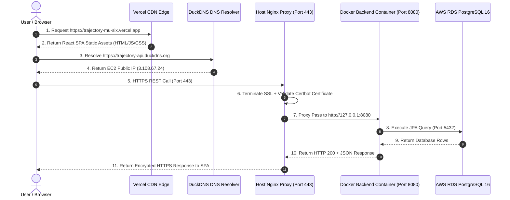
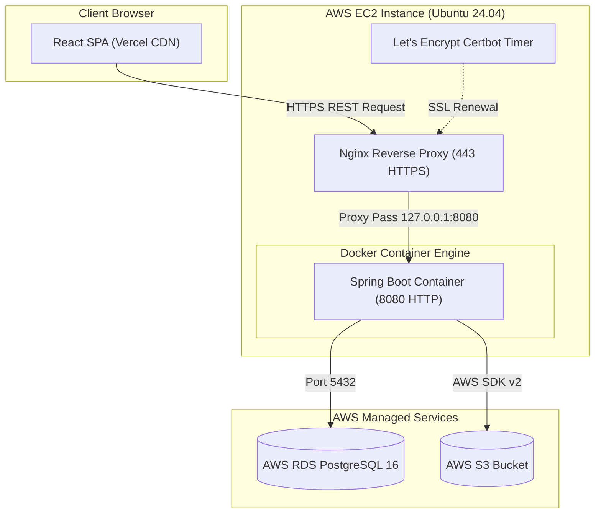

# Module 06: Production Cloud Infrastructure & Nginx Proxying

This guide teaches the cloud infrastructure architecture of **Trajectory**, detailing how AWS EC2, AWS RDS PostgreSQL, AWS S3, Vercel Edge SPA, Nginx reverse proxying, Let's Encrypt Certbot SSL renewal, and DuckDNS operate together.

---

## 1. What It Is
Trajectory's production environment is a **cloud-native, multi-provider deployment infrastructure**. The frontend React SPA is hosted on **Vercel's Edge CDN** (`trajectory-mu-six.vercel.app`), while the backend REST API runs inside a Docker container on an **AWS EC2 instance** (`trajectory-api.duckdns.org`), connected to **AWS RDS PostgreSQL 16** and **AWS S3**.

## 2. Why Trajectory Uses It
- **Cost-Effective Cloud Architecture:** Hosting static React frontend assets on Vercel's global CDN is free, fast, and offloads web server load from EC2. Running single backend container instances on EC2 backed by managed RDS and S3 provides dedicated compute and reliable database durability.
- **SSL & Proxy Isolation:** Nginx acts as a host-native reverse proxy on port `443` (HTTPS), enforcing SSL/TLS encryption via Let's Encrypt Certbot and proxying internal traffic to container port `8080`.

## 3. What Problem It Solves
- Eliminates HTTP non-secure browser warnings by enforcing HTTPS encryption.
- Solves CORS preflight issues by establishing clean domain mappings.
- Prevents container exposure: Container port `8080` is bound locally to `127.0.0.1` and protected by AWS Security Groups.

## 4. Where It Appears in This Repository
- **Production Compose File:** [`docker-compose.prod.yml`](file:///d:/vaibhav%20gupta/Coding/Projects----For%20Resume/Trajectory/docker-compose.prod.yml)
- **Production Secrets Spec:** [`.env.prod.example`](file:///d:/vaibhav%20gupta/Coding/Projects----For%20Resume/Trajectory/.env.prod.example)
- **Backend Dockerfile:** [`backend/Dockerfile`](file:///d:/vaibhav%20gupta/Coding/Projects----For%20Resume/Trajectory/backend/Dockerfile)
- **Vercel SPA Config:** [`frontend/vercel.json`](file:///d:/vaibhav%20gupta/Coding/Projects----For%20Resume/Trajectory/frontend/vercel.json)
- **Detailed Deployment Guide:** [`Docs/Deployment.md`](file:///d:/vaibhav%20gupta/Coding/Projects----For%20Resume/Trajectory/Docs/Deployment.md)

## 5. Every Related Configuration File
- [`docker-compose.prod.yml`](file:///d:/vaibhav%20gupta/Coding/Projects----For%20Resume/Trajectory/docker-compose.prod.yml) — Runs single backend service `trajectory_backend_prod` on port `8080`.
- [`frontend/vercel.json`](file:///d:/vaibhav%20gupta/Coding/Projects----For%20Resume/Trajectory/frontend/vercel.json) — Configures SPA rewrite: `{"rewrites": [{"source": "/(.*)", "destination": "/index.html"}]}`.

## 6. Every Important Class, File, Script, or Resource
- `/etc/nginx/sites-available/default` (on EC2) — Host Nginx reverse proxy configuration.
- `/etc/systemd/system/snap.certbot.renew.timer` (on EC2) — Systemd timer renewing SSL certificates every 12 hours.

## 7. Complete Request/Response Execution Flow



## 8. How It Works Internally
1. **Nginx Reverse Proxying:** Nginx receives HTTPS requests on port `443`, validates Let's Encrypt X.509 SSL certificates, injects forwarded headers (`X-Forwarded-Proto: https`, `X-Forwarded-Host: trajectory-api.duckdns.org`), and forwards unencrypted traffic locally to `http://127.0.0.1:8080`.
2. **Spring Boot Forwarded Header Strategy:** `application.yml` specifies `server.forward-headers-strategy: framework`. This instructs Spring Security's `ForwardedHeaderFilter` to read `X-Forwarded-Proto`, preserving HTTPS links during OAuth2 redirects.

## 9. How to Modify or Extend It Safely
- **Updating Nginx Proxy Rules:** On EC2 host, edit `/etc/nginx/sites-available/default` and reload Nginx:
  ```bash
  sudo nginx -t
  sudo systemctl reload nginx
  ```

## 10. Common Mistakes
- **Omitting `vercel.json` SPA Rewrites:** Refreshing a React sub-route (e.g. `/applications`) directly in browser returns HTTP 404 because Vercel looks for a static `applications.html` file. `vercel.json` rewrites all requests to `index.html`.

## 11. Debugging Techniques
- **Inspect Nginx Logs:**
  ```bash
  sudo tail -f /var/log/nginx/error.log
  sudo tail -f /var/log/nginx/access.log
  ```
- **Inspect Docker Container Logs:**
  ```bash
  docker logs -f trajectory_backend_prod
  ```

## 12. Production Considerations
- **AWS Security Groups:** EC2 Security Group permits inbound `80` & `443` from anywhere (`0.0.0.0/0`) and `22` (SSH) restricted to admin IPs. RDS Security Group permits `5432` *only* from the EC2 Security Group ID.

## 13. Security Considerations
- **Environment Secret Isolation:** Production secrets (`JWT_SECRET_KEY`, `SPRING_DATASOURCE_PASSWORD`, `AWS_SECRET_ACCESS_KEY`) live exclusively inside `.env.prod` on EC2 and are excluded from Git history via `.gitignore`.

## 14. Best Practices Used in Trajectory
- Multi-stage Docker container build packaging lightweight JRE runtime image.
- Automated Certbot SSL renewal via systemd timers.

## 15. Practical Code Example from Trajectory

```yaml
# Snippet from docker-compose.prod.yml
version: '3.8'

services:
  backend:
    build:
      context: ./backend
      dockerfile: Dockerfile
    container_name: trajectory_backend_prod
    restart: always
    ports:
      - "127.0.0.1:8080:8080" # Bound locally to host interface
    env_file:
      - .env.prod
    environment:
      - SPRING_AUTOCONFIGURE_EXCLUDE=org.springframework.boot.autoconfigure.data.redis.RedisAutoConfiguration
```

## 16. Architecture Diagram



## 17. Reference Source Files
- [`docker-compose.prod.yml`](file:///d:/vaibhav%20gupta/Coding/Projects----For%20Resume/Trajectory/docker-compose.prod.yml)
- [`backend/Dockerfile`](file:///d:/vaibhav%20gupta/Coding/Projects----For%20Resume/Trajectory/backend/Dockerfile)
- [`frontend/vercel.json`](file:///d:/vaibhav%20gupta/Coding/Projects----For%20Resume/Trajectory/frontend/vercel.json)
- [`.env.prod.example`](file:///d:/vaibhav%20gupta/Coding/Projects----For%20Resume/Trajectory/.env.prod.example)
- [`Docs/Deployment.md`](file:///d:/vaibhav%20gupta/Coding/Projects----For%20Resume/Trajectory/Docs/Deployment.md)
