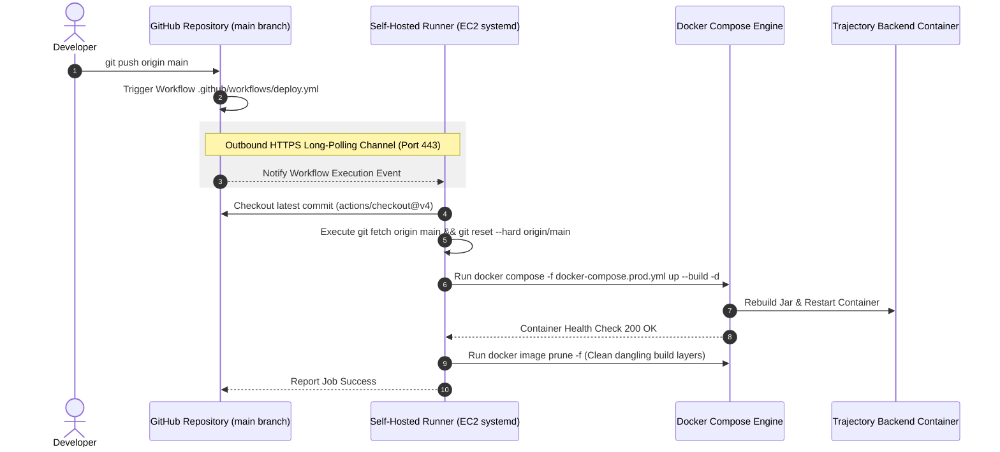
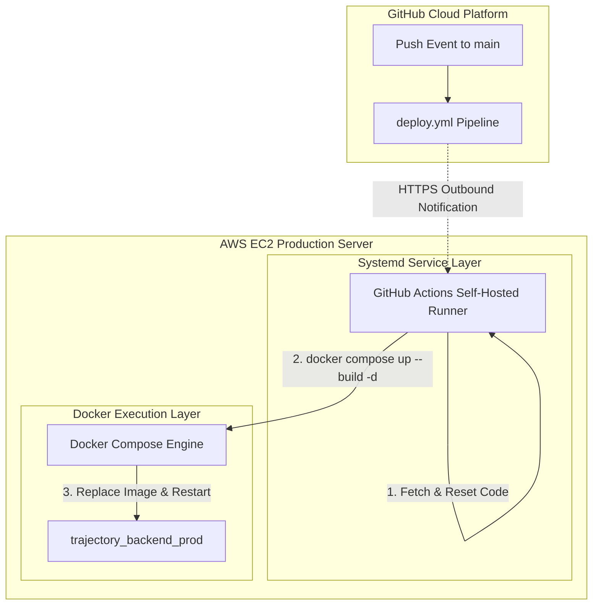

# Module 07: CI/CD Pipelines & Self-Hosted Runner Architecture

This guide teaches the continuous deployment architecture of **Trajectory**, detailing how GitHub Actions workflows, EC2 Self-Hosted Runner systemd services, outbound HTTPS long-polling, and automated Docker container rebuilds operate.

---

## 1. What It Is
The deployment pipeline in Trajectory uses a **Self-Hosted GitHub Actions Runner** running natively as a background systemd service on the AWS EC2 production server. When code is pushed to the `main` branch, GitHub notifies the runner, which executes local container rebuild commands (`docker compose up --build -d`) on the server.

## 2. Why Trajectory Uses It
- **Zero Inbound SSH Port Requirement:** Traditional GitHub Actions SSH deployment actions (`appleboy/ssh-action`) require exposing port `22` (SSH) to public GitHub runner IP ranges and managing SSH private keys.
- **Outbound Long-Polling Security:** The self-hosted runner connects *outward* from EC2 to GitHub's servers over secure HTTPS (port `443`). No inbound SSH ports need to be opened for CI/CD.

## 3. What Problem It Solves
- Eliminates SSH authentication timeout failures during automated deployments.
- Eliminates private key leak risks in GitHub repository secret settings.
- Leverages local EC2 Docker cache for fast, zero-bandwidth container rebuilds.

## 4. Where It Appears in This Repository
- **GitHub Actions Workflow:** [`.github/workflows/deploy.yml`](file:///d:/vaibhav%20gupta/Coding/Projects----For%20Resume/Trajectory/.github/workflows/deploy.yml)
- **Deployment Documentation:** [`Docs/Deployment.md`](file:///d:/vaibhav%20gupta/Coding/Projects----For%20Resume/Trajectory/Docs/Deployment.md)

## 5. Every Related Configuration File
- [`.github/workflows/deploy.yml`](file:///d:/vaibhav%20gupta/Coding/Projects----For%20Resume/Trajectory/.github/workflows/deploy.yml) — Specifies:
  ```yaml
  name: Deploy to Production

  on:
    push:
      branches: [ main ]

  jobs:
    deploy:
      runs-on: self-hosted

      steps:
        - name: Checkout Code
          uses: actions/checkout@v4

        - name: Deploy with Docker Compose
          run: |
            git fetch origin main
            git reset --hard origin/main
            docker compose -f docker-compose.prod.yml up --build -d
            docker image prune -f
  ```

## 6. Every Important Class, File, Script, or Resource
- `~actions-runner/` (on EC2) — Folder containing GitHub actions-runner binaries.
- `/etc/systemd/system/actions.runner.vaibhv19-Trajectory.ubuntu-ip-172-31-41-209.service` (on EC2) — Systemd daemon service controlling the runner.

## 7. Complete Request/Response Execution Flow



## 8. How It Works Internally
1. **Long-Polling Mechanism:** The `actions-runner` binary on EC2 establishes an outbound HTTPS WebSocket/long-poll connection to `https://pipeline.actions.githubusercontent.com`.
2. **Atomic Git Reset:** Rather than creating merge commits on the server, the workflow executes `git reset --hard origin/main`. This ensures the server working tree matches the remote `main` branch exactly.
3. **Container Replacement:** `docker compose up --build -d` compiles `backend/Dockerfile`, builds a new image, stops the old container (`trajectory_backend_prod`), and starts the new container with zero manual intervention.

## 9. How to Modify or Extend It Safely
- **Adding Automated Test Step:** Edit `.github/workflows/deploy.yml` to run Maven tests *before* executing container rebuilds:
  ```yaml
  - name: Run Backend Unit Tests
    run: cd backend && mvn test
  ```

## 10. Common Mistakes
- **Runner Service Offline:** Restarting the EC2 instance without enabling the runner as a systemd service stops automatic deployments. Fix by running `sudo ./svc.sh install` and `sudo ./svc.sh start`.

## 11. Debugging Techniques
- **Check Runner Status on EC2:**
  ```bash
  cd ~/actions-runner
  sudo ./svc.sh status
  ```
- **Inspect Systemd Logs:**
  ```bash
  sudo journalctl -u actions.runner.vaibhv19-Trajectory.ubuntu-ip-172-31-41-209.service -n 50 -f
  ```

## 12. Production Considerations
- **Disk Space Pruning:** Docker builds leave dangling intermediate image layers. The workflow step `docker image prune -f` prevents EC2 disk exhaustion over time.

## 13. Security Considerations
- **Least Privilege Runner User:** The runner runs under the standard `ubuntu` system user, preventing arbitrary workflow scripts from modifying system root files.

## 14. Best Practices Used in Trajectory
- Outbound long-polling architecture (no open inbound SSH ports required).
- Automated build artifact cleanup.

## 15. Practical Code Example from Trajectory

```yaml
# Snippet from .github/workflows/deploy.yml
name: Deploy to Production

on:
  push:
    branches: [ main ]

jobs:
  deploy:
    runs-on: self-hosted

    steps:
      - name: Checkout Code
        uses: actions/checkout@v4

      - name: Deploy with Docker Compose
        run: |
          git fetch origin main
          git reset --hard origin/main
          docker compose -f docker-compose.prod.yml up --build -d
          docker image prune -f
```

## 16. Architecture Diagram



## 17. Reference Source Files
- [`.github/workflows/deploy.yml`](file:///d:/vaibhav%20gupta/Coding/Projects----For%20Resume/Trajectory/.github/workflows/deploy.yml)
- [`docker-compose.prod.yml`](file:///d:/vaibhav%20gupta/Coding/Projects----For%20Resume/Trajectory/docker-compose.prod.yml)
- [`Docs/Deployment.md`](file:///d:/vaibhav%20gupta/Coding/Projects----For%20Resume/Trajectory/Docs/Deployment.md)
