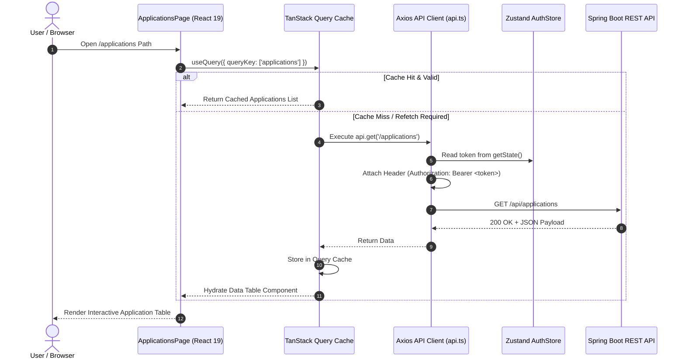

# Module 08: Frontend React 19 State Architecture, Query Caching & Routing

This guide teaches the client-side architecture of **Trajectory**, detailing how React 19, Vite, TypeScript, Zustand global stores, TanStack Query v5 (React Query), Axios API interceptors, and React Router Dom protected routes interact.

---

## 1. What It Is
The frontend of Trajectory is a **type-safe Single Page Application (SPA)** built with **React 19** and **TypeScript**, bundled via **Vite**, and styled with **Tailwind CSS** and **Shadcn UI** primitives. State management is cleanly divided into **Server State** (TanStack Query) and **Client State** (Zustand).

## 2. Why Trajectory Uses It
- **Clear Separation of State Concerns:** Storing API query data in global Redux/Zustand stores creates stale cache bugs. TanStack Query manages server data caching, background re-fetching, optimistic updates, and query invalidation automatically. Zustand manages lightweight global UI state (auth token, sidebar collapse, modal open states).
- **Type-Safe API Contracts:** TypeScript interfaces (`types/index.ts`) map exact JSON backend DTOs (`ApplicationResponse`, `JobExtraction`), giving developers full autocomplete and compile-time type checking.

## 3. What Problem It Solves
- Eliminates manual `useEffect` data fetching boilerplate.
- Prevents page re-renders across un-related components.
- Provides immediate responsive feedback via optimistic UI updates and protected route navigation guards (`ProtectedRoute.tsx`).

## 4. Where It Appears in This Repository
- **Client App Core:** [`frontend/src/App.tsx`](file:///d:/vaibhav%20gupta/Coding/Projects----For%20Resume/Trajectory/frontend/src/App.tsx)
- **Axios Interceptor Client:** [`frontend/src/services/api.ts`](file:///d:/vaibhav%20gupta/Coding/Projects----For%20Resume/Trajectory/frontend/src/services/api.ts)
- **Zustand Auth Store:** [`frontend/src/store/authStore.ts`](file:///d:/vaibhav%20gupta/Coding/Projects----For%20Resume/Trajectory/frontend/src/store/authStore.ts)
- **Pages & Canvases:** [`frontend/src/pages/`](file:///d:/vaibhav%20gupta/Coding/Projects----For%20Resume/Trajectory/frontend/src/pages/)
- **Types:** [`frontend/src/types/index.ts`](file:///d:/vaibhav%20gupta/Coding/Projects----For%20Resume/Trajectory/frontend/src/types/index.ts)

## 5. Every Related Configuration File
- [`frontend/package.json`](file:///d:/vaibhav%20gupta/Coding/Projects----For%20Resume/Trajectory/frontend/package.json) — Specifies React 19 (`^19.0.0`), Vite (`^5.3.4`), TanStack Query (`^5.51.1`), Zustand (`^4.5.4`), Zod (`^3.23.8`), and Recharts (`^2.12.7`).
- [`frontend/vite.config.ts`](file:///d:/vaibhav%20gupta/Coding/Projects----For%20Resume/Trajectory/frontend/vite.config.ts) — Configures path aliases (`@/` mapping to `src/`).

## 6. Every Important Class, File, Script, or Resource
- [`api.ts`](file:///d:/vaibhav%20gupta/Coding/Projects----For%20Resume/Trajectory/frontend/src/services/api.ts) — Axios instance adding `Authorization: Bearer <token>` from `authStore` to every outgoing HTTP request and handling 401 token refresh errors.
- [`authStore.ts`](file:///d:/vaibhav%20gupta/Coding/Projects----For%20Resume/Trajectory/frontend/src/store/authStore.ts) — Zustand store managing `token`, `refreshToken`, `user`, and `localStorage` synchronization.
- [`ProtectedRoute.tsx`](file:///d:/vaibhav%20gupta/Coding/Projects----For%20Resume/Trajectory/frontend/src/components/auth/ProtectedRoute.tsx) — Higher-order navigation wrapper enforcing authentication.

## 7. Complete Request/Response Execution Flow



## 8. How It Works Internally
1. **Axios Token Interceptor:** `api.ts` registers a request interceptor (`api.interceptors.request.use`). Before any HTTP request leaves the browser, it retrieves the active JWT token from Zustand (`useAuthStore.getState().token`) and attaches it to the HTTP `Authorization` header.
2. **TanStack Query Invalidation:** When a user creates or updates an application (`useMutation`), the `onSuccess` callback executes `queryClient.invalidateQueries({ queryKey: ['applications'] })`. This signals React Query to transparently refetch the table data in the background, updating the view without requiring a full page refresh.
3. **Zustand LocalStorage Persist:** `authStore.ts` synchronizes authentication state to browser `localStorage`. When a user opens a new tab, Zustand rehydrates `token` and `user` state seamlessly.

## 9. How to Modify or Extend It Safely
- **Adding a New Data Fetching Hook:**
  1. Define API call method in `services/api.ts`:
     ```ts
     export const getPlacementSheets = async (company?: string) => {
       const response = await api.get<PlacementSheet[]>('/public/placement-sheets', { params: { company } });
       return response.data;
     };
     ```
  2. Use hook inside React component:
     ```ts
     const { data: sheets, isLoading } = useQuery({
       queryKey: ['placement-sheets', company],
       queryFn: () => getPlacementSheets(company),
     });
     ```

## 10. Common Mistakes
- **Storing API Data in Local Component State:** Using `useState` + `useEffect` to manage server data causes duplicate fetches and stale cache state. Always use `useQuery` and `useMutation`.

## 11. Debugging Techniques
- **TanStack Query Devtools:** Enable Devtools overlay in `App.tsx` (`<ReactQueryDevtools />`) to inspect active query keys, cache staleness, and mutation states.
- **Inspect Network Panel:** Filter by `/api` in Chrome DevTools Network tab to verify `Bearer` token headers and JSON responses.

## 12. Production Considerations
- **Vite Production Bundling:** Running `npm run build` generates minified, tree-shaken static assets inside `frontend/dist/`.

## 13. Security Considerations
- **Automatic Logout on Expiration:** If the backend returns `401 Unauthorized` and refresh token rotation fails, `api.ts` automatically executes `useAuthStore.getState().logout()` and redirects the user to `/login`.

## 14. Best Practices Used in Trajectory
- Co-located component structure under `/src/components` and `/src/pages`.
- Custom hooks wrapping TanStack Query mutations for clean component code.

## 15. Practical Code Example from Trajectory

```ts
// Snippet from frontend/src/services/api.ts
import axios from 'axios';
import { useAuthStore } from '../store/authStore';

const API_BASE_URL = import.meta.env.VITE_API_BASE_URL || 'http://localhost:8080/api';

export const api = axios.create({
  baseURL: API_BASE_URL,
  headers: {
    'Content-Type': 'application/json',
  },
});

// Attach JWT access token to outgoing requests
api.interceptors.request.use((config) => {
  const token = useAuthStore.getState().token;
  if (token) {
    config.headers.Authorization = `Bearer ${token}`;
  }
  return config;
});
```

## 16. Architecture Diagram

```mermaid
graph TD
    subgraph ViewLayer ["React 19 User Interface"]
        Pages["Pages (/dashboard, /applications)"]
        Modals["Dialog Modals (AI Import)"]
    end

    subgraph StateLayer ["State Management Layer"]
        TanStack["TanStack Query Cache (Server State)"]
        Zustand["Zustand Auth Store (Client State)"]
    end

    subgraph APILayer ["API Client Layer"]
        Axios["Axios Interceptor (api.ts)"]
    end

    subgraph RemoteServer ["Production Backend API"]
        Spring["Spring Boot API (AWS EC2)"]
    end

    Pages -->|useQuery / useMutation| TanStack
    Pages -->|useAuthStore| Zustand
    TanStack -->|Trigger HTTP| Axios
    Zustand -.->|Inject Bearer Token| Axios
    Axios -->|HTTPS REST Call| Spring
    Spring -->>|JSON Data| Axios
    Axios -->>|Hydrate Cache| TanStack
    TanStack -->>|Re-render UI| Pages
```

## 17. Reference Source Files
- [`App.tsx`](file:///d:/vaibhav%20gupta/Coding/Projects----For%20Resume/Trajectory/frontend/src/App.tsx)
- [`api.ts`](file:///d:/vaibhav%20gupta/Coding/Projects----For%20Resume/Trajectory/frontend/src/services/api.ts)
- [`authStore.ts`](file:///d:/vaibhav%20gupta/Coding/Projects----For%20Resume/Trajectory/frontend/src/store/authStore.ts)
- [`frontend/README.md`](file:///d:/vaibhav%20gupta/Coding/Projects----For%20Resume/Trajectory/frontend/README.md)
