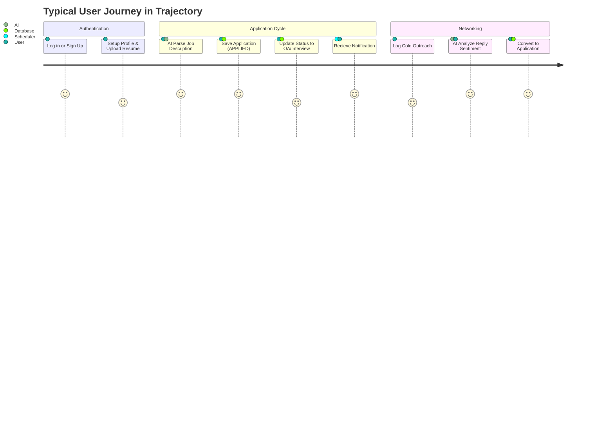

# Product Requirements Document (PRD): Trajectory (v1.0.1)

**Project Title:** Trajectory — The Career Operating System  
**Status:** Deployed / Production Ready  
**Target Version:** v1.0.1 (Documentation Retrofit Upgrade)  
**Author:** Senior Software Architect  

---

## 1. Executive Summary & Product Vision

### 1.1 Objective
**Trajectory** is an enterprise-grade, full-stack career management platform designed to centralize, track, and automate the highly fragmented job application and networking process. Moving beyond traditional, static spreadsheets, Trajectory consolidates resume versioning, AI-powered extraction, networking CRM, company resources, and analytical conversions into a unified, high-performance Command Center.

### 1.2 Architectural Architecture Overview
The system is built as a decoupled, high-performance application:
*   **Frontend SPA:** React 19 single-page application built with TypeScript and Tailwind CSS, hosted on the **Vercel Edge Network**.
*   **Backend REST Services:** Java 21 / Spring Boot 3.3.1 microservice running in a Docker container on an **AWS EC2** instance, utilizing **JDK 21 Virtual Threads** for non-blocking I/O throughput.
*   **Persistence & Storage:** Managed **AWS RDS PostgreSQL 16** for relational records and **AWS S3** (`ap-south-1`) for secure object storage.

---

## 2. User Personas & Core User Stories

### 2.1 Target Personas

| Persona | Archetype | Pain Points | Goals in Trajectory |
| :--- | :--- | :--- | :--- |
| **Active Job Seeker** | Recent graduate or transitioning engineer applying to 50–200+ roles. | Managing high volume, losing track of stage dates, forgotten follow-ups. | Centralize tracking, set reminders for OAs/Interviews, automate ghost flagging. |
| **Multi-Track Applicant** | Engineer tailoring profiles to different roles (e.g., Frontend vs. DevOps). | Uploading wrong resume versions, inconsistent branding across applications. | Create isolated **Career Profiles**, auto-link correct versioned resumes. |
| **Power Networker** | Candidate sourcing opportunities through cold outreach and referrals. | Tracking multiple email/LinkedIn threads, converting chat to application. | Log outreach, analyze response sentiment using AI, convert outreach to application in 1-click. |

### 2.2 Core User Stories



*   **As an Active Job Seeker,** I want my dashboard to display a consolidated summary of my pipeline metrics (OAs, Interviews, Offers) and a daily agenda so that I can prioritize my preparation every morning.
*   **As a Multi-Track Applicant,** I want to create distinct career profiles with customized color-codes and Lucide icons, so that I can immediately distinguish between different application channels in my pipeline.
*   **As a Power Networker,** I want to paste recruiter messages into an AI sentiment analyzer to quickly assess response sentiment and automatically convert successful outreach threads into job application entries.

---

## 3. Product Features & Functional Requirements

### 3.1 Dashboard (The Command Center)
The entry hub hydrates real-time metrics, funnel conversions, and action-oriented agendas.

*   **Pipeline Metrics Cards:** Displays key counters: `Total`, `Active` (sum of `APPLIED`, `OA`, `INTERVIEW`), `Rejected`, and `Ghosted` applications.
*   **Funnel Analytics:** Numerical tracking of key milestones: Online Assessments (OAs), Interviews, and Offers.
*   **Performance Conversion Rates:** Real-time percentage conversions calculated as:
    *   **Response Rate:** `(OAs + Interviews + Offers) / Total Applications`
    *   **Interview Conversion Rate:** `Interviews / (OAs + Applied)`
    *   **Offer Conversion Rate:** `Offers / Interviews`
*   **Temporal Rollups:** Dynamic count of applications submitted "This Week" (rolling 7 days) and "This Month" (current calendar month).
*   **Interactive Visualizations:** Integrated SVG charts (via Recharts) displaying application distribution by Source and Career Profile.
*   **Today's Agenda Widget:** A high-priority calendar listing upcoming OAs/Interviews scheduled for the current day and CRM follow-ups.

---

### 3.2 Job Application Management (CRUD & Timeline Audit)
Supports the full lifecycle of a job application from submission to final offer or rejection.

```
                    +-----------------------------+
                    |           APPLIED           |
                    +--------------+--------------+
                                   |
                     +-------------+-------------+
                     |                           |
                     v                           v
              +------------+              +------------+
              |     OA     |              | INTERVIEW  |
              +------+-----+              +------+-----+
                     |                           |
                     +-------------+-------------+
                                   |
                                   v
                             +-----+-----+
                             |   OFFER   |
                             +-----------+
```
*(Transitions to terminal states `REJECTED`, `GHOSTED`, or `WITHDRAWN` can occur from any active state.)*

*   **Attribute Metadata:** Tracks `company_name`, `role_title`, `location`, `career_profile_id`, `resume_id`, `date_applied`, `source` (LinkedIn, Referral, etc.), `salary_range`, `job_description_url`, and `notes`.
*   **State Machine Transitions:** Enforces strict compliance on status transitions (`APPLIED`, `OA`, `INTERVIEW`, `OFFER`, `REJECTED`, `GHOSTED`, `WITHDRAWN`).
*   **Timeline Audit Trail (`application_status_history`):** Every transition logs the status update, timestamp (`changed_at`), optional notes, and calculates the exact duration spent in the preceding phase.
*   **Dynamic Event Fields:** Transitioning to `OA` or `INTERVIEW` dynamically requests date/time markers (`oa_date_time` / `interview_date_time`) and video/meeting links (`meeting_link`).
*   **Archival Control (`is_archived`):** Soft-archive flag (`is_archived = true`) to hide closed applications from active dashboard views while retaining historical database audit trails.
*   **Automated Ghost Detection:** A daily Spring Scheduler daemon automatically flags active applications as `GHOSTED` if `last_activity_at` exceeds the user's `ghost_threshold_days` (default: 30).

---

### 3.3 Career Profiles & Versioned Resumes
Enables candidates to manage multiple professional identities and match versioned resumes.

*   **Profile Personalization:** Custom profiles defined by `title` (e.g., "DevOps Engineer"), a specific hex color (`color_code`), and Lucide icon mappings (`icon_identifier`).
*   **Auto-Incrementing Resume Versions:** Uploading a PDF resume automatically associates it with a `career_profile_id` and increments the `version_number` (v1 ➔ v2 ➔ v3).
*   **AWS S3 Persistence:** PDF files are stored privately in AWS S3 using structured paths (`resumes/{profile_id}/v{version_number}_{filename}`) and retrieved via secure presigned endpoints.
*   **Keyword Changelog:** Each resume version records changelog comments, allowing users to note specific skill additions.
*   **Modal Form Integration:** Allows direct inline resume upload inside the "Add Application" modal.

---

### 3.4 Cold Outreach & Networking CRM
A lightweight contact manager focused on building relationship funnels.

*   **Recruiter Metrics Tracking:** Logs `contact_name`, `company_name`, `position_discussed`, `email`, `linkedin_url`, outreach status (`PENDING`, `CONTACTED`, `REPLIED`, `INTERVIEW_SECURED`, `NO_RESPONSE`), and scheduled follow-up dates.
*   **AI Sentiment Analysis:** Uses LLM parsing to evaluate recruiter replies and suggest next status updates.
*   **One-Click Pipeline Conversion:** Instantly converts an outreach record into a formal application. This automatically maps the company name, role title, and transcripts to the new `applications` record.

---

### 3.5 AI-Powered Workflow Automation (Spring AI + Groq)
Minimizes input latency through LLM automation.

*   **Job Description Extraction:** Parses raw pasted text to extract `company_name`, `role_title`, `location`, `skills`, `salary_range`, and maps the description to a suggested profile title.
*   **Schedule Event Parsing:** Extracts scheduling attributes (`event_type`, `event_date`, `event_time`, `meeting_link`, and `duration_minutes`) from unstructured recruiter email invites.
*   **Outreach Sentiment Classification:** Classifies recruiter response sentiment to suggest CRM updates.
*   **Deterministic Mock Fallback:** Automatically switches to regex-based parsing when the Groq API key is set to `mock-key` or omitted, maintaining local environment functionality.

---

### 3.6 Placement Sheets & Company Documents
*   **Reference Repository:** A pre-populated database containing details on 100+ major technology firms (CTC ranges, eligibility criteria like CGPA and high school scores, and standard interview subjects).
*   **Private S3 Documents:** Vault to upload company-specific benefit guidelines, PDF guides, and offers using secure AWS S3 storage.

---

### 3.7 System Notifications & Preferences
*   **Scheduled Alerts:** Generates in-app notifications (`notifications` table) and Web Push notifications for upcoming OA times, interview slots, and outreach follow-up dates.
*   **User Preference Center:** Configurations for `ghost_threshold_days` (for cron tracking), auto-archival toggles, and multi-channel notification permissions (Browser / Email).

---

## 4. Database Schema Specifications

The PostgreSQL database relies on Flyway migrations (`V1` and `V2`) to version-control the schema:

```
                            +-------------------+
                            |       users       |
                            +-------------------+
                                      | 1
                                      |
         +------------------+---------+----------+-------------------+
         | 1                | 1                  | 1                 | 1
+--------▼--------+  +------▼-------+    +-------▼-------+  +--------▼---------+
| career_profiles |  |   outreach   |    | notifications |  |  refresh_tokens  |
+--------┬--------+  +--------------+    +---------------+  +------------------+
         | 1
         |
         +------------------+
         | M                | M
+--------▼--------+ +-------▼--------+
|  applications   | |    resumes     |
+--------┬--------+ +----------------+
         | 1
+--------▼--------+
| status_history  |
+-----------------+
```

### Table Definitions

#### 4.1 `users`
Tracks user credentials, security parameters, and preferences.
*   `id` (UUID, Primary Key)
*   `email` (VARCHAR, Unique, Not Null)
*   `password_hash` (VARCHAR, Nullable for Social Login)
*   `full_name` (VARCHAR)
*   `avatar_url` (TEXT)
*   `auth_provider` (VARCHAR, Default 'LOCAL' — LOCAL, GOOGLE, GITHUB)
*   `ghost_threshold_days` (INT, Default 30)
*   `auto_archive_enabled` (BOOLEAN, Default False)
*   `browser_notifications_enabled` (BOOLEAN, Default True)
*   `email_notifications_enabled` (BOOLEAN, Default True)
*   `ai_extractions_count` (INT, Default 0)
*   `last_ai_extraction_date` (DATE)

#### 4.2 `career_profiles`
Manages targeted candidate personas.
*   `id` (UUID, Primary Key)
*   `user_id` (UUID, FK -> users.id, Cascade Delete)
*   `title` (VARCHAR, Not Null)
*   `color_code` (VARCHAR, Default '#3b82f6')
*   `icon_identifier` (VARCHAR)
*   `is_default` (BOOLEAN, Default False)

#### 4.3 `resumes`
Metadata for versioned resumes stored in AWS S3.
*   `id` (UUID, Primary Key)
*   `profile_id` (UUID, FK -> career_profiles.id, Cascade Delete)
*   `version_number` (INT, Not Null)
*   `s3_key` (TEXT, Not Null)
*   `file_name` (VARCHAR, Not Null)
*   `changelog` (TEXT)
*   *(Unique constraint on `profile_id` + `version_number`)*

#### 4.4 `applications`
Main job tracking records.
*   `id` (UUID, Primary Key)
*   `user_id` (UUID, FK -> users.id, Cascade Delete)
*   `profile_id` (UUID, FK -> career_profiles.id, Not Null)
*   `resume_id` (UUID, FK -> resumes.id, Nullable)
*   `company_name` (VARCHAR, Not Null)
*   `role_title` (VARCHAR, Not Null)
*   `location` (VARCHAR)
*   `job_description_url` (TEXT)
*   `job_description_raw` (TEXT)
*   `status` (ENUM application_status, Default 'APPLIED')
*   `source` (VARCHAR)
*   `salary_range` (VARCHAR)
*   `date_applied` (DATE, Default Current Date)
*   `follow_up_date` (DATE)
*   `response_date` (DATE)
*   `is_archived` (BOOLEAN, Default False)
*   `oa_date_time` (TIMESTAMP WITH TIME ZONE)
*   `interview_date_time` (TIMESTAMP WITH TIME ZONE)
*   `meeting_link` (VARCHAR)
*   `last_activity_at` (TIMESTAMP WITH TIME ZONE)

#### 4.5 `application_status_history`
Audit log for status transitions.
*   `id` (UUID, Primary Key)
*   `application_id` (UUID, FK -> applications.id, Cascade Delete)
*   `status` (ENUM application_status, Not Null)
*   `notes` (TEXT)
*   `changed_at` (TIMESTAMP WITH TIME ZONE)

#### 4.6 `outreach`
Networking CRM contact log.
*   `id` (UUID, Primary Key)
*   `user_id` (UUID, FK -> users.id, Cascade Delete)
*   `contact_name` (VARCHAR, Not Null)
*   `company_name` (VARCHAR, Not Null)
*   `position_discussed` (VARCHAR)
*   `email` (VARCHAR)
*   `linkedin_url` (TEXT)
*   `status` (ENUM outreach_status, Default 'PENDING')
*   `date_sent` (DATE, Default Current Date)
*   `follow_up_date` (DATE)
*   `notes` (TEXT)

#### 4.7 `company_documents`
Private company resource vault.
*   `id` (UUID, Primary Key)
*   `user_id` (UUID, FK -> users.id, Cascade Delete)
*   `company_name` (VARCHAR, Not Null)
*   `document_name` (VARCHAR, Not Null)
*   `s3_key` (TEXT, Not Null)
*   `document_type` (VARCHAR)

#### 4.8 `notifications`
In-app alerts.
*   `id` (UUID, Primary Key)
*   `user_id` (UUID, FK -> users.id, Cascade Delete)
*   `title` (VARCHAR, Not Null)
*   `message` (TEXT, Not Null)
*   `type` (VARCHAR, Default 'INFO')
*   `is_read` (BOOLEAN, Default False)

#### 4.9 `refresh_tokens`
Tracks active sessions for JWT rotation.
*   `id` (UUID, Primary Key)
*   `user_id` (UUID, FK -> users.id, Unique, Cascade Delete)
*   `token` (VARCHAR, Unique, Not Null)
*   `expiry_date` (TIMESTAMP, Not Null)

---

## 5. Non-Functional & Security Requirements

### 5.1 Concurrency & Performance
*   **Virtual Threads Integration:** Runs Spring Boot 3.3.1 configured with `spring.threads.virtual.enabled=true` on Java 21 to process intensive REST/S3/LLM requests.
*   **Database Indices:** Specific indexes target query performance on foreign keys:
    *   `idx_applications_user` on `applications(user_id)`
    *   `idx_applications_status` on `applications(status)`
    *   `idx_outreach_user` on `outreach(user_id)`
    *   `idx_resumes_profile` on `resumes(profile_id)`
    *   `idx_status_history_app` on `application_status_history(application_id)`

### 5.2 Security Posture
*   **Stateless REST Security:** JWT authorization (HMAC SHA-256) enforcing 24-hour expiration for access tokens and automated rotation via refresh tokens.
*   **Data Isolation:** All operations enforce `user_id` parameter bindings to ensure users cannot view or manipulate other accounts.
*   **Nginx SSL Termination:** Native Nginx reverse proxy handles HTTPS routing and SSL handshake, forwarding client headers directly to Spring Boot (`server.forward-headers-strategy: framework`).
*   **CORS Safeguards:** Spring Boot restricts REST requests exclusively to the production SPA origin (`https://trajectory-mu-six.vercel.app`).

---

## 6. Future Roadmap (Un-implemented Features)

The following features represent planned enhancements for future releases:

> [!TIP]
> **Planned but Not Implemented (Future Roadmap):**
>
> 1.  **Browser Extension:** One-click application scraping directly from LinkedIn and Indeed.
> 2.  **Bi-Directional Calendar Sync:** Automatic Google Calendar / Microsoft Outlook event synchronization.
> 3.  **AI Cover Letter Generator:** Automated generation of personalized cover letters from Resume + Job Description.
> 4.  **JD vs. Resume Match Scoring:** Compatibility scoring comparing specific resume versions against job posting keywords.
> 5.  **Skill Gap Analytics:** Automated identification of missing resume keywords based on job search history.
> 6.  **Container Registry Integration:** Automating ECR/GHCR image compilation before deployment.

---

## Related Documentation
*   [**Documentation Index (Docs/INDEX.md)**](file:///d:/Coding/Projects----For%20Resume/Trajectory/Docs/INDEX.md)
*   [**Feature List (Docs/FEATURE_LIST.md)**](file:///d:/Coding/Projects----For%20Resume/Trajectory/Docs/FEATURE_LIST.md)
*   [**System Architecture (Docs/SYSTEM_ARCHITECTURE.md)**](file:///d:/Coding/Projects----For%20Resume/Trajectory/Docs/SYSTEM_ARCHITECTURE.md)
*   [**Application Flow (Docs/App Flow.md)**](file:///d:/Coding/Projects----For%20Resume/Trajectory/Docs/App%20Flow.md)
*   [**Tech Stack Specification (Docs/Tech Stack.md)**](file:///d:/Coding/Projects----For%20Resume/Trajectory/Docs/Tech%20Stack.md)
*   [**Visual Design System (Docs/DESIGN.md)**](file:///d:/Coding/Projects----For%20Resume/Trajectory/Docs/DESIGN.md)