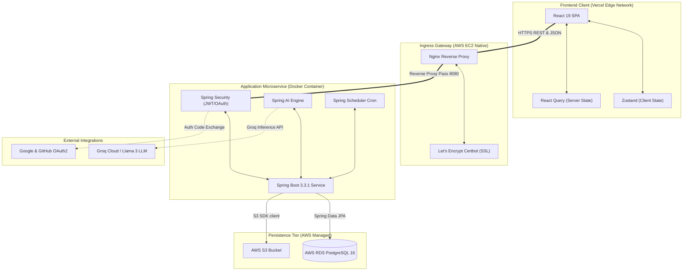

# System Architecture: Trajectory (v1.0.1)

This document provides a detailed overview of the system architecture, component relationships, data flows, and security infrastructure for **Trajectory**.

---

## 1. High-Level Architecture Diagram

Trajectory is designed around a decoupled client-server architecture. The user interface runs as a Single Page Application (SPA) on edge infrastructure, communicating via HTTPS REST with a backend application service running inside a containerized environment.



---

## 2. Component Design Breakdown

### 2.1 Frontend Client Tier (User Interface)
*   **Hosting:** Hosted on the **Vercel Edge Network**, using global CDN caching.
*   **Framework:** Built on **React 19** and **Vite** using **TypeScript**.
*   **State Split:**
    *   **Client UI State:** Managed by **Zustand** stores (`useAuthStore`) for authentication tokens and toast notifications.
    *   **Cached Server State:** Managed by **TanStack Query (React Query)** to handle data fetching, cache synchronization, and key-based invalidations.
*   **Security:** JWT access tokens are loaded into memory and appended to outbound Axios headers via request interceptors.

### 2.2 Edge Ingress Tier (Proxy & SSL)
*   **Hosting:** Runs on an **AWS EC2** instance (Ubuntu 24.04 LTS).
*   **Web Server:** **Nginx** handles SSL/TLS termination and routes request traffic to the backend application container running on port `8080`.
*   **Certificates:** SSL certs are issued by **Let's Encrypt** and automatically renewed via Certbot systemd timers.
*   **Subdomain Routing:** Resolves public IPs to custom domains using the DuckDNS dynamic DNS service.

### 2.3 Application Microservice Tier (Backend Engine)
*   **Core Framework:** **Spring Boot 3.3.1** running on **Java 21**.
*   **Virtual Threads:** Configured with `spring.threads.virtual.enabled=true` to handle blocking network calls.
*   **Security Gateway:** **Spring Security** handles request validation:
    *   **JWT Filter:** Intercepts REST requests, decodes signatures, and authorizes endpoints.
    *   **OAuth2 Client:** Integrates with Google and GitHub endpoints to handle user signup and signin redirects.
*   **AI Integration:** **Spring AI** manages structured prompts and formats JSON extraction parameters returned from the Groq API.
*   **Background Tasks:** A **Spring Scheduler** daemon runs cron jobs to process ghost application detection and notification sweeps.

### 2.4 Persistence & Storage Tier
*   **Relational Database:** **AWS RDS PostgreSQL 16** stores user account data, application metrics, status histories, outreach information, and notifications.
*   **Binary Object Storage:** **AWS S3** (`ap-south-1`) stores resume documents and attachments securely.
*   **Schema Control:** Database schemas are versioned and updated automatically using **Flyway** migrations.

---

## 3. Communication Protocols & Security Posture

### 3.1 Network Communications
*   **API Architecture:** All client-server communication uses HTTPS REST services with JSON payloads.
*   **CORS Security:** Spring Boot restricts CORS permissions exclusively to the production client URL (`https://trajectory-mu-six.vercel.app`).
*   **Nginx Header Forwarding:** Nginx forwards external headers (`X-Forwarded-For`, `X-Forwarded-Proto`) to the application, which is configured with `server.forward-headers-strategy: framework` to handle redirect URLs securely.

### 3.2 Security Posture
*   **JWT Access Tokens:** Short-lived tokens (24-hour expiration) signed using HMAC SHA-256 keys.
*   **Refresh Tokens:** Stored in the database as UUIDs to manage session rotation and revocation.
*   **User Data Isolation:** Database queries enforce isolation by filtering records based on the authenticated user's ID (`user_id`).
*   **Password Hashing:** Local user credentials are salted and hashed using Bcrypt before being persisted.

---

## 4. Concurrency Model: JDK 21 Virtual Threads

Trajectory uses JDK 21 Virtual Threads to improve concurrency performance:

```
Traditional OS Thread Model:
[Request 1] ---> [OS Carrier Thread A] ---> (Blocked: Waiting for Groq/S3) ---> [Thread Blocked]
[Request 2] ---> [OS Carrier Thread B] ---> (Blocked: Waiting for Groq/S3) ---> [Thread Blocked]

Trajectory Virtual Thread Model:
[Request 1] ---> [Virtual Thread V1] ---> (Blocked: Waiting for Groq/S3) ---> [V1 Unmounted]
[Request 2] ---> [Virtual Thread V2] ---> (Processes on Carrier Thread A)  ---> [Carrier Shared]
```

*   **Operation:** When an application thread blocks on an I/O operation (such as waiting for the Groq LLM API or an AWS S3 file upload), Spring Boot unmounts the virtual thread from the underlying carrier OS thread.
*   **Benefit:** The carrier OS thread is freed up to process other requests, allowing the system to scale and handle concurrent requests without thread pool exhaustion.

---

## Related Documentation
*   [**Documentation Index (Docs/INDEX.md)**](file:///d:/Coding/Projects----For%20Resume/Trajectory/Docs/INDEX.md)
*   [**Product Requirements Document (Docs/PRD.md)**](file:///d:/Coding/Projects----For%20Resume/Trajectory/Docs/PRD.md)
*   [**Feature List (Docs/FEATURE_LIST.md)**](file:///d:/Coding/Projects----For%20Resume/Trajectory/Docs/FEATURE_LIST.md)
*   [**Application Flow (Docs/App Flow.md)**](file:///d:/Coding/Projects----For%20Resume/Trajectory/Docs/App%20Flow.md)
*   [**Tech Stack Specification (Docs/Tech Stack.md)**](file:///d:/Coding/Projects----For%20Resume/Trajectory/Docs/Tech%20Stack.md)
*   [**Visual Design System (Docs/DESIGN.md)**](file:///d:/Coding/Projects----For%20Resume/Trajectory/Docs/DESIGN.md)
