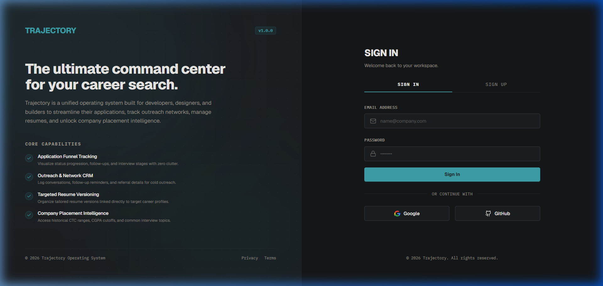
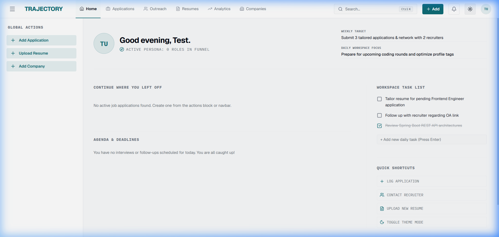
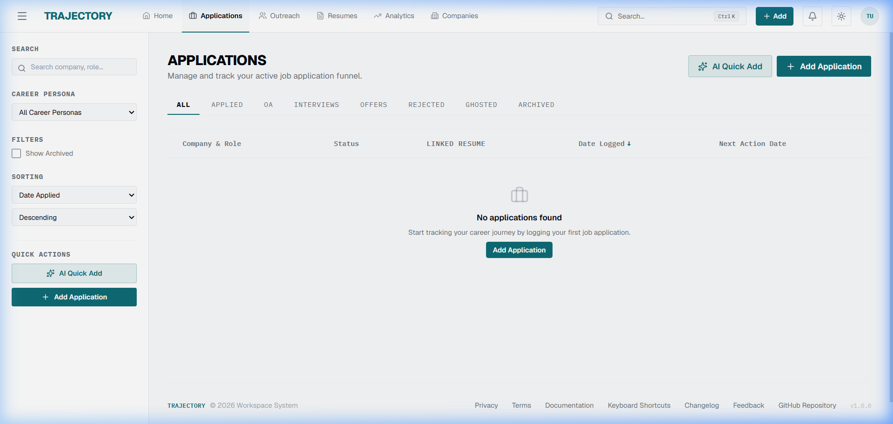
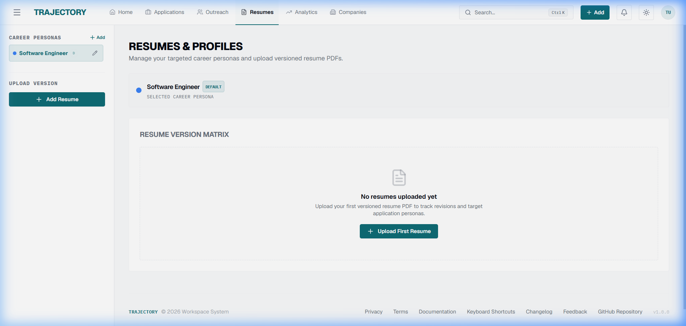
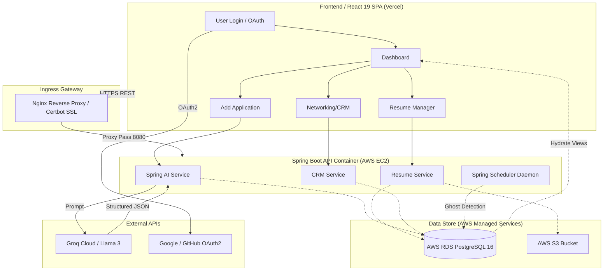

# Trajectory — Your Career Operating System

**Trajectory** is a comprehensive, full-stack career management platform designed to centralize and automate the fragmented job search process. By moving beyond static spreadsheets, Trajectory integrates resume versioning, AI-powered data extraction, cold outreach tracking, placement sheets, and deep analytics into a single unified "Command Center" (Dashboard).

This project is structured as a decoupled full-stack application (**React 19 Frontend** hosted on **Vercel** + **Java 21 / Spring Boot 3.3.1 Backend** hosted on **AWS EC2 via Docker Compose**) backed by **AWS RDS PostgreSQL 16**, **AWS S3**, and automated via a **GitHub Actions Self-Hosted Runner**.

---

## 🌐 Live Production Deployment

Trajectory is deployed in production and accessible at the following live endpoints:

| Component | Production URL | Description |
| :--- | :--- | :--- |
| **Frontend Web Application** | [**https://trajectory-mu-six.vercel.app**](https://trajectory-mu-six.vercel.app) | Production Single Page Application (SPA) hosted on Vercel's global Edge CDN. |
| **Backend REST API Gateway** | [**https://trajectory-api.duckdns.org**](https://trajectory-api.duckdns.org) | Secure HTTPS REST API hosted on AWS EC2 reverse-proxied by Nginx with Let's Encrypt SSL. |
| **Interactive Swagger OpenAPI** | [**https://trajectory-api.duckdns.org/swagger-ui/index.html**](https://trajectory-api.duckdns.org/swagger-ui/index.html) | Live interactive Swagger UI for testing API endpoints directly in the browser. |

---

## 🖼️ Application Screenshots

### 1. Split-Screen Authentication (Light Mode)


### 2. Command Center & Funnel Dashboard (Dark Mode)


### 3. Application Pipeline Board (Dark Mode)


### 4. Resume & Career Profile Version Matrix (Dark Mode)


---

## 🌟 Core Features

### 📊 1. The Command Center (Dashboard)
*   **Pipeline Metrics:** High-level bird's-eye counters of `Total`, `Active`, `Rejected`, and `Ghosted` applications.
*   **Funnel Analytics:** Numerical tracking of Online Assessments (OAs), Interviews, and Offers.
*   **Performance Conversion:** Real-time metrics for Response Rate, Interview Conversion, and Offer Conversion.
*   **Temporal Logging:** Rollup counts of applications submitted "This Week" (rolling 7 days) and "This Month".
*   **Analytics Visualizations:** Interactive charts comparing response rates of different resume versions and distribution of applications by sources and career profiles.
*   **Daily Action Agenda:** A "Today’s Agenda" widget compiling upcoming interviews, OAs, and networking follow-ups.

### 💼 2. Application Lifecycle Management (CRUD)
*   **Comprehensive Tracking:** Tracks Company Name, Role, Location, Career Profile, Resume Version, Applied Date, Source, Salary Range, and Application Link.
*   **Chronological Timeline:** A history log documenting the timeline and duration of each status transition (`Applied` ➔ `OA` ➔ `Interview` ➔ `Offer`).
*   **Smart Reminders:** Automatically prompts for Meeting Links, dates, and times when a status changes to `OA` or `Interview`, syncing them as calendar/push reminders.
*   **Ghost Detection:** Automated Spring Scheduler cron jobs that identify inactive applications (based on user-configured thresholds, e.g., 30 days) and flag them as `Ghosted`.
*   **One-Click Archiving:** Easy archival of inactive or rejected applications.

### 📄 3. Resume & Career Profile Manager
*   **Targeted Career Profiles:** Create profiles (e.g., "Full Stack Dev", "Product Manager") with custom color-coding and Lucide icons.
*   **Automatic Version Control:** Upload multiple resume versions. The backend auto-increments version numbers (v1 ➔ v2) and suggests the latest resume when applying for a matching profile.
*   **Inline Resume Creation:** "Quick Upload" new resumes directly within the application creation modal.
*   **Keyword Changelog:** Keep detailed records of what keywords/sections changed in each resume version to correlate resume adjustments with response rates.

### 🤝 4. Cold Outreach & Networking CRM
*   **Networking Tracker:** Track cold outreach sent to recruiters and employees with contact info, discussion topics, and outreach dates.
*   **Follow-Up Automation:** Set follow-up reminders relative to "Date Sent" with validation to prevent logical date conflicts.
*   **Application Conversion:** Convert successful conversations into formal job applications in one click, transferring history and company details.
*   **Sentiment Analysis:** Paste recruiter replies into the AI analysis tool to automatically classify sentiment (`REPLIED`, `INTERVIEW_SECURED`, etc.).

### 🤖 5. AI-Powered Automation (Spring AI + Groq)
*   **Data Extraction:** Paste job descriptions, recruiter emails, or invite letters, and let the AI extract Company, Role, Location, Salary, and Deadline details.
*   **Auto-Populate:** Pre-fill application forms from the extracted data for user review.
*   **Profile Suggestions:** AI maps the job posting to the most relevant Career Profile.
*   **Job Description Archival:** Preserves the original job description raw text to prevent loss if the external posting is deleted.
*   **Mock Fallback:** Automatic fallback to regex-based mock parsing when Groq API keys are omitted or set to `mock-key`.

### 🔔 6. Intelligent Notifications
*   **Web Push Notifications:** Real-time push alerts via Web Push API for OA/Interview times and outreach follow-ups.
*   **Daily Digest:** A consolidated overview of the daily agenda displayed in the dashboard widget.

### 📁 7. Company Resources & Placement Sheets
*   **Integrated Placement Sheets:** Built-in repository covering recruitment criteria for 100+ top technology companies, listing salary packages (CTC), eligibility thresholds (CGPA, high school grades), and common interview topics.
*   **Private S3 Document Storage:** Dedicated document vault to upload and manage company-specific PDFs, offer details, and benefit guidelines stored securely in AWS S3.

### ⚙️ 8. User Preferences & Settings
*   **Pipeline Fine-Tuning:** Define custom thresholds for the automatic "Ghosted" detection cron job.
*   **Automated Lifecycle Actions:** Toggle preferences like auto-archiving rejected roles and managing notification alerts.

---

## 🔄 Application Flow & User Journey

Trajectory's interactive flows are optimized to minimize administrative overhead:

1.  **Authentication & Onboarding:** Users sign up or login locally (JWT) or via OAuth2 (Google/GitHub). They configure their initial **Career Profile** and upload their base **Resume (v1)**.
2.  **The Application Loop:** Users click "Add Application", paste a job description or email, trigger the **Spring AI** extraction (powered by **Groq / Llama 3**), verify the auto-populated fields, and save.
3.  **Lifecycle Management:** When updating status (e.g., from `Applied` to `OA`), the user enters the meeting details. The system logs the history transition, calculates the duration of the previous status, and schedules a push reminder.
4.  **Networking (CRM) Flow:** Users log recruiter outreach and follow-up dates. If an interview is secured, they convert the entry into an Application.
5.  **Data Portability:** Users can export their entire workspace data as JSON/CSV or restore their status using the import feature.

For a detailed view of the backend execution and frontend events, read [Docs/App Flow.md](file:///d:/vaibhav%20gupta/Coding/Projects----For%20Resume/Trajectory/Docs/App%20Flow.md).

---

## 🏗️ System Architecture



---

## 🎨 Visual Design & Routing System

Trajectory features a type-safe, high-contrast visual design system built with Tailwind CSS and Shadcn UI primitives. For full details on tokens, components, and design rules, refer to [Docs/DESIGN.md](file:///d:/vaibhav%20gupta/Coding/Projects----For%20Resume/Trajectory/Docs/DESIGN.md).

### 🚦 Client Routing Directory
*   **`/login`** — Authentication Canvas: Credentials login/signup tabs and social authentication buttons (Google/GitHub).
*   **`/dashboard`** — Command Center: Displays rollups for active pipelines, Recharts funnel charts, and Daily Agenda.
*   **`/applications`** — Application Matrix: Searchable and paginated data table of all job applications with multi-select filters, AI Import, and Quick Resume Upload.
*   **`/applications/:id`** — Application Inspector: Detailed page displaying status audit history on a chronological timeline with pulsing indicators.
*   **`/outreach`** — Networking CRM: Recruiter grid view showing contact details, LinkedIn links, and follow-up warning alerts.
*   **`/resumes`** — Career Profile Matrix: Displays custom color-coded career personas, versioned PDF resume records (`v1`, `v2`), and changelogs.
*   **`/resources`** — Placement Sheets & Company Documents: Dashboard displaying integrated placement criteria for 100+ top tech companies (CTC, CGPA, prep topics) and private S3 document storage.
*   **`/settings`** — User Profile & Settings: Configurations for display name, custom inactivity thresholds for automatic "Ghosted" detection, and lifecycle automation toggles.

---

## 🛠️ Tech Stack Specifications

### Frontend (Client-Side)
*   **Framework:** React 19 (`^19.0.0`) bundled with **Vite**
*   **Language:** TypeScript (`^5.5.3`)
*   **Styling:** Tailwind CSS + Shadcn UI (Radix UI primitives)
*   **State Management:**
    *   **Server State:** TanStack Query (`@tanstack/react-query ^5.51.1`) for API caching and sync
    *   **Client State:** Zustand (`^4.5.4`) for lightweight global UI states
*   **Forms & Validation:** React Hook Form + Zod (`zod ^3.23.8`)
*   **Analytics Visualizations:** Recharts (`^2.12.7`)
*   **Iconography:** Lucide React (`lucide-react ^0.407.0`)
*   **Hosting:** Vercel Edge Network (`vercel.json` SPA rewrites)

### Backend (Server-Side)
*   **Core Platform:** Java 21 + Spring Boot 3.3.1
*   **AI Integration:** **Spring AI** (`spring-ai-openai-spring-boot-starter`) orchestrating Groq Cloud / Llama 3
*   **Security:** Spring Security (Stateless JWT auth + OAuth2 with Google/GitHub)
*   **Data Access:** Spring Data JPA + Hibernate
*   **Database Migrations:** Flyway (`flyway-core` + `flyway-database-postgresql`)
*   **Documentation:** SpringDoc OpenAPI 2.6.0 (Swagger UI at `/swagger-ui.html`)
*   **Daemon & Jobs:** Spring Scheduler (`GhostDetectionScheduler`, `NotificationScheduler`)
*   **Concurrency:** Java 21 **Virtual Threads** (`spring.threads.virtual.enabled=true`)

### Production Infrastructure
*   **Server Host:** AWS EC2 (Ubuntu 24.04 LTS)
*   **Primary Database:** AWS RDS PostgreSQL 16
*   **Object Storage:** AWS S3 (`ap-south-1` region)
*   **Containerization:** Docker & Docker Compose (`docker-compose.prod.yml`)
*   **Reverse Proxy:** Nginx with Certbot Let's Encrypt SSL (`https://trajectory-api.duckdns.org`)
*   **CI/CD Pipeline:** GitHub Actions with **Self-Hosted Runner** installed on EC2

For complete architectural details, read [Docs/Tech Stack.md](file:///d:/vaibhav%20gupta/Coding/Projects----For%20Resume/Trajectory/Docs/Tech%20Stack.md) and [Docs/Deployment.md](file:///d:/vaibhav%20gupta/Coding/Projects----For%20Resume/Trajectory/Docs/Deployment.md).

---

## 🗄️ Database Schema & Flyway Migrations

The database schema is versioned via Flyway migrations under `backend/src/main/resources/db/migration/`:

```
                     +------------------+
                     |      users       |
                     +------------------+
                                | 1
                                |
             +------------------+------------------+-------------------+
             | 1                | 1                | 1                 | 1
    +--------▼--------+  +------▼-------+  +-------▼-------+  +--------▼---------+
    | career_profiles |  |   outreach   |  | notifications |  |  refresh_tokens  |
    +--------┬--------+  +--------------+  +---------------+  +------------------+
             | 1
             |
             +------------------+
             | M                | M
    +--------▼--------+ +-------▼--------+
    |  applications   | |    resumes     |
    +--------┬--------+ +----------------+
             | 1
    +--------▼--------+
    |status_history   |
    +-----------------+
```

### Table Dictionary
1.  **`users`**: Account identity, auth provider (LOCAL, GOOGLE, GITHUB), configurations (`ghost_threshold_days`, `auto_archive_enabled`, `browser_notifications_enabled`), and AI extraction metrics.
2.  **`career_profiles`**: Career personas (e.g. Title, Color Hex, Icon) linked to users.
3.  **`resumes`**: Versioned PDF metadata (`s3_key`, version numbers, file names, changelog notes).
4.  **`applications`**: Application lifecycle entities (`status`, `company_name`, `role_title`, `is_archived`, `oa_date_time`, `interview_date_time`, `meeting_link`, job description raw text).
5.  **`application_status_history`**: Audit trail logging every application status transition and duration.
6.  **`outreach`**: Networking CRM tracker (contacts, outreach status, date sent, follow-ups, position discussed).
7.  **`company_documents`**: Private company-specific documents (eligibility PDFs, benefit guides) stored in AWS S3.
8.  **`notifications`**: System alerts and reminders for OAs, interviews, and outreach follow-ups.
9.  **`refresh_tokens`**: Secure token persistence for JWT session rotation.

---

## 🚀 Getting Started (Local Development)

### Prerequisites
*   **Java SDK 21**
*   **Node.js 20+** & npm
*   **Docker & Docker Compose**

### 1. Provision Local Infrastructure
Start PostgreSQL, Redis, and MinIO locally using Docker Compose:
```bash
docker compose up -d
```

### 2. Configure Environment Variables
Copy template environment files:
- Backend: `backend/src/main/resources/application.yml`
- Production Environment: `.env.prod` (refer to `.env.prod.example`)
- Frontend: `frontend/.env` (`VITE_API_BASE_URL=http://localhost:8080/api`)

### 3. Run Backend Server
```bash
cd backend
mvn spring-boot:run
```
The REST API will start on port `8080`. Swagger UI is accessible at `http://localhost:8080/swagger-ui.html`.

### 4. Run Frontend Server
```bash
cd frontend
npm install
npm run dev
```
The React SPA will start on `http://localhost:5173`.

---

## 📂 Project Documentation Index

*   [Documentation Index (Docs/INDEX.md)](file:///d:/vaibhav%20gupta/Coding/Projects----For%20Resume/Trajectory/Docs/INDEX.md) — Master index for all project documentation.
*   [REST API Specification (Docs/API_SPECIFICATION.md)](file:///d:/vaibhav%20gupta/Coding/Projects----For%20Resume/Trajectory/Docs/API_SPECIFICATION.md) — Complete endpoint reference, DTO records, and security requirements.
*   [Production Deployment Guide (Docs/Deployment.md)](file:///d:/vaibhav%20gupta/Coding/Projects----For%20Resume/Trajectory/Docs/Deployment.md) — AWS EC2, RDS, S3, Nginx, HTTPS, and GitHub Actions Self-Hosted Runner deployment guide.
*   [Product Requirements Document (PRD)](file:///d:/vaibhav%20gupta/Coding/Projects----For%20Resume/Trajectory/Docs/PRD.md) — Functional and non-functional specifications.
*   [Application Flow](file:///d:/vaibhav%20gupta/Coding/Projects----For%20Resume/Trajectory/Docs/App%20Flow.md) — User journeys, state lifecycles, and sequence diagrams.
*   [Tech Stack Rationale](file:///d:/vaibhav%20gupta/Coding/Projects----For%20Resume/Trajectory/Docs/Tech%20Stack.md) — Architectural decisions and technical specifications.
*   [Visual Design System (DESIGN.md)](file:///d:/vaibhav%20gupta/Coding/Projects----For%20Resume/Trajectory/Docs/DESIGN.md) — UI theme guidelines, status color mappings, and design rules.
*   [Spring AI Prompt Engineering](file:///d:/vaibhav%20gupta/Coding/Projects----For%20Resume/Trajectory/Docs/PromptSkills.md) — Prompt templates, system prompts, and mock fallback logic.
*   [Documentation Audit & Health Report](file:///d:/vaibhav%20gupta/Coding/Projects----For%20Resume/Trajectory/Docs/DOCUMENTATION_AUDIT.md) — Audit metrics and Documentation Coverage Matrix.
