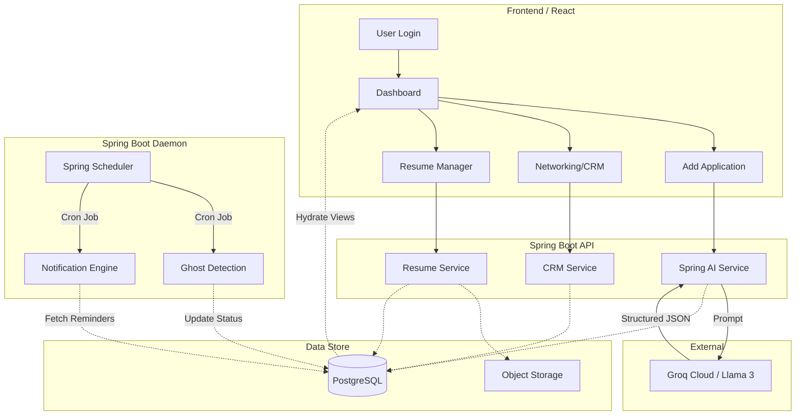

# Trajectory 🚀 — Your Career Operating System

**Trajectory** is a comprehensive, full-stack career management platform designed to centralize and automate the fragmented job search process. By moving beyond static spreadsheets, Trajectory integrates resume versioning, AI-powered data extraction, cold outreach tracking, and deep analytics into a single unified "Command Center" (Dashboard).

This project is structured as a decoupled full-stack application (React Frontend + Spring Boot Backend) designed to help job seekers optimize their pipelines, automate administrative overhead, and secure their next career move with data-driven insights.

---

## 🌟 Core Features

### 📊 1. The Command Center (Dashboard)
*   **Pipeline Metrics:** High-level bird's-eye counters of `Total`, `Active`, `Rejected`, and `Ghosted` applications.
*   **Funnel Analytics:** Numerical tracking of Online Assessments (OAs), Interviews, and Offers.
*   **Performance Conversion:** Real-time metrics for Response Rate, Interview Conversion, and Offer Conversion.
*   **Temporal Logging:** Rollup counts of applications submitted "This Week" (rolling 7 days) and "This Month".
*   **Analytics Visualizations:** Interactive charts comparing response rates of different resume versions and distribution of applications by sources and career profiles.
*   **Daily Action Agenda:** A "Today’s Agenda" widget compiling upcoming interviews, OAs, and networking follow-ups.

### 💼 2. Application Lifecycle Management (CRUD)
*   **Comprehensive Tracking:** Tracks Company Name, Role, Location, Career Profile, Resume Version, Applied Date, Source, Salary Range, and Application Link.
*   **Chronological Timeline:** A history log documenting the timeline and duration of each status transition (e.g., `Applied` ➔ `OA` ➔ `Interview` ➔ `Offer`).
*   **Smart Reminders:** Automatically prompts for Meeting Links, dates, and times when a status changes to `OA` or `Interview`, syncing them as calendar/push reminders.
*   **Ghost Detection:** Automated cron jobs that identify inactive applications (based on user-configured thresholds, e.g., 30 days) and flag them as `Ghosted`.
*   **One-Click Archiving:** Easy archival of inactive or rejected applications.

### 📄 3. Resume & Career Profile Manager
*   **Targeted Career Profiles:** Create profiles (e.g., "Full Stack Dev", "Product Manager") with custom color-coding and icons.
*   **Automatic Version Control:** Upload multiple resume versions. The backend auto-increments version numbers (v1 ➔ v2) and suggests the latest resume when applying for a matching profile.
*   **Inline Resume Creation:** "Quick Upload" new resumes directly within the application creation modal.
*   **Keyword Changelog:** Keep detailed records of what keywords/sections changed in each resume version to correlate resume adjustments with response rates.

### 🤝 4. Cold Outreach & Networking CRM
*   **Networking Tracker:** Track cold outreach sent to recruiters and employees with contact info, discussion topics, and outreach dates.
*   **Follow-Up Automation:** Set follow-up reminders relative to "Date Sent" with validation to prevent logical date conflicts.
*   **Application Conversion:** Convert successful conversations into formal job applications in one click, transferring history and company details.

### 🤖 5. AI-Powered Automation
*   **Data Extraction:** Paste job descriptions, recruiter emails, or invite letters, and let the AI extract Company, Role, Location, Salary, and Deadline details.
*   **Auto-Populate:** Pre-fill application forms from the extracted data for user review.
*   **Profile Suggestions:** AI maps the job posting to the most relevant Career Profile.
*   **Job Description Archival:** Preserves the original job description raw text to prevent loss if the external posting is deleted.

### 🔔 6. Intelligent Notifications
*   **Web Push Notifications:** Real-time push alerts via Web Push API for OA/Interview times and outreach follow-ups.
*   **Daily Digest:** A consolidated overview of the daily agenda displayed in the dashboard widget.

---

## 🔄 Application Flow & User Journey

Trajectory's interactive flows are optimized to minimize administrative overhead:

1.  **Authentication & Onboarding:** Users sign up or login locally (JWT) or via OAuth2 (Google/GitHub). They configure their initial **Career Profile** and upload their base **Resume (v1)**.
2.  **The Application Loop:** Users click "Add Application", paste a job description or email, trigger the **Spring AI** extraction (powered by **Groq / Llama 3**), verify the auto-populated fields, and save.
3.  **Lifecycle Management:** When updating status (e.g., from `Applied` to `OA`), the user enters the meeting details. The system logs the history transition, calculates the duration of the previous status, and schedules a push reminder.
4.  **Networking (CRM) Flow:** Users log recruiter outreach and follow-up dates. If an interview is secured, they convert the entry into an Application.
5.  **Data Portability:** Users can export their entire workspace data as JSON/CSV or restore their status using the import feature.

For a detailed view of the backend cron execution and frontend events, read the [Docs/App Flow.md](file:///d:/vaibhav%20gupta/Coding/Projects----For%20Resume/Trajectory/Docs/App%20Flow.md).

---

## 🏗️ System Architecture

The following diagram illustrates the relationship between the React frontend, the Spring Boot REST API, database triggers, background workers, and external AI providers:



---

## 🛠️ Tech Stack

### Frontend (Client-Side)
*   **Framework:** React 18+ (Vite) with TypeScript
*   **Styling:** Tailwind CSS + Shadcn UI (Radix UI primitives)
*   **State Management:**
    *   **Server State:** TanStack Query (React Query) for API caching and sync
    *   **Client State:** Zustand for lightweight global state (modals, settings, etc.)
*   **Form & Validation:** React Hook Form + Zod (matching API validation criteria)
*   **Data Visualization:** Recharts (for analytics and conversion funnels)
*   **Icons:** Lucide React

### Backend (Server-Side)
*   **Core Platform:** Java 21 + Spring Boot 3.x
*   **AI Integration:** **Spring AI** (providing unified orchestration with Groq/Gemini)
*   **Security:** Spring Security (Stateless JWT auth + OAuth2 with Google/GitHub)
*   **Data Access:** Spring Data JPA + Hibernate
*   **Database Migrations:** Flyway
*   **Documentation:** SpringDoc OpenAPI (Swagger UI)
*   **Daemon & Jobs:** Spring Scheduler (automated daily ghosting detection and push notifications)
*   **Concurrency:** Java 21 **Virtual Threads** (optimizing blocking I/O threads during concurrent external LLM/API calls)

### Data & Infrastructure
*   **Primary Database:** PostgreSQL 16 (Local) / AWS RDS PostgreSQL (db.t3.micro Free Tier)
*   **Cache & Rate Limiting:** Redis (Local) / AWS ElastiCache Redis (Free Tier)
*   **Object Storage:** MinIO (Local) / AWS S3 (Free Tier up to 5GB)
*   **Containerization:** Docker & Docker Compose (for local development and environment packaging)
*   **Cloud Deployment:** Amazon Web Services (AWS) (deploying Docker containers via Free Tier ECS/Fargate services and GitHub Actions CI/CD)
*   **Web Server:** Nginx (reverse proxy and static content host)

For a complete breakdown of why these tech stacks were chosen, read [Docs/Tech Stack.md](file:///d:/vaibhav%20gupta/Coding/Projects----For%20Resume/Trajectory/Docs/Tech%20Stack.md).

---

## 🗄️ Database Schema

The database model is configured to manage security, custom career configurations, application timelines, and CRM outreach:

```
                     +------------------+
                     |      users       |
                     +------------------+
                               | 1
                               |
            +------------------+------------------+
            | 1                                   | 1
   +--------▼--------+                   +--------▼---------+
   | career_profiles |                   |     outreach     |
   +--------┬--------+                   +------------------+
            | 1
            |
            +------------------+
            | M                | M
   +--------▼--------+ +-------▼--------+
   |  applications   | |    resumes     |
   +--------┬--------+ +----------------+
            | 1
   +--------▼--------+
   |status_history   |
   +-----------------+
```

### Table Dictionary
1.  **`users`**: Contains account attributes, credentials (bcrypt/argon2), and configurations like `ghost_threshold_days` and `auto_archive_enabled`.
2.  **`career_profiles`**: Linked to users. Tracks profile classifications (e.g. Title, Color Hex, Icon) to distinguish multiple personas.
3.  **`resumes`**: Linked to profiles. Tracks resume binaries (`s3_key`), file names, version increments, and notes (`changelog`).
4.  **`applications`**: Tracks the job description raw text, URLs, status enums, dates, company names, and salaries.
5.  **`application_status_history`**: Maintained for audit trails and stage duration tracking. Every status change creates a record.
6.  **`outreach`**: The networking CRM tracker (contact info, discussion details, outreach status, date sent, follow-ups).
7.  **`company_documents`**: Private company-specific documents (eligibility PDFs, benefit guides, etc.) stored in the S3 bucket.

For details on index creation and raw SQL configurations, refer to the [Schema.sql](file:///d:/vaibhav%20gupta/Coding/Projects----For%20Resume/Trajectory/Schema.sql) file.

---

## 🚀 Getting Started

### Prerequisites
*   **Java SDK 21**
*   **Node.js 18+** & npm/pnpm
*   **Docker & Docker Compose**

### 1. Provision Infrastructure
Run the database, caching layer, and MinIO storage using Docker:
```bash
docker-compose up -d
```
This initializes:
*   PostgreSQL running on port `5432` with database `trajectory_os`
*   Redis running on port `6379`
*   MinIO running on port `9000` (API) & `9001` (Console)
*   An initialization job (`minio-init`) that automatically creates the `resumes` and `company-docs` buckets.

### 2. Configure Environment Variables

#### Backend (`/backend/.env` or `application.properties`)
```properties
SPRING_DATASOURCE_URL=jdbc:postgresql://localhost:5432/trajectory_os
SPRING_DATASOURCE_USERNAME=trajectory_user
SPRING_DATASOURCE_PASSWORD=trajectory_password

# Redis Caching
SPRING_DATA_REDIS_HOST=localhost
SPRING_DATA_REDIS_PORT=6379

# Object Storage (MinIO / S3)
AWS_ACCESS_KEY_ID=trajectory_admin
AWS_SECRET_ACCESS_KEY=trajectory_storage_secret
AWS_S3_ENDPOINT=http://localhost:9000

# Spring AI & Groq Configuration
SPRING_AI_OPENAI_API_KEY=your_groq_api_key
SPRING_AI_OPENAI_BASE_URL=https://api.groq.com/openai/v1
```

#### Frontend (`/frontend/.env`)
```env
VITE_API_BASE_URL=http://localhost:8080/api
VITE_WEB_PUSH_PUBLIC_KEY=your_vapid_public_key
```

### 3. Run Applications
Refer to the [CLAUDE.md](file:///d:/vaibhav%20gupta/Coding/Projects----For%20Resume/Trajectory/CLAUDE.md) guide for specific build and startup commands.

---

## 📂 Project Documentation

*   [Product Requirements Document (PRD)](file:///d:/vaibhav%20gupta/Coding/Projects----For%20Resume/Trajectory/Docs/PRD.md) — Comprehensive functional specifications.
*   [Application Flow](file:///d:/vaibhav%20gupta/Coding/Projects----For%20Resume/Trajectory/Docs/App%20Flow.md) — Detailed user journeys and state flows.
*   [Tech Stack Decisions](file:///d:/vaibhav%20gupta/Coding/Projects----For%20Resume/Trajectory/Docs/Tech%20Stack.md) — Rationale behind architectural choices.
*   [Database Schema](file:///d:/vaibhav%20gupta/Coding/Projects----For%20Resume/Trajectory/Schema.sql) — Raw PostgreSQL DDL configurations.
*   [Docker Infrastructure](file:///d:/vaibhav%20gupta/Coding/Projects----For%20Resume/Trajectory/docker-compose.yml) — Local environment docker services.
*   [Claude Developer Guide](file:///d:/vaibhav%20gupta/Coding/Projects----For%20Resume/Trajectory/CLAUDE.md) — Coding conventions, guidelines, and commands.
